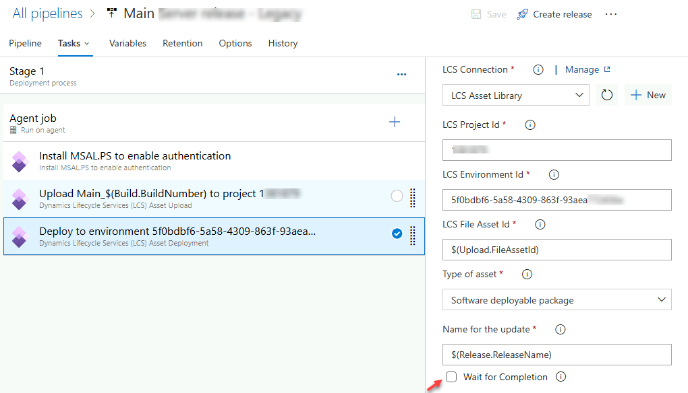

## Setup Azure Build Pipeline

This guide will walk through the standard procedures for setting up a D365FO Azure-hosted build pipeline.

### References

Before we begin, please refer to the following documentation for context:

- [Build automation that uses Microsoft-hosted agents and Azure Pipelines](https://learn.microsoft.com/en-us/dynamics365/fin-ops-core/dev-itpro/dev-tools/hosted-build-automation)
- [Upload assets by using Azure Pipelines](https://docs.microsoft.com/en-us/dynamics365/fin-ops-core/dev-itpro/dev-tools/pipeline-asset-upload)
- [Create a Dynamics Lifecycle Services connection in Azure pipelines](https://learn.microsoft.com/en-us/dynamics365/fin-ops-core/dev-itpro/dev-tools/pipeline-lcs-connection)

## Procedure detail

### Pre-checks

Before diving into the setup, perform a few essential pre-checks:

1. **Install the «Dynamics 365 Finance and Operations Tools» extension**

   

2. **Create personal access token (az)**

   Navigate to DevOps > User Settings > Personal Access Tokens.
   Scopes: Full Access, Expiration – 1 year (maximum)

3. **Create a service account user with no MFA and [Application](https://learn.microsoft.com/en-us/dynamics365/fin-ops-core/dev-itpro/dev-tools/pipeline-lcs-connection) registration**

## Creating the Build Pipeline

1. **Download the 4 NuGet files to your local PC**

   

2. **Log in to DevOps > Your Project > Artifacts > Create Feed**

   

3. Click the **Connect to Feed** button and select NuGet.exe

   

   Copy the selected text and paste it into the **nuget.config** file in the same directory as the previous packages.

4. Click the **Get the Tools** button and download the latest version of **nuget.exe**

5. Create a new file named **packages.config** and add the following content (ensure correct version numbers):

   ```xml
   <?xml version="1.0" encoding="utf-8"?>
   <packages>
   <package id="Microsoft.Dynamics.AX.Application.DevALM.BuildXpp" version="10.0.1084.80" targetFramework="net40" />
   <package id="Microsoft.Dynamics.AX.ApplicationSuite.DevALM.BuildXpp" version="10.0.1084.80" targetFramework="net40" />
   <package id="Microsoft.Dynamics.AX.Platform.CompilerPackage" version="7.0.6253.76" targetFramework="net40" />
   <package id="Microsoft.Dynamics.AX.Platform.DevALM.BuildXpp" version="7.0.6253.76" targetFramework="net40" />
   </packages>
   ```

   Obtain the version number from the package files(there should be 2 different versions, 2 for Applications and 2 for Platform).

   

6. Open the command line and run the following command for each NuGet file:

   ```cmd
   nuget.exe push -Source "AxBuild" -ApiKey az C:\AAA\Build\Microsoft.Dynamics.AX.Application.DevALM.BuildXpp.nupkg
   nuget.exe push -Source "AxBuild" -ApiKey az C:\AAA\Build\Microsoft.Dynamics.AX.ApplicationSuite.DevALM.BuildXpp.nupkg
   nuget.exe push -Source "AxBuild" -ApiKey az C:\AAA\Build\Microsoft.Dynamics.AX.Platform.CompilerPackage.nupkg
   nuget.exe push -Source "AxBuild" -ApiKey az C:\AAA\Build\Microsoft.Dynamics.AX.Platform.DevALM.BuildXpp.nupkg
   ```

   When prompted, use: Username = az; Password = token value

7. Create a new solution with an empty project for each package you want to build. No need to include nested packages. Copy **nuget.config** and **packages.config** to the solution folder.

   

8. Download the sample pipeline from the following GitHub account:

    [https://github.com/microsoft/Dynamics365-Xpp-Samples-Tools](https://github.com/microsoft/Dynamics365-Xpp-Samples-Tools)

    (Note: Some users reported issue with wrong task ID, not used now - <https://github.com/microsoft/Dynamics365-Xpp-Samples-Tools/pull/2/files> )

9. Open a **PowerShell** prompt and run the following commands to create a new pipeline:

   ```powershell
   cd C:\Users\Admin05ec84c604\Downloads\Dynamics365-Xpp-Samples-Tools-master\CI-CD\Pipeline-Samples

   ./xpp-classic-ci-.ps1 
   ```

This will create a new build pipeline.

### Adjusting the Build Pipeline Parameters

Open the created pipeline and make the following adjustments:

1. Click **Get sources** and specify the full path to the source code.

   

2. Update the path to the build Solution with empty projects:

   

3. Update the **NugetConfigsPath** path on the **Variables** tab to: *$(Build.SourcesDirectory)\Projects\AzureBuild*

4. Optionally, enable the **Licenses Load** task:

   *$(Build.SourcesDirectory)\Licences\*.txt*

   

5. Run the pipeline and verify that everything is working as expected.

## Updating Build Pipeline to a new version

If you need to update a Build Pipeline to a new version follow these steps:

1. Execute steps 1-6 from the Create pipeline process
2. Copy **nuget.config** and **packages.config** files to the AxBuild solution folder(replace existing files).

## Creating a New Release Pipeline

1. Open **Pipeline > Releases** and create a new pipeline based on the Empty job.

   

2. Add a new artifact

   

3. Add the **Install MSAL.PS to enable authentication** task.

4. Add the **Dynamics Lifecycle Services (LCS) Asset Upload** task.

   In this task create a new Connection:

   - **UserId**: <svc_Dev_LCS@xxx.onmicrosoft.com> (service account, no MFA)
   - **[Application](https://learn.microsoft.com/en-us/dynamics365/fin-ops-core/dev-itpro/dev-tools/pipeline-lcs-connection) (Client) ID**: 2eb122fa-a3d0-4a15-b2ff-a8b0339xxxxx  

   

   **Project ID**:

   

   **File to upload:**  Select a file and replace its name:

   *$(System.DefaultWorkingDirectory)/_X++ (Main)/drop/AXDeployableRuntime_22.04.07.1.zip*

   with

   *$(System.DefaultWorkingDirectory)/X++ (Main)/drop/AXDeployableRuntime$(Build.BuildNumber).zip*

   **Reference name**: Upload

   **LCS Asset name**: AppRelease$(Build.BuildNumber)

   **LCS Asset Description:** $(Release.ReleaseDescription)

5. Add the **Dynamics Lifecycle Services (LCS) Asset Deployment** task

   Specify **LCS File Asset Id**: $(Upload.FileAssetId)

   Untick **Wait for Completion** to prevent timeouts.

   

## Summary

This post provides a detailed guide for setting up Dynamics 365 Finance and Operations **Build** and **Release** pipelines. I intend to keep this guide up-to-date, so please report any issues you encounter.

Hope you find this guide useful. Stay updated by following me on [LinkedIn](https://www.linkedin.com/in/denis-trunin-3b73a213/) or [twitter](https://twitter.com/TruninDenis) .
