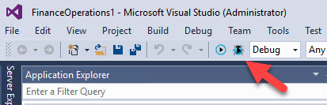
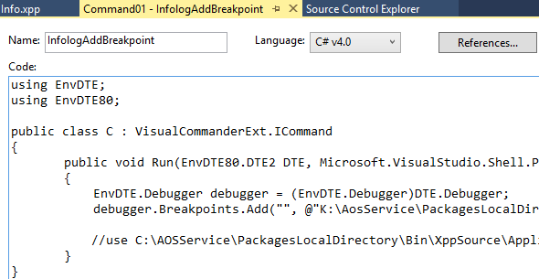
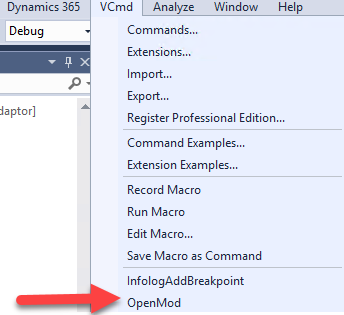

Visual Studio Marketplace contains lots of tools, and some of them can be used with D365 Finance and Operations. In this post, I want to describe some useful Visual Studio extensions to simplify your D365FO debug experience.

### Debug Attach Manager

The first one is a free, open-source tool [Debug Attach Manager](https://marketplace.visualstudio.com/items?itemName=ViktarKarpach.DebugAttachManager) by Viktar Karpach.
To debug the running D365FO application you need to go to Debug > [Attach to process](https://microsoftdynamix.blogspot.com/2019/01/d365fo-debugging.html) > then select **iisexpress.exe** process and press Attach.

But with **Debug Attach Manager** it is much simpler - it adds a new button that allows doing this in one click.

 

### Visual Commander

[Visual Commander](https://marketplace.visualstudio.com/items?itemName=SergeyVlasov.VisualCommander) is designed to provide lightweight scripting to Visual Studio IDE. It more like macro VBA scripts in Excel, but for Visual Studio. You can use C# to write new commands and a free version allows you to create 10 commands.

For example, you can create a command that adds a breakpoint to **Infolog.add()** method

```csharp
EnvDTE.Debugger debugger = (EnvDTE.Debugger)DTE.Debugger;  
debugger.Breakpoints.Add("", @"K:\AosService\PackagesLocalDirectory\bin\XppSource\ApplicationPlatform\AxClass_Info.xpp", 298);
//use C:\AOSService\PackagesLocalDirectory\Bin\XppSource\ApplicationPlatform\AxClass_Info.xpp for Local VMs
```



or create a command that opens your favourite object

```csharp
string absolutePath = @"K:\AosService\PackagesLocalDirectory\ApplicationPlatform\ApplicationPlatform\AxClass\Info.xml";
DTE.ItemOperations.OpenFile(absolutePath, null);
```

These commands will be available in **VCmd** menu



## Summary

I hope you may find these tools useful, also feel free to comment if you see something is missing

> Note: there is a strange bug when downloading extensions using IE from VS Marketplace site. It autosaves downloaded file as **".zip"**, but to install the extension, you need to rename this file to **".vsix"**
