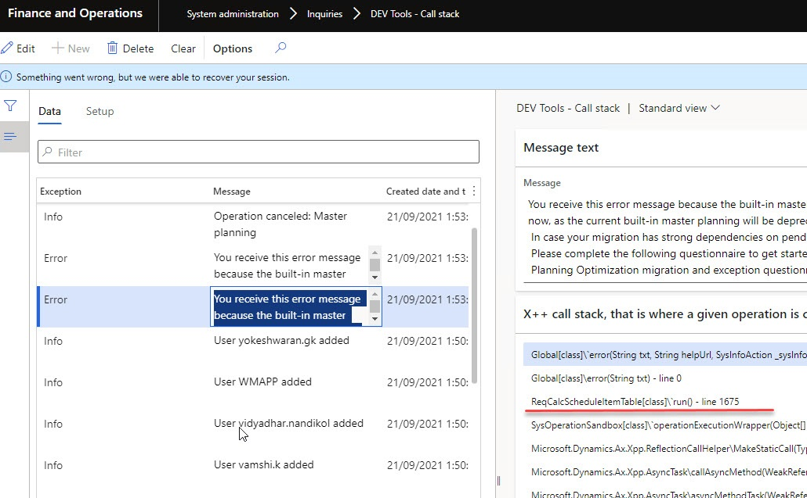

Having recently completed several Microsoft Dynamics 365 for Finance and Operations (D365FO) projects,  I want to share a few practical hints that helped my team successfully navigate the Go-Live stage. These insights are based on real-world scenarios and are meant to complement [standard methodologies](https://learn.microsoft.com/en-us/dynamics365/guidance/implementation-guide/prepare-to-go-live) with a hands-on approach.

## Environments management

In every D365FO project, Microsoft provides a single Tier 2 environment as part of the standard subscription. It’s important to name this environment correctly from the start—avoid calling it **UAT** or **TEST** and instead use **PRE-PROD** (PP or PPN).

A common issue is that, after Go-Live, business users continue using the **PRE-PROD** environment for Testing purposes. This can lead to complications, as most post-Go-Live issues are data-related and can’t be reproduced in DEV you’ll often need a copy of the **PROD** database to investigate these issues. However, the **PROD** database can only be copied to **PRE-PROD** before being distributed to other environments for debugging

 

The same rule applies to code deployments—before installing a new code package on **PROD**, it must first be deployed on **PRE-PROD**, which usually causes about an hour of downtime.

If you name this environment **UAT**, some users or consultants might think it’s a test area for them to play around with, leading to complaints when you have to restore the database and wipe their work.

That’s why it’s crucial to establish from the start that the **PRE-PROD** environment can be refreshed from **PROD** at any time, and it should never contain any valuable data. This ensures that users don’t treat it as a permanent testing environment. The key here is to create a process where data refreshes and code deployments to **PRE-PROD** don’t require formal approvals—just a quick notification to the team should be enough to keep things running smoothly.

If your project involves ongoing development, I recommend having at least two Tier 2 environments: one for PRE-PROD and one dedicated to user testing, to avoid these kinds of conflicts.

For more details on D365FO environments, you can check out my posts [Understanding Dynamics 365FO different Tiers performance](https://denistrunin.com/performanceD365-tierperf/) and  [Development VM configuration](https://denistrunin.com/devvm-perfv13/)

### Proactive Data Restore Process

During the first few days after Go-Live, I recommend proactively refreshing the **PRE-PROD** environment with **PROD** data at the end of each day(or in the morning). The main challenge is that certain data, such as integration-related or encrypted data, may not copy over or should not be copied during the refresh. To handle this, create an automated procedure to restore these settings. The key is ensuring this process doesn’t require significant manual intervention.

Here’s the process we followed:

1. Run the **PRE-PROD** data refresh from **PROD** (for smaller databases, this typically takes around one hour).
2. Execute a script that adjusts **PROD**-specific settings to their Test values (in our case, it was an SQL script to modify integration settings, enable users, etc.).
3. Perform a database export job for **PRE-PROD** to LCS (which usually takes at least another hour).

This proactive approach offers a significant advantage: if an issue occurs on **PROD**, there’s a high chance it can be replicated on the restored **PRE-PROD** data. In such cases, a developer can restore the database from LCS and start debugging within 1-2 hours after the issue is reported.

There’s also an option to automate this process further using [LCS API and Power Automate](https://www.powerazure365.com/blog-1/lcs-api-database-movement-with-powerautomate), although we haven’t gone that far.

If your database is large and the restore takes too long, first ensure there aren’t unnecessary "log" tables inflating its size by using [this script](https://github.com/TrudAX/TRUDScripts/blob/master/Performance/AX Technical Audit.md#database-size). Additionally, consider implementing tips from my post on [speeding up BACPAC database restores from Tier 2 to Tier 1](https://denistrunin.com/performance-restoretier2/).

### Timings the Project Team Should Know

When an issue occurs in **PROD**, the first step is to investigate and try to understand the problem. If it’s still unclear, you’ll need to initiate a data refresh on the DEV environment. It’s important that everyone on the team is aware of the expected timings for this process. For example, if a normal data restore procedure is required, debugging can typically begin within 4 hours.

Once the issue is resolved in the DEV environment, the fix should be deployed to **PRE-PROD** (ensure the team understands how long this will take). After validation on **PRE-PROD**, the fix will be included in the next **PROD** release. It’s critical that the entire team knows the deployment schedule for **PROD** to ensure smooth coordination.

Issues are often raised by functional consultants working closely with key users, and having clear project timings in place makes communication and planning much easier for everyone involved.

## Release Management

Effective release management is key to ensuring a smooth Go-Live experience. It’s unrealistic to expect the first days to be error-free—even with a fully tested system, issues are likely to arise. Therefore, good planning should include an action plan for resolving possible errors, and it’s better to avoid relying too much on an "agile" approach during this critical period.

### Issue Triaging

During Go-Live, you will encounter both critical and non-critical issues. Critical issues should be resolved as quickly as possible, while non-critical issues should be evaluated. If they pose no immediate risk, it’s better to address them within the ongoing work queue.

Ignoring non-critical issues can cause users to lose interest in reporting problems. For example, imagine you’re a user of a new system and encounter an issue that, while not critical, adds an extra two minutes to your workflow. You take the time to report it, but nothing happens. The next time something goes wrong, you might not even bother reporting it, and eventually, you might tell your manager the new system isn’t working well.

To avoid this scenario, it’s essential to maintain user engagement by responding quickly to their feedback and delivering improvements with minimal delay.

### PROD Deployments Planning

One of the biggest technical limitations of D365FO is that every **PROD** release requires 40-50 minutes of system downtime, which makes planning your deployments around this window crucial.

During the first two weeks of the Go-Live period, I recommend planning:

- A scheduled release window every day (e.g., in the evening)
- An emergency release window in the morning

Even if these windows aren’t always used, planning them in advance saves time and avoids last-minute discussions with users about system downtime. It also helps set realistic expectations for users regarding resolving their issues.

- Here’s a breakdown of how a typical release happens and the associated timings:
  1. The developer fixes and tests the issue on the DEV environment.
  2. The fix is deployed to **PRE-PROD** for final validation via the Deployment Pipeline, which takes approximately 1.5 hours.
  3. The release manager logs into LCS, marks the **PRE-PROD** package as a release candidate, opens the **PROD** environment, and schedules the release (40 minutes of downtime).

Keep in mind that **PROD** releases cannot be fully automated and will require some manual effort, which can vary depending on the project.

I recently ran a poll on [LinkedIn](https://www.linkedin.com/posts/denis-trunin-3b73a213_question-to-people-who-maintain-d365fo-production-activity-7030514980114362368-sBVy?utm_source=share&utm_medium=member_desktop) and got the following results:

Lastly, make sure to communicate with the person handling the releases to clarify that some overtime may be required during this period.

### Code Branch Management

During the Go-Live phase, it’s essential to keep your code [branch management](https://learn.microsoft.com/en-us/azure/devops/repos/tfvc/branching-strategies-with-tfvc?view=azure-devops) as simple as possible. In some projects, we used only a single **Main** branch, while in others **Main** and **Release** branches, with **Release** being mostly a copy of **Main**. This approach requires quality control, and Javier Lopez’s series of [blog posts](https://javi-kata.medium.com/ci-cd-the-journey-of-a-dummy-team-f51a061684bc) provides some useful insights.

It’s easy to overcomplicate this process and end up with a full-time person just to manage branches and releases. But for the Go-Live period, I recommend sticking to a "simple mode."

There are two key factors to consider when planning your branch strategy:

1. **Speed of Deployment**: How quickly can a validated fix be deployed to **PROD**? During Go-Live, this should ideally be within 1 day.
2. **Effort Required**: How much time does it take to deploy? A good setup shouldn’t take more than 1 hour of work time.

## Integration Issues

During the initial Go-Live phase, you’ll likely encounter a wide range of integration-related errors.

**For inbound integrations, typical issues include:**

- External systems sending messages in the wrong format (e.g., missing XML tags, incorrect date or numeric formats)
- Messages containing invalid values (e.g., references to data that doesn’t exist in D365FO)
- Duplicated messages
- Incorrect field mapping on the D365FO side
- Misconfigured or missing D365FO settings during message processing

**For outbound integrations, common problems are:**

- External systems reporting that they didn’t receive some documents from D365FO
- Or Received messages containing wrong values for individual fields

**For Service/OData-based integrations:**

- Complaints from external systems about incorrect data returned by D365FO (often accompanied by screenshots showing empty or incorrect fields in their UI)

In addition to these issues, you may also encounter errors in the X++ code that processes integration messages(so need to reverse and reprocess existing messages), or experience performance bottlenecks during high message volumes.

On my most recent project, I used the [External Integration](https://github.com/TrudAX/XppTools?tab=readme-ov-file#devexternalintegration-submodel) framework, which provides comprehensive logging and allows for replaying/debugging individual messages to troubleshoot issues. It worked exceptionally well for investigating and resolving common integration problems.

If you’re using a different integration approach, make sure the team has a plan in place to address at least the types of issues mentioned above.

## Update Planning and Feature Management

Microsoft releases eight updates per year for D365FO, and you can pause two of them. I highly recommend using one of these pauses during your Go-Live phase to ensure the system remains stable without the added complexity of updates.

### Feature Management

Feature management in D365FO allows you to gradually enable new features, but it’s not a configuration tool. If you're a new client, a good strategy is to enable all relevant features before starting your main user testing. This ensures that you’re testing the system as it is in its current version rather than working with legacy code that may no longer be supported.

To do this, simply press the "Enable all" button in the Feature Management workspace, but make sure to exclude any features marked as "Preview," as these are not yet fully supported for production use.

## X++ Tooling

Having the right tools can significantly simplify issue resolution during the Go-Live phase. I highly recommend exploring the available resources in the [X++ community](https://github.com/anderson-joyle/awesome-msdyn365fo?tab=readme-ov-file#x-tools). Below, I’ve listed some of the tools our team relied on most during the initial Go-Live phase.

### Field List

The **[Field List](https://denistrunin.com/xpptools-fieldslist/)** tool is useful for quickly checking data and comparing values between different records. For example, if you have two sales orders that appear similar, but one of them is missing certain buttons or actions, you can easily compare the records to identify the differences.

### Call Stack to Infolog

The **Call Stack to Infolog** tool is a real [time saver](https://denistrunin.com/xpptools-devinfocallstack/). It has saved us a lot of time, helping resolve issues in minutes instead of spending hours on data restores and debugging. When enabled for key users, this tool logs an X++ call stack for every error or warning message.

Some D365FO error messages may be unclear—for instance, encountering *"Account not specified"* during a complex document posting. With this tool, you can see the exact X++ call stack that generated the message, providing crucial insight into the issue.

**Standard approach**: Without this tool, the usual process would involve restoring the database and setting a breakpoint in `info.add();`—a much more time-consuming approach.

### SQL Execute

The **SQL Execute** tool is incredibly useful for data analysis. When I first [introduced](https://denistrunin.com/xpptools-sqlexecute/) it, some people considered it unsafe (despite similar modifications being possible through ER), but it actually becomes true. Over time, consultants began writing update queries, which brought attention to potential risks. It's important to note that [Microsoft does not provide support for correcting damaged data](https://learn.microsoft.com/en-us/power-platform/admin/support-overview?toc=%2Fdynamics365%2Ffin-ops-core%2Fdev-itpro%2Ftoc.json&bc=%2Fdynamics365%2Fbreadcrumb%2Ftoc.json#does-microsoft-provide-support-for-data-corruption), so care is needed.

To enhance safety, I added separate roles for **Select** and **Update** modes, along with extended logging. **Update** mode was disabled for everyone except one system administrator, who wasn’t involved in user support. This setup worked well for us.

Another feature added since the initial release is the ability to export results to Excel with proper formatting, including displaying Enum labels and converting DateTime to the user's time zone.

**Standard approach**: Without this tool, you would typically need to export the database to Tier 2 and connect via SQL Management Studio, which is much more time-consuming.

### Execute custom code

In every project I’ve worked on, there was at least one issue that required modifying inventory or ledger transactions. This happened for various reasons: data wasn’t loaded correctly, Unit of Measures contained a wrong conversion, or users selected incorrect accounts or pressed the wrong buttons.

Microsoft introduced the [Run custom X++ scripts with zero downtime](https://learn.microsoft.com/en-us/dynamics365/fin-ops-core/dev-itpro/deployment/run-custom-scripts) utility, which has been a valuable tool. However, the approval process they implemented is quite strange. The script runs within a transaction, which doesn’t allow for dialogs, and it requires approval from two people before the final run.

The process is different in real-world project scenarios. Typically, you write a custom class to correct the data and run it in **PRE-PROD** first, then ask key users to review and confirm the changes. Once they approve, you run the same class in **PROD**. At this point, since the changes have already been tested and validated in **PRE-PROD**, no further approval is necessary when the code reaches **PROD**.

The improved [Custom Scripts](https://github.com/TrudAX/XppTools/tree/master/DEVTools/DEVCustomScripts) utility eliminates the standard validations and allows you to run a custom class without external transactions, enabling the use of dialogs.

Another option for similar tasks is the [MXT - X++ Interpreter](https://github.com/milnet92/MXTXppInterpreter?tab=readme-ov-file) from [Oriol Ribes Amenós](https://www.linkedin.com/in/oriol-ribes-amenós-16055667/), which may have some compile risks but works well for [simple scripts](https://www.linkedin.com/pulse/mxt-x-interpreter-useful-tool-developers-denis-trunin-huhec/).

## Automation Scripts

One of the most important steps in a project is to automate as much as possible to streamline processes. In our project, we used the following automation scripts:

- **Automated build and deployment pipelines**: This setup requires a service account without MFA. You can find a sample instruction for setting up the pipeline [here](https://denistrunin.com/d365fo-buildrelease/).
- **Script to prepare the development VM**: This [script](https://github.com/TrudAX/TRUDScripts/blob/master/D365FO/PrepareNewVMScript.ps1) ensures that all necessary tools(e.g d365fo.tools) are installed and available on every project VM.
- **Script to refresh code on the DEV VM**: This [script](https://github.com/TrudAX/TRUDScripts/blob/master/D365FO/RestoreCode.ps1) allows you to compile one or all models in the correct sequence.
- **Various scripts to support the development process**: These [scripts](https://github.com/TrudAX/TRUDScripts/blob/master/D365FO/UsefulScripts.ps1) include important tools such as restoring the Tier 2 database and sharing it through a separate storage account.
- **SQL script for post-PROD data restore**: This script enables users and updates integration settings to test values after restoring the **PROD** database.

## Summary

In this post, I’ve shared practical insights from my experience in technical management for Go-Live D365FO projects. At a high level, the process is simple: you need to organize an efficient workflow for the following activities:

- Delivering fixes from Development to Production
- Replicating test cases for Production issues on the Development VM (via data restore)
- Monitoring the system to address typical issues

However, the complexity lies in the details. I hope you found this post helpful. Feel free to ask any questions or share your own insights—I’d be happy to discuss them further.
