If you are developing in Dynamics 365 Finance and Operations, you need to use Team Foundation Version Control(**TFVC**) system. It is not very complex, but its concept is different from what we have in AX2012.

In this post, I describe some scenarios that may produce unexpected results if you don't fully understand **TFVC** and use it in an "old AX2012 way".

On a typical AX2012 project, we usually have a common development application, where we are developing modifications, and when they are ready, we use import/export XPO file to transfer them on TEST application. Let's discuss how this may work in D365FO.  

## Initial setup

Here is our project setup, I created two branches one for our internal development and testing(Trunk - **Main**) and one for user testing - **TEST**. **TEST** is mapped to some temporary folder to allow merging.

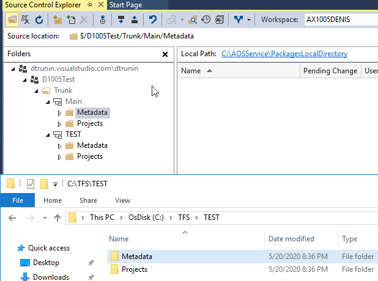

## Case 1 - Why my code doesn't compile

let's do our first modification. Add a new EDT **EDT_FieldA** and a new field based on this type to **CustGroup** table

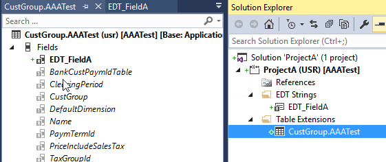

Commit our changes as **ProjectA**

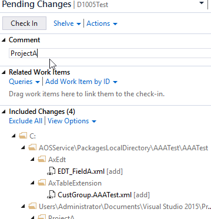

Then let's do our second modification - A new field to the same **CustGroup** table based on a new EDT **EDT_FieldB**

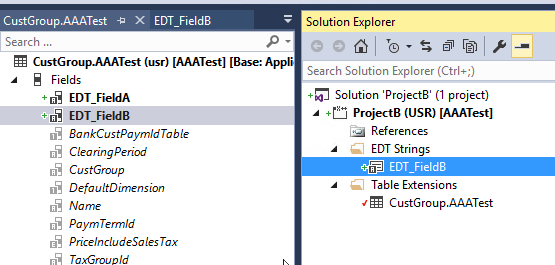

and then commit it to our **Main** branch as **ProjectB**

These two modifications are logically not linked, so after the testing, we can decide to move only **ProjectB** to the user test environment. It is a typical situation in AX2012, where you just export the project to XPO from DEV and load it into TEST(during the import you compare XPO with the existing code on TEST and transfer only relevant changes)

But the trick is you can't use this approach in Dynamics 365 Finance and Operations.

A typical mistake is to use **Selected changesets** merge to do this. Let see how it works:

You run a Merge command and choose **Selected changesets**

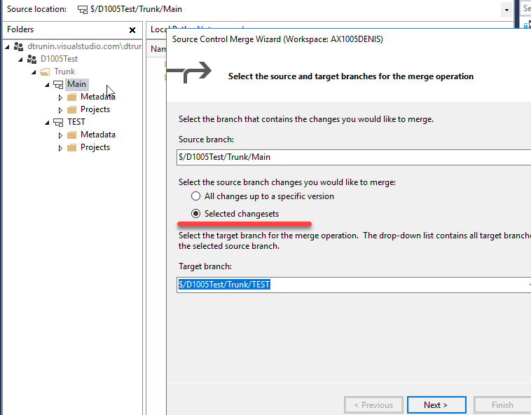

then you select only **ProjectB** assuming that only changes from **ProjectB** will be included.

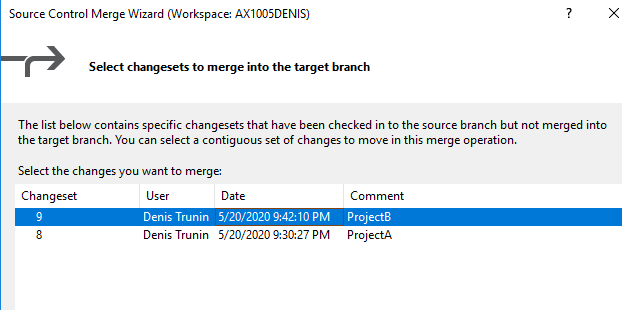

But the result will be not as expected - you will also transfer a new **FieldA** and it refers to EDT that doesn't exist in TEST branch. So you will get a compile error when you try to Build your TEST branch(and that is not the worst scenario)  

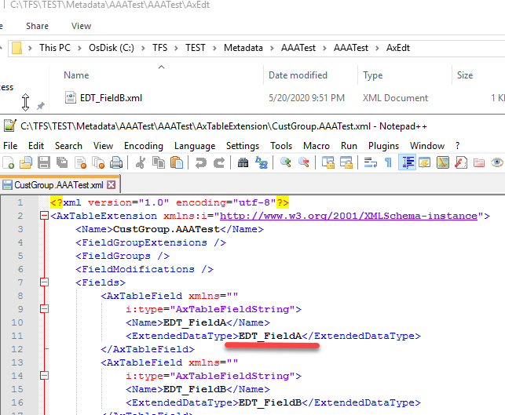

## Case 2 - Why my test system doesn't work

Let's consider another example - you are developing some complex modification(**Project1**), and a part of this modification is a new validation on the Sales table

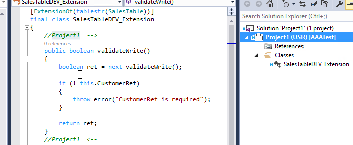

Another developer has developed in the same branch a simple modification just to provide some default values for the SalesTable(**Project2**)

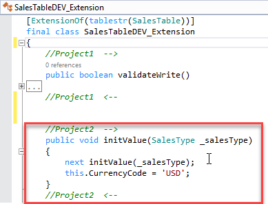

**Project2** is simple to test and after testing you decided to move to it user testing - TEST branch. Again this is a typical valid scenario in AX2009 or AX2012, we often don't care about other people modifications, we just transfer XPO and compare the code during the import.

You run "selected changesets" transfer and choose only **Project2**.

As the result, you will get a file that contains a part or **Project1**.

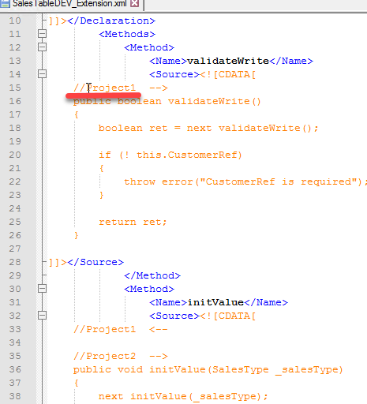

This will probably create an unexpected new validation on TEST branch, and your users may even not be able to create Sales orders due to this validation.

## Case 3 - Why my code is missing after the merge

Let's continue with the example above. Consider that it is your lucky day and you noticed that you added unwanted code from **Project1** to the TEST version before it's being deployed to users.

You open the class in TEST branch and delete the code related to **Project1** from it. It is a typical AX2012 operation, you don't need this code now. 

Then after some time, you finally decide to transfer **Project1** to TEST from Main. You can even run full branch merge for this. 

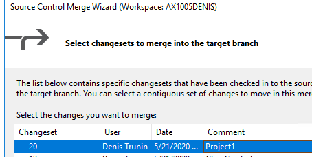

After a successful merge, your code related to **Project1** will not appear in TEST. You lost it!  

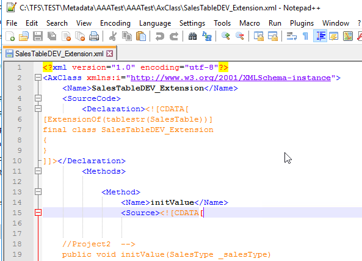

## Microsoft recommendations

All examples above may happen due to incorrect usage of branching strategy.

The basic advice from Microsoft is the following:

> Start with the main only branching strategy, [branch strategically](https://docs.microsoft.com/en-us/azure/devops/repos/tfvc/branching-strategies-with-tfvc?view=azure-devops) and adopt other strategies to evolve into more complex strategies as needed.

To achieve this, you need to work in sprints(for example 1 release per week).

It is a high chance that sometimes you need an emergency fix (that can't wait for a week). In this case, you restore a new temporary branch from the last build, implement a fix in this temporary branch and merge changes back to Main before the next release(so it will be a **Release isolation strategy**).

Full list of strategies is available here https://docs.microsoft.com/en-us/azure/devops/repos/tfvc/branching-strategies-with-tfvc?view=azure-devops, but please note that none of the recommended strategies allows "Merge selected changesets", you should always work with a forward-only merge. So merging just changeset2 on this diagram may corrupt your branch

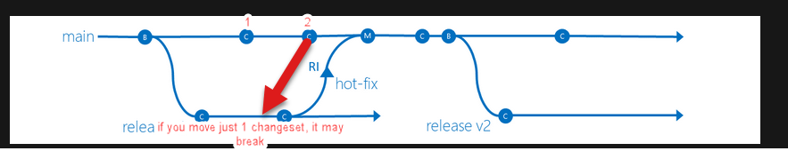

The main issue that **TFVC** doesn't prevent from executing the wrong commands and probably in 95% cases when you run "Merge selected changesets" it will run without any issues as modifications usually don't contain common elements. And this may create a wrong feeling that it will always work.

## Summary

One of the key features of Team Foundation Version Control(**TFVC**) is that changeset is a whole object, not just changes.

If you use the old AX approach("Merge selected changesets" in random order) with D365FO Team Foundation Version Control(**TFVC**) system, you may face problems. You may get compile errors, transfer unwanted code and lost changes in code.

So choose your branching strategy before the development, agree on it with a Project manager and follow it. Also If you know any tools that can prevent the described cases feel free to post a comment.
