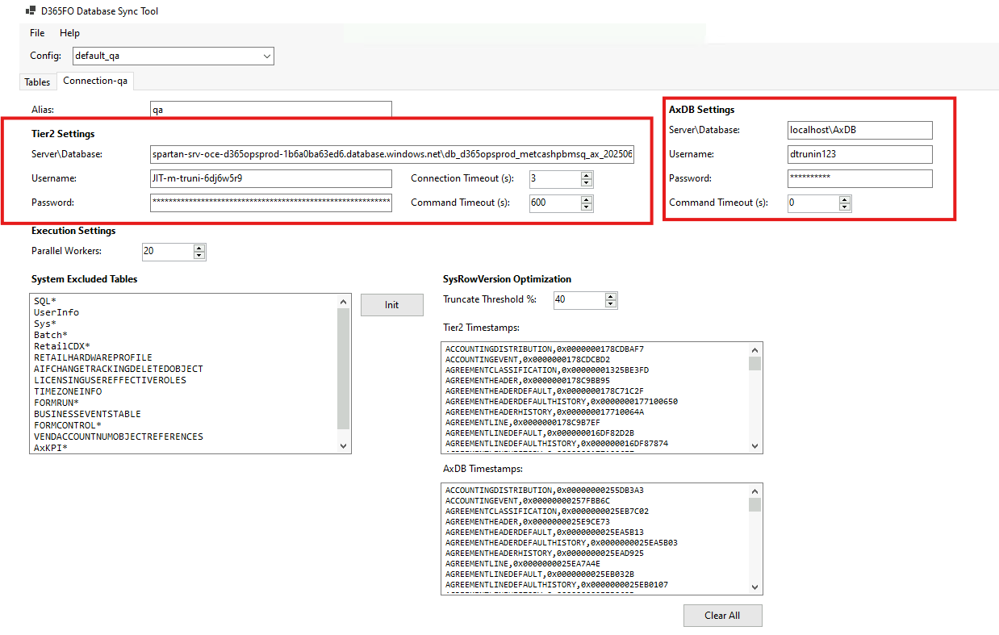
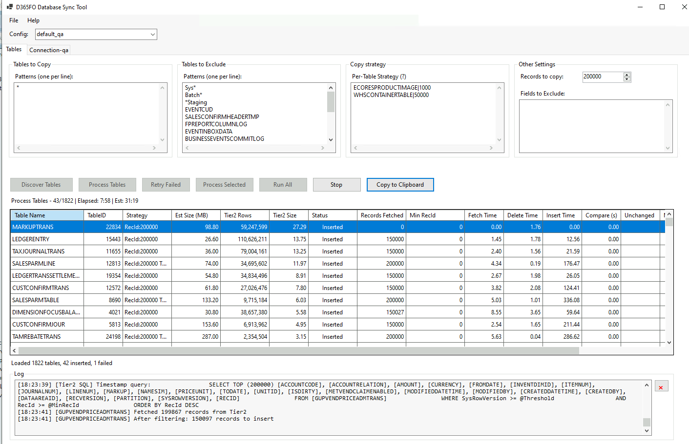
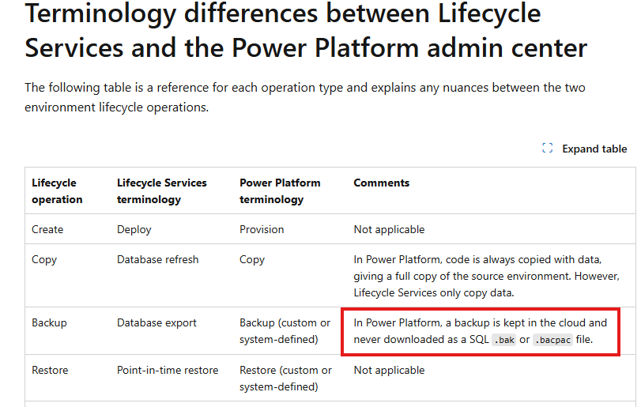
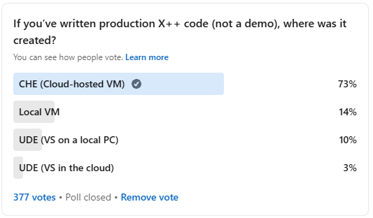

One of the frequent challenges in Dynamics 365 Finance & Operations development is keeping the local development database (`AxDB`) synchronized with fresh data from a Tier2 (UAT/Sandbox) environment. Standard approaches often involve restoring a full BACPAC, which is time-consuming and overwrites everything, or manually copying data, which is tedious and error-prone. To address this, I created the **D365FO-DBSync** utility. This tool helps developers synchronize data from D365FO cloud environments to their local development databases, making it easier to test with production-like data. 

The main idea is to make the last X records (ordered by `RecId`) the same between Tier2 and `AxDB`. E.g. A typical dynamics implementation has ~2000 tables with the data, around 200 tables are transactional tables that exceed 100k records, so if we sync last 100k records per table we can get a compact DB with the most of the base data and recent transactional data.

## Usage

For detailed technical instructions and setup steps, please refer to the [GitHub repository](https://github.com/TrudAX/D365FO-DBSync).

The main workflow is straightforward:

1.  **Prepare your environment**: Whitelist your IP and get database credentials from LCS.
2.  **Configure the tool**: Enter the connection details for both the source (Tier2) and destination (Local AxDB).

    
3.  **Define strategies**: Choose which tables to copy and how (e.g., last 10k records).
4.  **Sync**: Run the discovery and process steps to synchronize the data.

    

## Custom Copy Strategies

The default behavior of the tool is to copy the last X records (based on `RecId`). While this works for most transaction tables, you might need more control for some tables.

You can define custom copy strategies using the following syntax:

`TableName|RecordCount|sql:CustomQuery -truncate`

also the CustomQuery may contains the following placeholders:

*   `@recordCount`: Replaced with the record count defined in the global parameters.
*   `@sysRowVersionFilter`: Used for enabling **INCREMENTAL** mode in custom SQL strategies.

### Examples

Let's describe different scenarious where a custom copy strategy is required.

#### Copy tables where a row contains large data

Some tables may contains images or some binary info and copying a standard 100k records may take a lot of time. For such scenario one you can specify custom RecordCount to copy to limit the number of records. Usage examples:

    *   `ECORESPRODUCTIMAGE|1000`: Copies the last 1,000 product images.
    *   `WHSCONTAINERTABLE|50000`: Copies the last 50,000 warehouse containers.

#### Copy Inventory dimensions if Licence plate is used(InventDim)

In case you use a WHS solution, InventDim table may contains a lot of records with a LicensePlateId. During the copy you can't simply take the latest records, as you miss a lot of references to InventDimId that have a blank LicensePlateId. The solutoin for this is to take all dimensions without LicensePlateId PLUS all recent records with LicensePlateId. In this case you transfer the records that may be used in some setup and the latest transactional records. A setting for this looks the following:

```sql
    InventDim|sql: SELECT * FROM InventDim WHERE RecId IN (SELECT RecId FROM (SELECT RecId FROM InventDim WHERE LICENSEPLATEID = '' AND PARTITION = 5637144576 AND DATAAREAID = 'USMF' AND WMSLOCATIONID = '' UNION SELECT RecId FROM (SELECT TOP 50000 RecId FROM InventDim ORDER BY RecId DESC) t) u) AND @sysRowVersionFilter ORDER BY RecId DESC
```

#### Copy inventory onhand (InventSum)

If InventSum is large, you may deside to copy only records that have some values. These records has the foolowing filter (`Closed = 0`), and it can reduce data volume. A settings for this will be the following:

```sql
    InventSum|sql: SELECT * FROM InventSum WHERE Closed = 0 AND @sysRowVersionFilter ORDER BY RecId DESC
```

 #### Copy inventory reservations 

To optimize a copy of inventory reservation (WHSINVENTRESERVE) we can use a filter that includes all reservation for a level 1 PLUS any records modified in the last 93 days. This ensures you have both current availability and recent history.

```sql
    WHSINVENTRESERVE|sql: SELECT * FROM WHSINVENTRESERVE WHERE ((HIERARCHYLEVEL = 1 AND AVAILPHYSICAL <> 0) OR MODIFIEDDATETIME > DATEADD(DAY, -93, GETUTCDATE())) AND PARTITION = 5637144576 AND DATAAREAID = 'USMF' AND @sysRowVersionFilter ORDER BY RecId DESC
```

## Copy Performance Optimization

Copy speed is optimized using multiple approaches.

### SysRowVersion Optimization (Incremental Sync)

The tool saves a `SysRowVersion` for every table during the first run. If a saved value exists, it tries to estimate the changes first by querying only system fields before copying all data.

- If changes are below a certain percentage(e.g. 40%), it deletes only changed records and re-inserts them.
- If changes are higher, it truncates the table (to save time on delete) and re-inserts the table.

This may give a reduction in data transfer for tables with minimal changes.

### Smart Strategies
You are not limited to just "all or nothing". You can exclude specific tables (e.g., `Sys*`, `*Staging`) or write custom SQL to fetch only relevant data (e.g., specific `DataAreaId`).

### Execution Efficiency
- **Parallel Execution**: Uses multiple workers to process tables concurrently. Usually 10-20 workers are used.
- **Bulk Insert**: Uses `SqlBulkCopy` for high-throughput data insertion.

With all these changes, the time for the first run (e.g. limit 100k records) may be around 2 hours, and for subsequent runs it may start from 30+ minutes.

## Future Usage Scenarios

With the [recent announcement from Microsoft](https://www.linkedin.com/posts/laneswenka_onedynamicsoneplatform-odop-ppac-ugcPost-7405271671118602240-Xm_4/) stating there will be "No New Cloud Implementation Projects in Dynamics Lifecycle Services" (LCS), the landscape for Dynamics 365 development is  evolving. As the ecosystem moves towards the Power Platform Admin Center (PPAC), utilities like **D365FO-DBSync** may become helpful.

One of the limitations with the new PPAC experience is the inability to download a database backup directly(see [Terminology differences between Lifecycle Services and the Power Platform admin center](https://learn.microsoft.com/en-us/power-platform/admin/unified-experience/finance-operations-apps-overview#terminology-differences-between-lifecycle-services-and-the-power-platform-admin-center)).



This limitation complicates the process for developers who rely on restoring UAT data to their local environments for debugging and development.

Furthermore, adoption of the Unified Developer Experience (UDE) remains low. A [recent poll](https://www.linkedin.com/feed/update/urn:li:activity:7405495534313992193/) indicates that despite being introduced over two years ago, only about 13% of developers have switched to UDE.



As a result, it is likely that many developers will migrate to a hybrid workflow combining UDE for some tasks and local VHDs for others. In this mixed environment, **D365FO-DBSync** can assist with data transfer, helping developers work with relevant datasets.

## How This Tool Was Built

It is an interesting time for software development. This tool contains around 3000 lines of C# code, but, I didn't write a single line manually. All of it was done using **Claude Code**, leveraging **Claude 4.5 Sonnet** for the actual coding and **Claude 4.5 Opus** for the planning phase.

In planning mode, I would provide requirements to Opus and ask it to generate questions to create a detailed specification. For a single feature, it might ask 50+ questions. Once the specification was ready, I would provide it to Claude Code for implementation.

The only downside is that the standard $20 Claude subscription is not enough; the session limits are reached quite quickly. You often need to switch to API mode, which can consume $5-10 per few requests, or wait for the limits to reset.

## Summary

This tool helps reduce the friction of getting fresh data into your local VM.

You can download the **D365FO-DBSync** from the GitHub repository:  
[https://github.com/TrudAX/D365FO-DBSync](https://github.com/TrudAX/D365FO-DBSync)

If you find it useful or have suggestions, feel free to open an issue or contribute!
