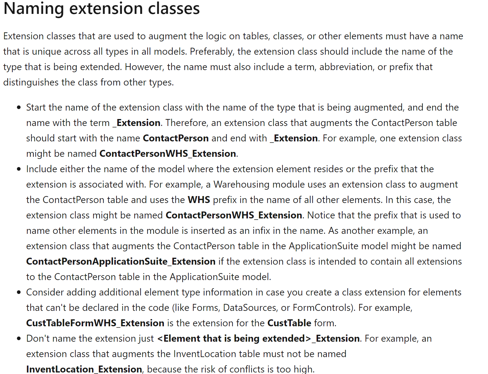
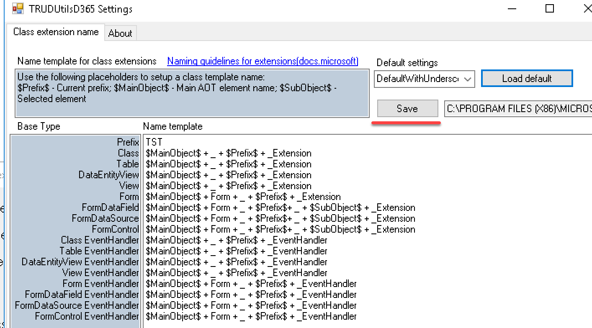
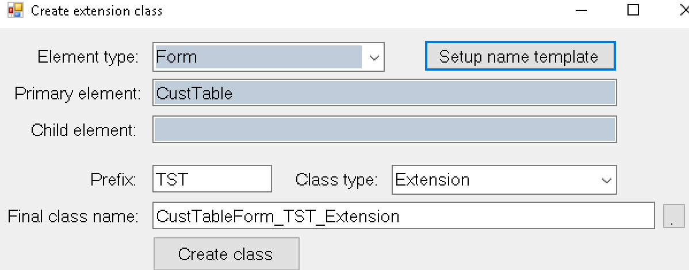

In D365FO Microsoft introduced a new concept of extension classes, which is different from standard elements. For example, for a form, you have the form design and all related code as one object. But for a form extension you create form design as one AOT object and all the code related to individual form extension components as separate AOT objects(extension classes). And this created a new problem for developers - how to name these classes.

Microsoft published some basic guidelines for this - [Naming guidelines for extensions-Naming extension classes](https://docs.microsoft.com/en-us/dynamics365/fin-ops-core/dev-itpro/extensibility/naming-guidelines-extensions#naming-extension-classes), but it seems these rules are not even used inside Microsoft teams.

The page provides some basic rules - technically extension classes are not new objects, so Suffix should be used instead of Prefix, and you need to create a distinction between objects with the same names(like form **CustTable** and table **CustTable**)



Some objects from the standard code follow these rules, but many don't. Let's check standard objects in 10.0.5 application:

```csharp
[ExtensionOf(tableStr(InventTable))]
public final class AppTroubleshooting_InventTable_Extension
```

Why is the name not InventTable**AppTroubleshooting**_Extension?

```csharp
[ExtensionOf(formstr(BudgetReservationCreate_PSN))]
public final class BudgetReservationCreatePSN_Extension

[ExtensionOf(formStr(RetailStatementsPart))]
public final class RetailStatementsPart_Extension
```

These two are against the rule - "Don't name the extension just **_Extension**."

```csharp
[ExtensionOf(formStr(SalesEditLines))]
internal final class RevRecSalesEditLines_Extension

[ExtensionOf(formStr(LedgerJournalTable))]
internal final class RevRecLedgerJournalTableForm_Extension
```

Here "**RevRec**" is used as a prefix instead of suffix, but more interesting that for the first element they used an additional "**Form**" suffix but didn�t add it to the second one.  

So organising a naming convention even within Microsoft teams is a quite hard task.

## Why this is important

Currently, there is no combined view in Visual Studio to view the final code(that includes all applied extensions and event handlers), so proper naming convention helps you to quickly find objects and avoid code duplication(where the same logical function is implemented in two different classes).

It doesn't matter what rules you will follow, more critical that within one project names should be the same.

## Solution to this problem - automatic class creation

First, you need to define the naming conventions for your project. Currently, 8 elements can have extension classes; you need to define naming rules for all these elements(I have seen several dev guides where only 2 or 3 types were specified).

- Class
- Table
- DataEntityView
- View
- Form
- FormDataField
- FormDataSource
- FormControl

In addition to these rules, you also need to define rules where to put your event handlers. Technically event handlers are static methods and can be created in any class, but you should not put these static methods to extension classes(details can be found in this article - https://daxmusings.codecrib.com/2018/06/accidental-code-extensions.html). I think the best approach to use the same names as for extensions, but with the different suffix **_EventHandler**, and for forms put all handlers into one class.

So totally you need to define 16 rules.

I created a setup form where you can define these naming rules and added a function to quickly define an initial template (currently there are only two: with "_" and without).

You can adjust the default settings and save it to file



Next step is to exclude manual work when creating extension classes. I extended my "Create extension class" add-in to automatically generate a class name based on these rules(this form can be called for any object that allows extension classes)



As a result, the following class will be generated

```csharp
[ExtensionOf(formstr(CustTable))]
final class CustTableForm_TST_Extension
```

## Summary

You can download this Create class extension from the following https://github.com/TrudAX/TRUDUtilsD365/releases. If you find that something is missing or can be improved don't hesitate to leave a comment. If you have your own rules you can also send them to me(or create a Pull request) and I will add them as an option for the default settings.
