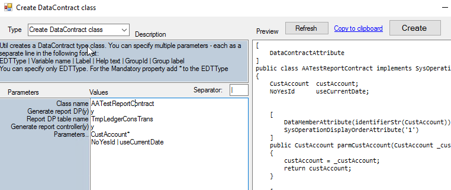

One of the most common applications of X++ SysOperation framework in D365FO is to build reports. In a common scenario, you need to create three classes: Contract, Data provider and Controller.

To generate all three classes, I extended my "**TRUDUtils - DataContract class builder**" Add-ins. You run it from the Dynamics 365 - Addins menu.

Let's consider the following example - a contract class **AATestReportContract** with 2 fields



### Data provider

To generate a template code for a data provider class you need to specify "y" for "**Generate report DP(y)**" parameter and specify a data provider table(better to use TempDB table here).

The following class with 2 methods - **getReportDataTmp()** and **processReport()** will be generated 

```csharp
[SRSReportParameterAttribute(classStr(AATestReportContract)),
SRSReportQueryAttribute(queryStr(LedgerJournalTrans))]  //Change query
public class AATestReportDP extends SrsReportDataProviderPreProcessTempDB
{
    TmpLedgerConsTrans tmpLedgerConsTrans;

    [SRSReportDataSetAttribute(tableStr(TmpLedgerConsTrans))]
    public TmpLedgerConsTrans getReportDataTmp()
    {
        select * from tmpLedgerConsTrans;
        return tmpLedgerConsTrans;
    }

    public void processReport()
    {
        AATestReportContract   reportContract;
        Query           query;

        reportContract  = this.parmDataContract();
        query           = this.parmQuery();
        //populate tempdb table here..
    }
}
```

### Controller

In order to generate a sample controller class, you need to specify "y" for "**Generate report controller(y)**" parameter.

In this case, the following class will be generated

```csharp
public class AATestReportController extends SrsReportRunController
{
    protected void prePromptModifyContract()
    {
        AATestReportContract      contract;
        super();
        contract = this.parmReportContract().parmRdpContract() as AATestReportContract;
        //handle external record
        if (!args || ! args.record() || args.dataset() != tablenum(CustGroup))
        {
            throw error(strfmt("@GLS110030",tablestr(CustGroup)));
        }
        CustGroup custGroup = args.record();
        //contract.parmGroupId(custGroup.GroupId);
        //Query query = this.getFirstQuery();
    }

    public static void main (Args args)
    {
        AATestReportController         reportController;

        reportController  = new AATestReportController();

        reportController.parmArgs(args);
        reportController.parmReportName(ssrsReportStr(SalesInvoice,Report));
        reportController.parmShowDialog(true);
        reportController.startOperation();
    }
}
```

After generation, you need to modify a code according to your needs. Addin allows you to do less typing and focus more on report logic.

If you are new to SSRS reports development, Docentric has a great post [Create a new custom SSRS report in D365FO](https://ax.docentric.com/create-a-new-custom-ssrs-report-in-d365fo/). Also [Microsoft Dynamics AX 2012 White Paper: Report Programming Model](https://www.microsoft.com/en-in/download/details.aspx?id=27725) provides some development examples.

## Summary

You can download this "**DataContract class builder**" from the following link https://github.com/TrudAX/TRUDUtilsD365/releases. If you find that something is missing or can be improved, don't hesitate to leave a comment.
