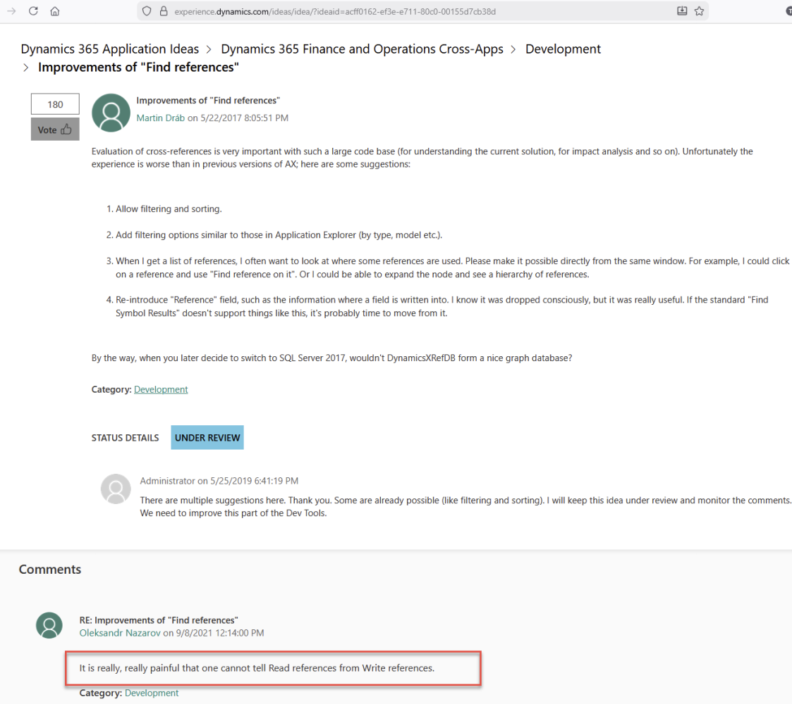
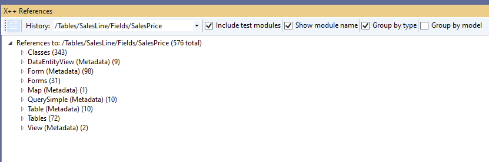
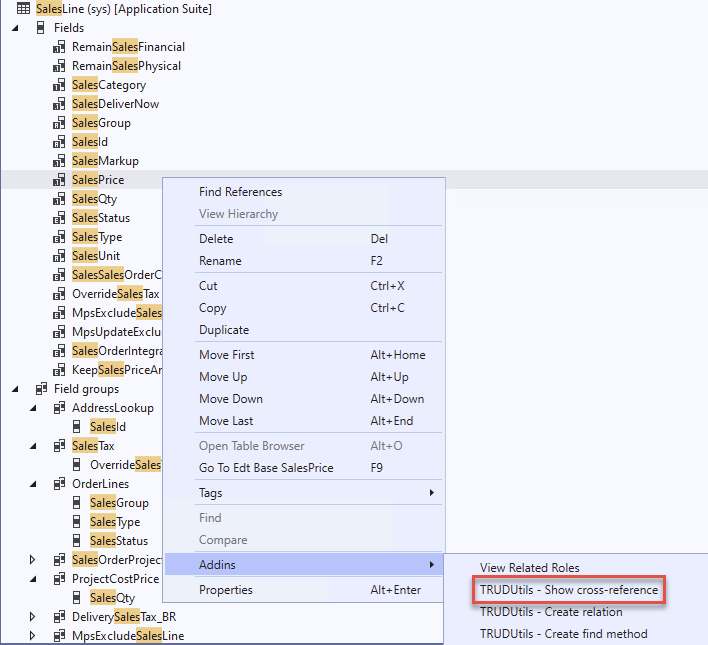
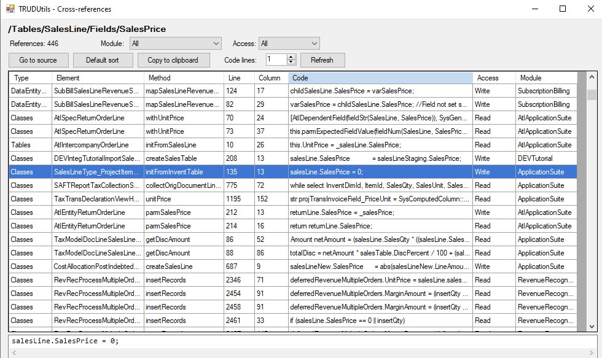
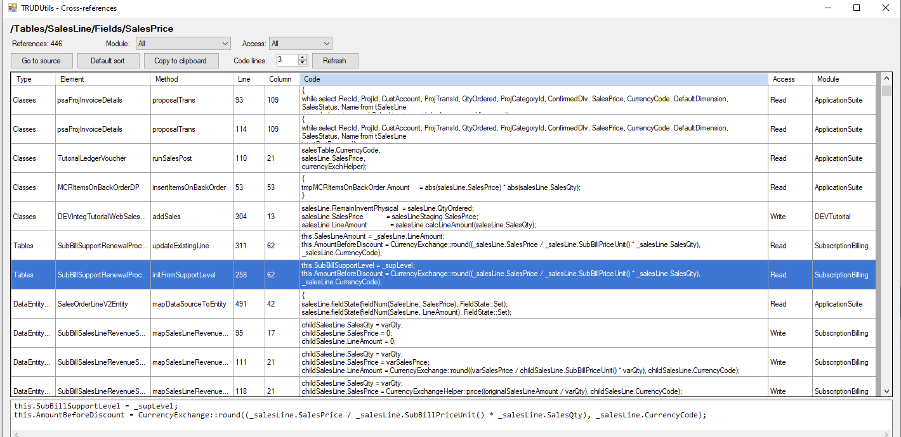

From the first release of Visual Studio for X++ development, one of the top [ideas](https://experience.dynamics.com/ideas/idea/?ideaid=acff0162-ef3e-e711-80c0-00155d7cb38d) was to improve cross-references - specifically, to add a **Read/Write** modifier in the **Cross-Reference form**:    

​              

​                      

I don't know why Microsoft has not been fixing this for so long.  In the latest release 10.0.47 they introduced a new Cross-reference form (with **Model** and **Type** grouping), but still don't address the main issue: **Read** vs **Write** references for table fields.    

​              

​                      

​      This is quite a typical task in X++ development: you have a table field and want to know which code updates this field.    

​      Recently, I managed to connect **Claude Code** to the [TRUDUtilsD365](https://github.com/TrudAX/TRUDUtilsD365) DevTools project, and it was able to implement this feature(The main challenge was [teaching](https://github.com/TrudAX/TRUDUtilsD365/blob/master/CLAUDE.md) Claude how to work with standard D365 DLLs - once that was sorted, it handled the rest).    

So a new [release](https://github.com/TrudAX/TRUDUtilsD365/releases) of **TRUDUtilsD365** DevTools includes a "**Show Cross-Reference**" Add-in that displays **Read**/**Write** access type for field references.    

​              

​                      

The idea is simple: find all code references to a field, extract the code line, and analyse whether it's a **Read** or **Write**. Currently, the detection looks for the "=" symbol - if the field is on  the left side, it's a Write; everything else is Read. It also handles  patterns like setField(fieldNum(...)).    

I tested it on several popular fields, such as **SalesLine.SalesPrice** and it works great. The tool also displays the actual code line  (configurable - one or several lines of context), so you can visually  confirm what the code does.    

View for 1 line:  

    

View for 3 lines:

    

Other features:    

- Supports tables, classes, forms, views, data entities, enums, methods, and extensions
- Filter by module and access type
- Go to source navigation (opens the X++ file at the exact line)
- Copy to clipboard (paste-friendly for Excel)

The tool is open-source and 100% AI-written, so if you're missing something, you can ask Claude to add it.    

I hope you find this tool useful. Install it from [here](https://github.com/TrudAX/TRUDUtilsD365?tab=readme-ov-file#using-power-shell)    

Feel free to ask questions!    (The original post for this tool is here:  https://www.linkedin.com/pulse/x-show-cross-reference-readwrite-field-reference-denis-trunin-0p8ec  ).

