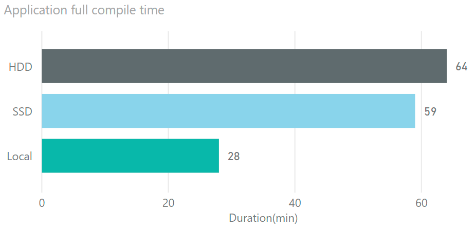
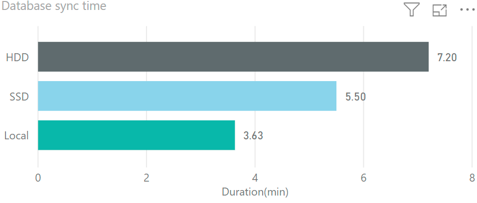
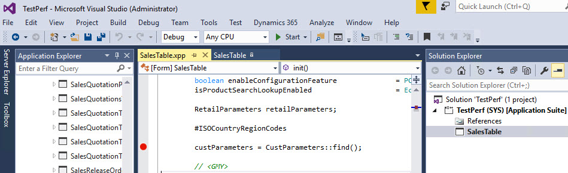
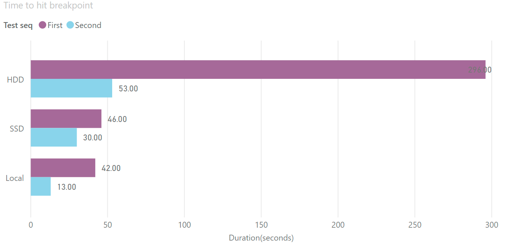
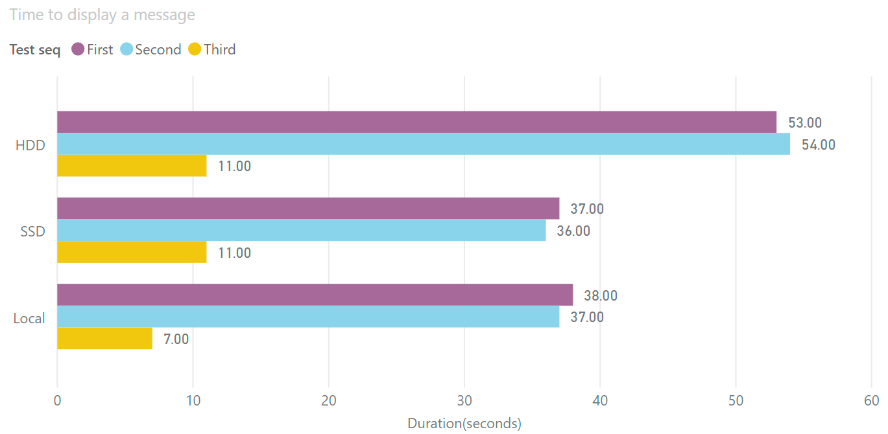

D365FO version requires more resources to perform development. In this post, I try to compare 3 popular development configurations and describe the pros and cons for each.

I have chosen the following VMs: Local Hyper-V Image, Azure VM based on SSD disks, Azure VM based on HDD disks.

There are detail specifications of these VMs:

| Name         | Local                            | SSD                                        | HDD                                        |
| ------------ | -------------------------------- | ------------------------------------------ | ------------------------------------------ |
| VM Type      | Local Hyper-V Image              | Standard D8s v3                            | Standard D12 v2                            |
| CPU          | Core i7-8700 3.2GHz, 6 cores     | E5-2673 v4 2.30GHz, 8 vcpus, 32 GiB memory | E5-2673 v4 2.30GHz, 4 vcpus, 28 GiB memory |
| Storage      | Samsung 970(more than 100k IOPS) | 5 premium disks                            | 16 HDD disks                               |
| Run cost     | Box for run 3 VMs - around 1.5k$ | 0.75$ per hour                             | 0.52$ per hour                             |
| Storage cost | 0                                | ~4$ per day                                | ~0                                         |

Both 3 VMs have used the same D365FO version - 10.0 PU24. After installation I disabled the following services:

- Microsoft Dynamics 365 Unified Operations: Batch Management Service

- Microsoft Dynamics 365 Unified Operations: Data Import Export Framework Service

- Management Reporter 2012 Process Service

## Overall system performance tests

First, let's compare overall system performance by running a full compile and full DB sync. They are not frequent operations for Dev machines, but they are very resource-intensive and it allows us to find out VMs overall capacity.

For the compile task I got the following results:



Compile is a CPU intensive task.

What is interesting here - SSD VM time is very close to HDD despite of the fact that SSD has 8 cores and HDD has 4 cores. The main reason for this - is that Dv3 series has CPUs with Hyperthreading enabled but Dv2 has CPUs with Hyperthreading disabled. Hyperthreading gives only a small boost, that is why it is very important when you plan you virtual infrastructure to keep in mind - when we say for example '8 core VM' - whether these are real cores or virtual ones.

Local VM has CPU with a higher clock speed and CPU itself has 6 physical cores - that explains more than 2 times difference in performance compared to the Azure-based machines.

Next test is a database synchronize:



Synchronize operation is IO and CPU-intensive task. Local VM has a more powerful IO system, and a more powerful CPU, that explains the better result. SSD VM performed much better compared to HDD in this test due to faster disks.

## Daily task tests

In order to test performance for more frequent developer tasks I chose 2 tasks - time to hit breakpoint and time to display 'Hello world' message from the job. In AX2012 both these tasks have near-zero execution time, you don't need to wait.

### Time to hit breakpoint test

Before the test I opened the AX main screen, to warm the system cache.

To prepare for this test I switched off 'Load symbols for items in the solution'. Then I opened AOT, searched for **SalesTable** form and added it into the new project. Marked the form as a startup object. After that opened the code and added a new breakpoint to the **init()** method.

Time in this test - is the time between I pressed **Start** and the time when the breakpoint was hit.



Two tests were performed to see how the cache changes this time



HDD VM was very slow in this test. You need to wait almost 5 minutes to see your first breakpoint! SSD and Local VMs first run was the same, but the second run Local VM was faster.

### Hello world test

This test was performed straight after the breakpoint test, but I restarted Visual Studio. In this test I created a new project and added a Runnable class with the following code

```charp
info("Hello world");  
```

On the second run, I changed this test to "Hello world2". On the Third run I didn't change the text, just run the same job.

I measured the time between pressing Start and the time when the message displayed in the browser. 

Here are the results:



You need to wait almost a minute for the HDD to see the results of a simple job. For Local and SSD it is 70% faster. Local VM also executed the job faster if it was not changed - probably due to a high single-core CPU speed(but you still need to wait 7 second, it is not instant)

## Conclusion

For D365FO typical development actions can take longer time comparing to AX2012 where most operations were near-instant. But, by choosing a proper hardware for Development VM you can compensate this time to some extent. There is no right answer what to choose, you need to consider your situation:

- If you want maximum performance and can buy a new hardware(and now you can buy a PC that has 10-20% more [speed](https://www.cpubenchmark.net/singleThread.html) than mine) - Local VM is the best choice, but this VM is hard to manage.
- Azure Premium disks VM(SSD) is the best choice if you can spend a little bit more for the cloud. It costs 6$ more per day(10 hours) than HDD, but provides a noticeable performance boost. But you need to pay for the storage - if you use this VM only sometimes it can be expensive.
- Azure standard disks(HDD) VM is the most commonly used configuration, but according to my tests, it is not the best choice for an active project. If you just do a simple math(typical consulting rate is 180$ per hour(3$ per minute), 5 minutes wait for the first breakpoint will cost you more than the daily price difference with SSD VM)

I also will try to repeat the same tests after the next D365FO release, it will be interesting to compare the progress in this area.
