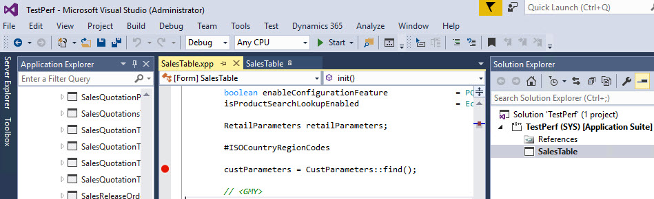
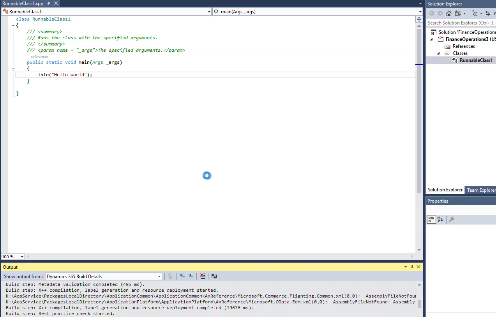

Starting from PU37 Microsoft has changed Dynamics 365 Finance and Operation development environment from Visual Studio 2015 to VS2017. This post is an updated version of my [previous one for VS2015](https://denistrunin.com/devvm-perfv10/), I try to compare the performance of 4 development configurations with the new VS2017 version.

I have chosen the following VMs:

- Local Hyper-V Image
- Standard VM based on 3 HDD disks - this is a default Development setting in LCS
- Azure VM based on Premium SSD disks
- Azure VM based on 15 HDD disks - changed via LCS Advanced settings

There are detail specifications of these VMs:

| Name                   | Local                                       | SSD                                                 | HDD15                                                 | HDD3                                                |
| ---------------------- | ------------------------------------------- | --------------------------------------------------- | ----------------------------------------------------- | --------------------------------------------------- |
| VM Type                | Local Hyper-V Image                         | Standard D8s v3                                     | Standard D12 v2                                       | Standard D12 v2                                     |
| CPU                    | Core i7-8700 3.2GHz, 6 cores, 24 GiB memory | Xeon Platinum 8171M 2.10GHz, 8 vcpus, 32 GiB memory | Xeon Platinum 8272CL, 2.60GHz, 4 vcpus, 28 GiB memory | Xeon Platinum 8171M 2.10GHz, 4 vcpus, 28 GiB memory |
| Storage                | Samsung 970(more than 100k IOPS)            | 3 premium disks 512GB (2300 IOPS) + build           | 15 HDD disks 32GB (500 IOPS)+ build                   | 3 HDD disks 512GB (500 IOPS)+ build                 |
| Run cost               | Box for run 3 VMs - around 1.5k$            | 0.75$ per hour                                      | 0.52$ per hour                                        | 0.52$ per hour                                      |
| Storage cost (monthly) | 0                                           | 219 USD                                             | 24 USD                                                | 65 USD                                              |

One thing to note: in Azure the [performance of SSD disks](https://docs.microsoft.com/en-us/azure/virtual-machines/disks-types#disk-size-1) depends on the disk size and it is different from HDD performance that is always 500 IOPS.


That means that in Azure word SSD disk is not always better than HDD. It is also tricky to do any tests with SSD because they have [disk bursting](https://docs.microsoft.com/en-us/azure/virtual-machines/linux/disk-bursting) than can temporary increase disk IOPS to 3500 up to 30 minutes.
I did some testing with 16HDDs(500 IOPS) and 3 SSD 512GB, 2300IOPS max( + Build 26GB ) and get the following results: for 16HDD you will get 8000 stable IOPS, for 3 SSD you get 7100 stable IOPS and Bursting can temporarily add 3500 IOPS.


## System version and initial setup

Both 4 VMs have used the same D365FO version - Finance and Operations - Develop (10.0.13 with Platform update 37). After installation I disabled the following services:

- Microsoft Dynamics 365 Unified Operations: Batch Management Service

- Microsoft Dynamics 365 Unified Operations: Data Import Export Framework Service

- Management Reporter 2012 Process Service

Added D365 Defender Rules:

```powershell
Install-Module -Name d365fo.tools
Add-D365WindowsDefenderRules
```

## Overall system performance tests

First, let's compare overall system performance by running a full compile and full DB sync. They are not frequent operations for Dev machines, but they are very resource-intensive and it allows us to find out VMs overall capacity.

For the compile task I got the following results:


The times are much longer than in previous VS2015.

Next test is a database synchronize:


Synchronize operation is IO and CPU-intensive task. Local VM has a more powerful IO system, and a more powerful CPU, that explains the better result. SSD VM performed better compared to HDD in this test due to faster disks. And again ~ 30% performance decrease compared to VS2015.

## Daily task tests

To test performance for more frequent developer tasks I chose 2 tasks - time to hit breakpoint and time to display 'Hello world' message from the job. In AX2012 both these tasks have near-zero execution time, you don't need to wait.

### Time to hit breakpoint test

Before the test I opened the D365FOmain screen, to warm the system cache.

To prepare for this test I switched off 'Load symbols for items in the solution'. Then I opened AOT, searched for **SalesTable** form and added it into the new project. Marked the form as a startup object. After that opened the code and added a new breakpoint to the **init()** method.

Time in this test - is the time between I pressed **Start** and the time when the breakpoint was hit.



For HDD03 VM this test initially failed, I got a Timeout message.


Two tests were performed to see how the cache changes this time.


The result probably depends on IO speed.

### Hello world test

This test was performed straight after the breakpoint test, but I restarted Visual Studio. In this test, I created a new project and added a Runnable class with the following code

```csharp
info("Hello world");  
```

On the second run, I changed this test to "Hello world2". On the Third run I didn't change the text, just run the same job.

I measured the time between pressing Start and the time when the message displayed in the browser.

Here are the results:


The problem that for HDD based machines that test also failed from the first attempt, Visual studio just hung, the solution was to kill the process and restart it again(that explained that HDD "First times" are better)



## Conclusion

Let's summarize the current recommendations based on these tests for Visual Studio 2017 D365FO development environment and what to do if it is slow:

- If you want maximum performance and can buy new hardware(and now you can buy a PC that has 10-20% more [speed](https://www.cpubenchmark.net/singleThread.html) than mine) - Local VM is the best choice, but this VM is hard to manage.

- Standard Development Environment from LCS(with the default of 3 HHD disks) is the slowest and constantly hangs. If you can control the Environment creation - never use it and always change the number of disks(15 32GB HDD are cheaper and faster).

- HDD15 VM is the best choice in term of price/performance. It is a little bit slower than SSD based VM, but the storage price(that should be paid even if VM is deallocated) is almost 10 times cheaper(24 vs 220 USD)

I also will try to repeat the same tests after the next D365FO release, it will be interesting to compare the progress in this area.
