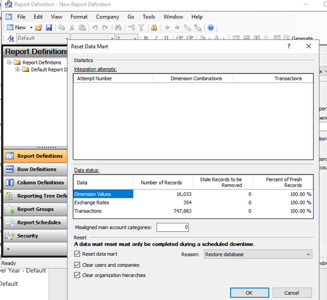
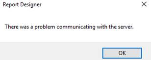
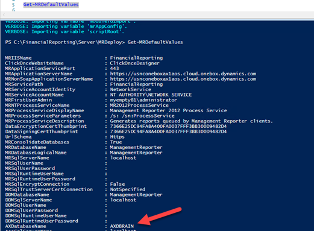
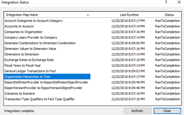

Using Financial reporting (aka Management Reporter in Ax2012) on local DEV D365FO one box requires some addition settings, that are not yet documented. This post describes the problem and possible solution.

## Problem description

Let's start with the standard 8.1PU20 VM One box.

Download and install it, rename and execute AdminUserProvisioning tool.

Then open *General ledger - Inquiries and reports - Financial reports* and press New in this form

Go to the Tools - Reset Data Mart and press OK.



You will get the error "There was a problem communicating with the server"



 and weird text in the Event log, like this

> exceptionMessage {"Class":16,"Number":8169,"State":2,"Message":"Conversion failed when converting from a character string to uniqueidentifier.","ErrorCode":-

There is a standard topic about Data Mart reset on the docs site, but it works only if you have a proper connection properties

<https://docs.microsoft.com/en-us/dynamics365/unified-operations/dev-itpro/analytics/reset-financial-reporting-datamart-after-restore?toc=/fin-and-ops/toc.json>

If your search the same topic for AX2012, you will find several posts, that describe full reset(like this one - Management Reporter: Rebuilding your Data Mart
<https://community.dynamics.com/365/financeandoperations/b/dynamicsaxbi/archive/2016/02/01/management-reporter-rebuilding-your-data-mart> )

But the problem is that in D365FO we don't have MR Configuration Console, instead, PowerShell should be used.

## Solution

Let's recreate a Data Mart using the standard PowerShell scripts

Open PowerShell ISE as administrator

As a first step, let's back up our existing ManagementReporter database

```powershell
$FileNameLocal = "C:\backup\ManagementReporter.bak"
$FileDirName = Split-Path $FileNameLocal
New-Item -ItemType Directory -Path $FileDirName -Force
Backup-SqlDatabase -ServerInstance localhost -Database "ManagementReporter" -BackupFile $FileNameLocal -CompressionOption On
```

Then import the standard MRDeploy library and check it's default settings

```powershell
cd C:\FinancialReporting\Server\MRDeploy
Import-Module –Name C:\FinancialReporting\Server\MRDeploy\MRDeploy.psm1 -Verbose
Get-MRDefaultValues
```

The current problem is that many pre-configured parameters contain irrelevant to local One box values(like DB name is AXDBRAIN instead of AxDB, some users credentials are empty)



I could not find any documentation that describes the correct configuration for One box, so just specified one value for all user accounts.

```powershell
Set-MRDefaultValues -SettingName AXDatabaseName -SettingValue AxDB
Set-MRDefaultValues -SettingName AosUserName -SettingValue AOSUser
Set-MRDefaultValues -SettingName AosUserName -SettingValue AOSWebSite@123
Set-MRDefaultValues -SettingName AosWebsiteName -SettingValue AOSService
Set-MRDefaultValues -SettingName MRSqlUserName -SettingValue AOSUser
Set-MRDefaultValues -SettingName MRSqlUserPassword -SettingValue AOSWebSite@123
Set-MRDefaultValues -SettingName MRSqlRuntimeUserName -SettingValue AOSUser
Set-MRDefaultValues -SettingName MRSqlRuntimeUserPassword -SettingValue AOSWebSite@123
Set-MRDefaultValues -SettingName DDMSqlUserName -SettingValue AOSUser
Set-MRDefaultValues -SettingName DDMSqlUserPassword -SettingValue AOSWebSite@123
Set-MRDefaultValues -SettingName DDMSqlRuntimeUserName -SettingValue AOSUser
Set-MRDefaultValues -SettingName DDMSqlRuntimeUserPassword -SettingValue AOSWebSite@123
Set-MRDefaultValues -SettingName AXSqlUserName -SettingValue AOSUser
Set-MRDefaultValues -SettingName AXSqlUserPassword -SettingValue AOSWebSite@123
Set-MRDefaultValues -SettingName AXSqlRuntimeUserName -SettingValue AOSUser
Set-MRDefaultValues -SettingName AXSqlRuntimeUserPassword -SettingValue AOSWebSite@123
```

The main script can then be run. It will delete the existing ManagementReporter database and performs a new DB initialization.

```powershell
New-MRSetup  -IntegrateDDM
```

After that, you can run the Reset command without errors. If you check Integration status you will see "Integration complete"



## Summary

I posted the whole script to GitHub - <https://github.com/TrudAX/TRUDScripts/tree/master/FinancialReporting> It has been tested for the 8.1 version. If you find any issues or have ideas how to improve it, Pull requests are always welcome. Hope Microsoft will fix this in the new version, as right now it looks like a missing documentation step.