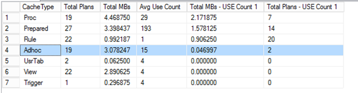
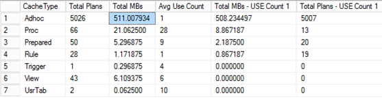
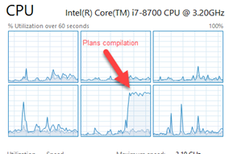
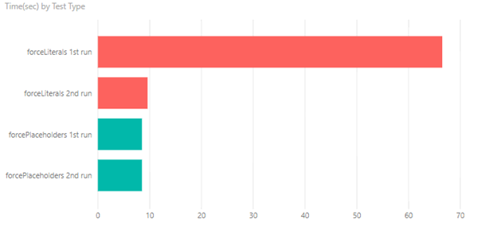

The idea of this post came after discussing new PU23 feature “Enabling index hints in X++ again”

<https://docs.microsoft.com/en-us/dynamics365/unified-operations/fin-and-ops/get-started/whats-new-platform-update-23#enabling-index-hints-in-x-again>

And the main question during the discussion was – Do we really need “index hints” for the modern SQL Server?

First of all some theory about SQL statement execution.
In D365FO we have 2 way of executing a SQL statement

### **ForcePlaceholders**

This is the default for SQL Statements. In this case, every SQL Statement that you write in X++, processed in 2 steps – first **sp_prepare** command executed with placeholders instead of actual values and the result of this **sp_prepare** is the cached plan. Then **sp_cursorexecute** is called that executes the statement using the plan and the actual values. For one statement with the different values, the plan is calculated only once.

How does the SQL server knows what plan to generate in **sp_prepare** if the statement in new (for some values one plan can be more efficient than another)? For the unknown plans it uses “parameters sniffing” feature. If it gets **sp_prepare** command for the new statement, it doesn’t try to calculate it immediately, instead, it waits for the first call of **sp_cursorexecute** and uses the first call values to calculate the plan.

### **ForceLiterals**

In this case, your actual SQL statement (with the actual values) is sent to SQL Server and executed as is. The drawback is that for every set of values you will need to parse this statement and compile a SQL plan.

### **Parameters sniffing**

Parameters sniffing quite often becomes a reason for the performance problems. For example, you have a warehouse where most of the items have one batch ID, but there are some Items and batches with general names (like “No batch”, “Empty”). In this situation when you query item by batch your actual plan depends on the first query values. If you query contains “general” batch values, SQL Server creates a plan that starts execution with the ItemId as a “general batch value” is not selective in this case. But for most of your items, it will be wrong and gives huge overhead as in most cases Batch is a unique value.

**How to resolve a Parameters sniffing issue**:

There is no universal way to resolve Parameters sniffing issue(refer to the excellent BrentOzar post that describes this <https://www.brentozar.com/archive/2013/06/the-elephant-and-the-mouse-or-parameter-sniffing-in-sql-server/> ), but there are several ways to deal with it in D365FO

- Create new indexes – you can create new indexes to help SQL server always choose the best plan. This often works only if you have conditions to one table only
- Use the **sp\_create\_plan\_guide** command to force the actual plan – using this path creates a big admin overhead as you need to maintain these created plans. In case you add a new field in AX table you need to change all plan guides that use this table
- **forceLiterals** hint –you send actual values to SQL Server and it chooses the best plan for these values. The overhead that the plan needs to be compiled each time
- Use index hint (new feature in PU23) – it is the same as **sp\_create\_plan\_guide** but with no admin overhead

## Overhead of forceLiterals usage

Let’s check what is the overhead of **forceLiterals** usage(I have tested this on medium size AX2012 DB and on D365 8.1 demo, time proportions were the same in both cases)

For the test let’s use the following job. It calculates actual item quantity for the warehouse.

```java
class dev_testForceLiterals
{
    public static void main(Args _args)
    {
        InventTable         inventTable;
        InventDim           inventDim;
        InventSum           inventSum;
        InventLocation      inventLocation;
        int                 curCount, maxCount = 5000;
        System.Diagnostics.Stopwatch stopwatch = new System.Diagnostics.Stopwatch();
        real                         timeMs;
        ;
        stopwatch.Start();
        while select inventTable
        {
            while select inventLocation
            {
                //select forcePlaceholders  //case 1
                select forceLiterals        //case 2
                    sum(AvailPhysical) from inventSum
                group by ItemId
                where inventSum.ItemId == inventTable.ItemId &&
                      inventSum.Closed == false
            exists join inventDim
                where inventDim.inventDimId      == inventSum.InventDimId &&
                      inventDim.InventLocationId == inventLocation.InventLocationId &&
                      inventDim.InventSiteId     ==   inventLocation.InventSiteId;

                curCount++;
                if (curCount > maxCount) break;
            }
            if (curCount > maxCount) break;
        }
        stopwatch.Stop();
        timeMs = stopwatch.get_ElapsedMilliseconds();
        info(strFmt("Time for %1 lines: %2 sec", curCount, timeMs / 1000));
    }
}
```

Before each run we clear SQL plan cache using the following command (note that this command only clears plan cache, not the data cache, all used tables are located in memory)

```sql
DBCC FREEPROCCACHE
GO
```

To calculate memory consumption after each run we will use the following statement

```sql
SELECT objtype AS [CacheType]
        , count_big(*) AS [Total Plans]
        , sum(cast(size_in_bytes as decimal(18,2)))/1024/1024 AS [Total MBs]
        , avg(usecounts) AS [Avg Use Count]
        , sum(cast((CASE WHEN usecounts = 1 THEN size_in_bytes ELSE 0 END) as decimal(18,2)))/1024/1024 AS [Total MBs - USE Count 1]
        , sum(CASE WHEN usecounts = 1 THEN 1 ELSE 0 END) AS [Total Plans - USE Count 1]
FROM sys.dm_exec_cached_plans
GROUP BY objtype
ORDER BY [Total MBs - USE Count 1] DESC
```

### **forcePlaceholders results**

For the first and for the second execution time was the same

First run: 8,51 sec

Second run: 8,51 sec

Memory consumption



### **forceLiterals results**

First run: 66,57 sec

Second run: 9,60 sec

Memory consumption



Almost 100% utilization for 1 CPU core during the execution



If we put these values into the diagram



Memory consumption is about 100KB per saved plan. So in forceLiterals case, it requires a 500MB memory per 5k SQL statements. This is a large amount of memory just for the plan cache.

## Results analysis

Plan compilation is still a complex task that consumes a lot of CPU. This 1-minute difference between the first run of **forceLiterals** and **forcePlaceholders** is utilizing one CPU core for 100%. For the **forceLiterals** case, time to build a plan is 6 times more than a time to fetch actual data. Also, notice a difference between the second run for **forceLiterals** and **forcePlaceholders**. It is about a second – this time is a time server spend doing lexical parsing of SQL statement.

For single SQL statements (or statements that executes once per document header) **forceLiterals** can provide some benefit, but if we have a large number of users who are working with different items and different dimensions **forceLiterals** usage for the frequent SQL requests can affect overall SQL server performance (both for memory consumption and CPU), so we need to avoid **forceLiterals** usage on per line level. And the new “index hints” feature can help us in this.
