---
title: "D365FO Integration: Import Purchase Orders from PDF using Gemini AI"
date: "2025-09-10T22:12:03.284Z"
tags: ["Integration", "XppDEVTutorial"]
path: "/integration-importpurchpdf"
featuredImage: "./logo.png"
excerpt: "Learn how to use AI to import purchase orders into Dynamics 365 Finance from complex PDF files. This post covers integration design, sample prompts, and practical code examples."
---

In this blog post, I'll guide you through the process of using AI to import purchase orders into Dynamics 365 Finance and Operations (D365FO) from complex PDF files.

Although the example provided here is simplified to illustrate core integration concepts, the approach and code samples are based on real-world scenarios. This makes them highly adaptable for similar integration tasks you might encounter. We'll utilize the free and open-source External Integration [Framework](https://github.com/TrudAX/XppTools?tab=readme-ov-file#devexternalintegration-submodel), which provides reusable components explicitly designed for building robust integrations in X++.

## Integration Scenario Overview

Let's start by defining the integration scenario:

**Goal: The customer receives complex invoice documents from external vendors as PDF files. We want to create Purchase orders in D365FO based on these documents.**

## Current solutions on the market

Before approaching this task, I researched the available options.

### PDF to Excel converters

There are numerous online services, such as https://studio.convertapi.com/pdf-to-excel and https://www.ilovepdf.com/pdf_to_excel, that claim to extract tables from invoice documents. The idea was that the user converts the PDF to an Excel template and then uploads it to D365FO.

However, after initial testing, they generated many errors in the line sections—for example, empty cells when a description spans two lines, or merged cells where columns should be separate, etc.

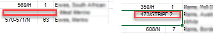

### Invoice capture solution

The invoice [capture solution](https://learn.microsoft.com/en-us/dynamics365/finance/accounts-payable/invoice-capture-overview) is a standard option for Microsoft Dynamics 365 for Finance and Operations (D365FO). It is based on the Power Platform and utilises Optical Character Recognition (OCR) to parse invoices. 

I researched it and found:

- The installation document is 65 [pages](https://github.com/TrudAX/denistrunin-blog/blob/master/src/posts/integration-importpurchpdf/Assets/Implementation_Guide_Invoice_Capture_GA_1.9.1.x.pdf) long, and you must be an administrator of “everything” just to try it.
- Because it’s based on the Power Platform, extensibility is limited.
- The Yammer group is full of questions (for example, why something is incorrectly parsed on page 2) without clear responses.

Because invoice capture relies on Azure services, I tried Microsoft AI Foundry [Document Intelligence](https://azure.microsoft.com/en-us/products/ai-services/ai-document-intelligence/#Pricing-5) directly in Azure, and result's were not perfect even on the first sample (see below)

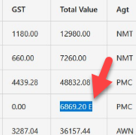

The advantage of OCR is that it provides a direct link between the image and the parsed data, and it is quite fast. However, after the initial research, I decided not to pursue this further.

### Use AI models

We currently live in an AI world, and many modern models support file inputs. The idea was to use an AI model to read the document and output it as a JSON structure. Then, use the External Integration Framework (which can work with [JSON data](https://denistrunin.com/xpptools-integservbussalesjson/)) to create the required D365FO documents. 

I tried several models and got the best results with Gemini 2.5 [Flash](https://deepmind.google/models/gemini/flash/). It’s among the fastest on the market, and performance is essential. For example, an invoice with ~200 lines (4–5 pages) takes about 2 minutes to process.

After some quick prototyping with Claude Code, I extended the External Integration Framework with a “Get data from AI” option. Below are the setup and usage instructions. 

*Note: Microsoft recently released a Power App [Sales Order Agent](https://github.com/microsoft/Dynamics-365-FastTrack-Implementation-Assets/tree/master/AI%20ERP%20Agents/Sales%20Order%20Agent#configuration-wizard) that implements a similar concept of processing documents by defining custom prompts and then utilising virtual data entities. However, the customisation option is unclear(probably not even possible)*.

## External integration AI solution setup

In this section, we'll discuss how to set up AI for PDF import.

### AI Providers

You can have multiple AI providers. Define a provider using the **AI Providers** form. A provider is a class that extends a [DEVIntegAIProviderBase](https://github.com/TrudAX/XppTools/blob/master/DEVTutorial/DEVExternalIntegration/AxClass/DEVIntegAIProviderBase.xml) and defines the following:

- A set of parameters with default values that the user may override(in this case it is a model)
- A free‑text description of how to set up the provider
- A connection reference that defines the endpoint and API key
- A method that implements the call to the AI provider

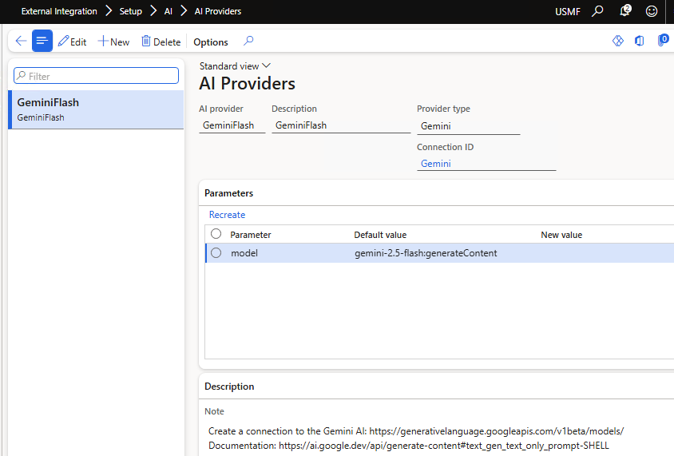

In the current implementation, we can use only one [Gemini](https://github.com/TrudAX/XppTools/blob/master/DEVTutorial/DEVExternalIntegration/AxClass/DEVIntegAIProviderGemini.xml) class, but you can extend it later.

### Connection type

To store an API key, we need to create a connection type. The Google Gemini endpoint is: https://generativelanguage.googleapis.com/v1beta/models/.

To obtain the key, sign in to https://aistudio.google.com and click the "**Get API Key**". The price is a fraction of a cent per 1 page.

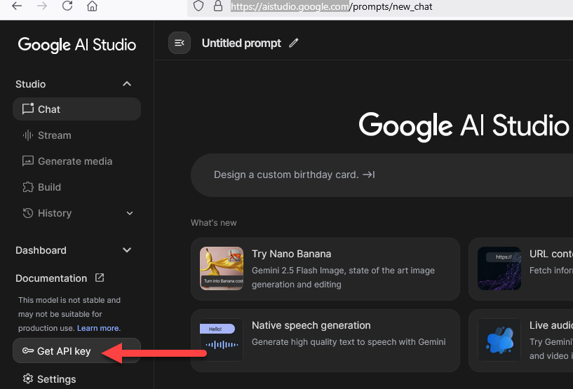

Enter these values in the **Connections** form. 

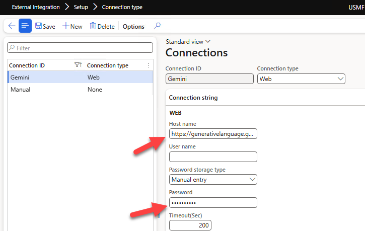

Also, we need to create a **Manual** connection for the inbound message.

### AI Prompt Definition

After setting up the connection, define a prompt. The **AI Prompt Definition** form lets you define and validate the prompt.

First, validate that the connection works by sending a simple “Hi” prompt. The **Call API** button runs the prompt, displays the response, and shows related statistics.

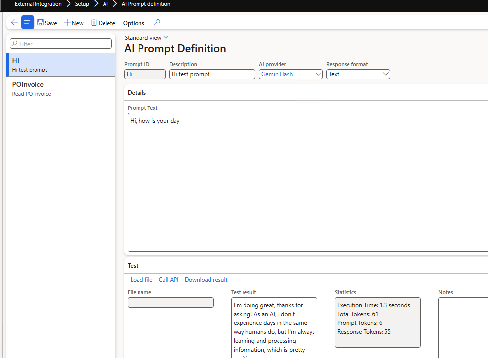

Then define a prompt for invoice parsing and test it on sample invoices.

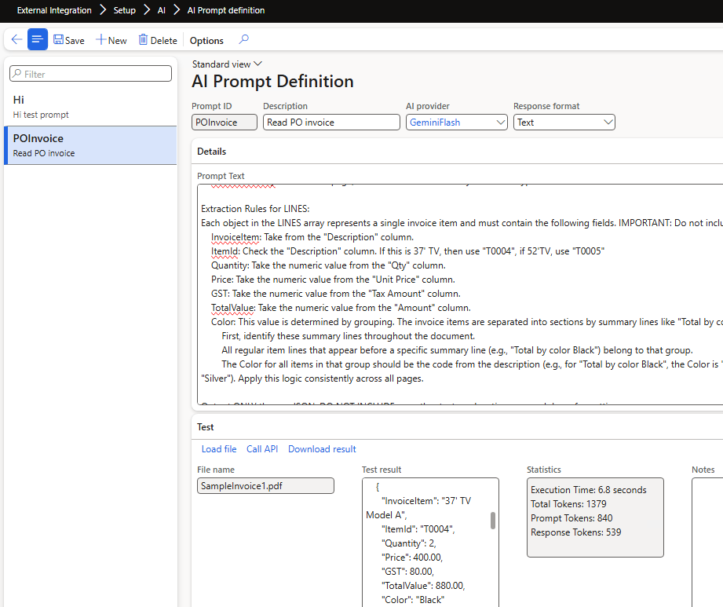

A sample prompt used here: 

```json
You are an expert at extracting structured data from multi-page PDF invoices. Your task is to process the entire document and produce a single, valid JSON object.
The JSON object must have two top-level keys: HEADER and LINES.
    HEADER: A single JSON object containing summary information from the invoice.
    LINES: A JSON array of objects, where each object represents a single purchased item.
Extraction Rules for HEADER:
    VendorName: This is printed on the first page header before or after the "Tax Invoice" label after "Vendor:" label. 
    ReceiptDate: Find the "Delivery date" date on the first page. Convert this to a "yyyy-MM-DD" format.
    PurchPoolId: Extract the value located directly below the "Delivery date" date on the first page. 
    ChargeValue: At the end of the document, there is a line that states "Handling fee". Get the value from it, the data type should be real, if not found 0.
    InvoiceTotalAmount: On the final page, find the line "Grand Total". Extract the final numeric total. The data type must be a number.
    InvoiceTotalQty: On the final page, find the line "Total Quantity". The data type must be a number.

Extraction Rules for LINES:
Each object in the LINES array represents a single invoice item and must contain the following fields. IMPORTANT: Do not include summary or Total by lines as items in this array.
    InvoiceItem: Take from the "Description" column.
    ItemId: Check the "Description" column. If this is 37' TV, then use "T0004", if 52'TV, use "T0005"
    Quantity: Take the numeric value from the "Qty" column.
    Price: Take the numeric value from the "Unit Price" column.
    GST: Take the numeric value from the "Tax Amount" column.
    TotalValue: Take the numeric value from the "Amount" column.
    Color: This value is determined by grouping. The invoice items are separated into sections by summary lines like "Total by color Black", "Total by color Silver".
        First, identify these summary lines throughout the document.
        All regular item lines that appear before a specific summary line (e.g., "Total by color Black") belong to that group.
        The Color for all items in that group should be the code from the description (e.g., for "Total by color Black", the Color is "Black"; for "Total by color Silver", the Color is "Silver"). Apply this logic consistently across all pages.

Output ONLY the raw JSON. DO NOT INCLUDE any other text, explanations, or markdown formatting.
```


If you notice that the abilities are quite powerful, we can utilise AI to implement simple mappings. For example, to convert from **InvoiceItem** to **ItemId**, I defined a couple of rules. To derive the **Color** for each line, we used quite a complex logic based on the “Total by color” group. 

However, if the mapping requires numeric comparisons (e.g., greater/less), Flash 2.5 can struggle; in that case, include all the necessary data in the output and implement the logic in X++.  

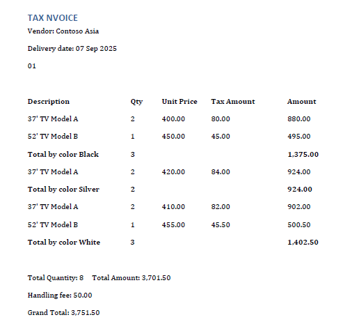

Output for the [invoice](https://github.com/TrudAX/denistrunin-blog/blob/master/src/posts/integration-importpurchpdf/Assets/SampleInvoice1.pdf) above looks like this:

```json
{
  "HEADER": {
    "VendorName": "Contoso Asia",
    "ReceiptDate": "2025-09-07",
    "PurchPoolId": "01",
    "ChargeValue": 50.00,
    "InvoiceTotalAmount": 3751.50,
    "InvoiceTotalQty": 8
  },
  "LINES": [
    {
      "InvoiceItem": "37' TV Model A",
      "ItemId": "T0004",
      "Quantity": 2,
      "Price": 400.00,
      "GST": 80.00,
      "TotalValue": 880.00,
      "Color": "Black"
    },
    {
      "InvoiceItem": "52' TV Model B",
      "ItemId": "T0005",
      "Quantity": 1,
      "Price": 450.00,
      "GST": 45.00,
      "TotalValue": 495.00,
      "Color": "Black"
    },
    {
      "InvoiceItem": "37' TV Model A",
      "ItemId": "T0004",
      "Quantity": 2,
      "Price": 420.00,
      "GST": 84.00,
      "TotalValue": 924.00,
      "Color": "Silver"
    },
```

This output will be used as initial data for the processing class.

### Inbound message type 

To setup processing, we need to create a new Inbound message type with a processing class  [DEVIntegTutorialPurchOrderOCRProcess](https://github.com/TrudAX/XppTools/blob/master/DEVTutorial/DEVExternalIntegrationSamples/AxClass/DEVIntegTutorialPurchOrderOCRProcess.xml) which reads the JSON from the AI call and creates a purchase order based on it.

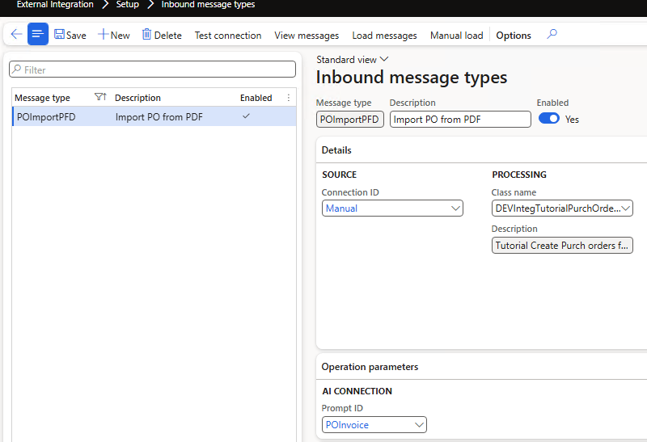

As a custom parameter, this class requires a link to the previously defined prompt.

### Operation parameters

We also need some custom parameters. When importing documents, you’ll likely define rules for tax calculation. There are usually two options: either take the value from the document (and then use the line **Tax adjustment**) or calculate it directly in D365FO. The latter requires defining a **Zero tax** group. 

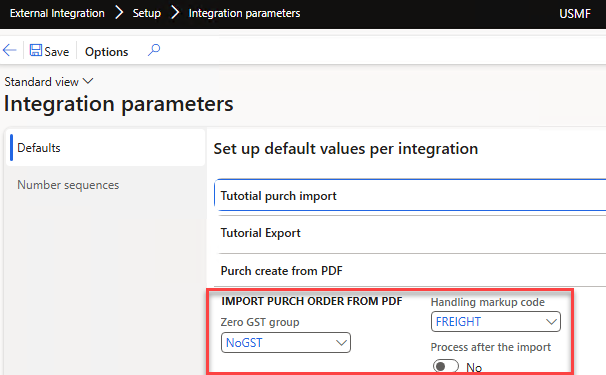

## Main modification description

After specifying all settings, we can test the import. Open **Tutorial Purchase orders OCR Staging** and select **New order import**.

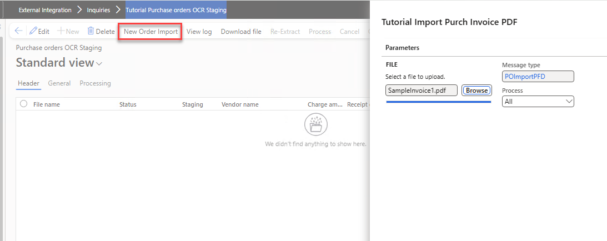

The system analyses the provided PDF and creates staging data.

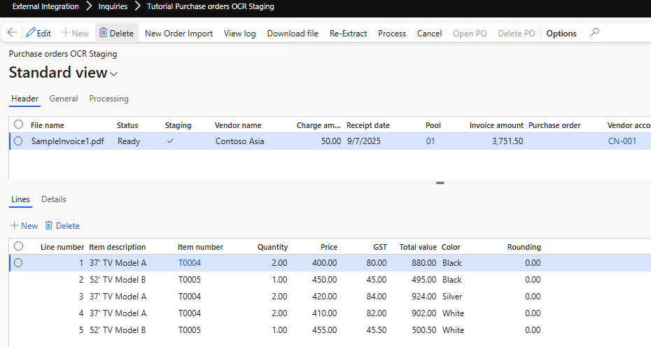

### Invoice validation

The next step is validation. AI models may hallucinate, so it’s crucial to establish proper validation.

In our case, we have three validation points:

- The total quantity of all lines must match the **Total Quantity** from the invoice.
- The total amount of all lines plus **Charge amount** must match the **Total amount** from the invoice.
- For each line, **Quantity × Price + GST** must match the line value. The **Rounding** field should be **0**.

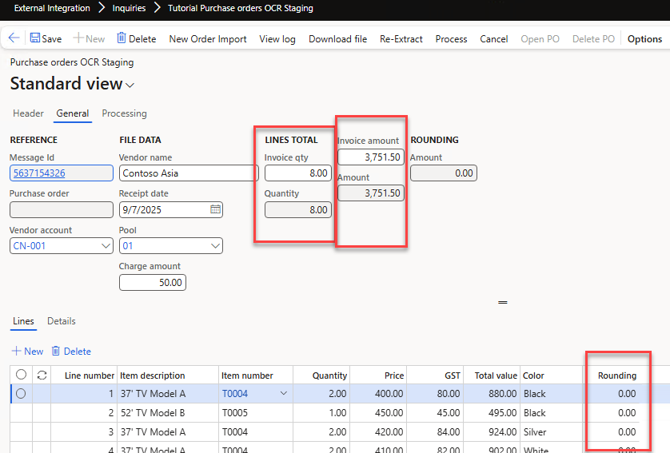

You can also edit any field in the staging tables if needed. 

### Purchase order creation

After validation, select **Process** to create a purchase order. The purchase order is created, and the staging data reference is updated (so you can always trace an individual order to the original PDF file).

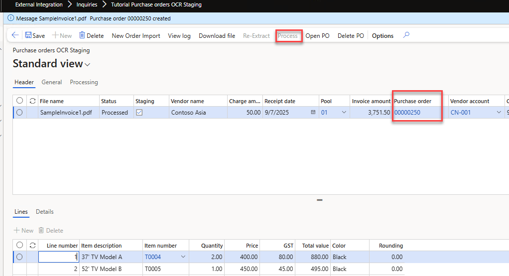

From this form, you can also open the created purchase order using **Open PO**.

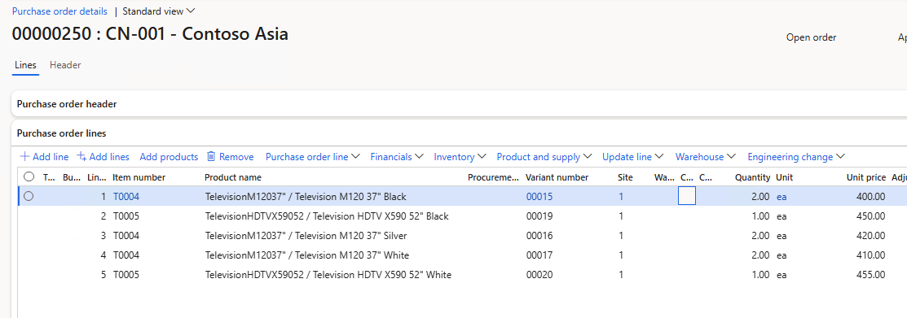

## Resources for This Blog Post

All resources mentioned in this blog post are available on [GitHub](https://github.com/TrudAX/XppTools/tree/master/DEVTutorial/DEVExternalIntegrationSamples). Here’s a brief overview of what’s included and how you can use these resources as a starting point for your AI integration projects.

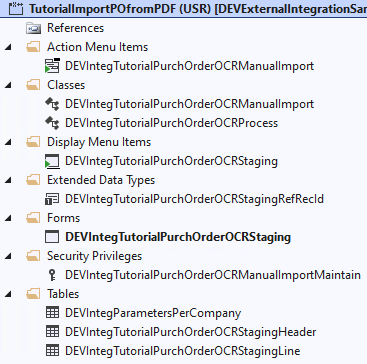

The main components are:

1. Tables and a form to manage staging data.
2. A **Processing class**, [DEVIntegTutorialPurchOrderOCRProcess](https://github.com/TrudAX/XppTools/blob/master/DEVTutorial/DEVExternalIntegrationSamples/AxClass/DEVIntegTutorialPurchOrderOCRProcess.xml), which contains the logic for parsing JSON data from AI, saving it to staging tables and creating a purchase order based on it.
3. A class for a "**New order import**" dialog, [DEVIntegTutorialPurchOrderOCRManualImport](https://github.com/TrudAX/XppTools/blob/master/DEVTutorial/DEVExternalIntegrationSamples/AxClass/DEVIntegTutorialPurchOrderOCRManualImport.xml). In this sample it’s empty, but you can extend it to handle parameters in addition to the provided file (e.g., different formats, missing fields, etc.).

Once these components are set up, the [External Integration](https://github.com/TrudAX/XppTools/tree/master?tab=readme-ov-file#devexternalintegration-submodel) framework automatically handles the remaining integration process. The solution uses vanilla X++ code without external DLLs and works even on a local VHD.

## Summary

In this post, I explained how to use AI to implement a complex PDF document import into Dynamics 365 Finance and Operations using the **External Integration** framework. We covered these key topics:

- How to setup an AI prompt and test it.
- Examples of processing AI output and creating purchase orders in Dynamics 365 Finance and Operations.
- How to validate the results and create a document.

I hope you found this information helpful. If you have any questions, suggestions, or improvements, please feel free to reach out.
