---
title: "D365FO Integration: Import Sales Orders from an External Web Application"
date: "2025-03-12T22:12:03.284Z"
tags: ["Integration", "XppDEVTutorial"]
path: "/integration-inboundwebsales"
featuredImage: "./logo.png"
excerpt: "Learn how to implement robust and efficient process to import complex documents into Dynamics 365 Finance and Operations from external Web services. This post covers integration design, practical code examples and troubleshooting strategies."
---

In this blog post, I'll walk you through the process of importing sales orders into Dynamics 365 Finance from an external web service using REST API calls.

Although the example provided here is simplified to illustrate core integration concepts, the approach and code samples are based on real-world scenarios. This makes them highly adaptable for similar integration tasks you might encounter. We'll utilize the free and open-source External Integration [Framework](https://github.com/TrudAX/XppTools?tab=readme-ov-file#devexternalintegration-submodel), which provides reusable components explicitly designed for building robust integrations in X++.

## Integration Scenario Overview

Let's start by defining our integration scenario:

**Goal: Design and implement an integration solution that imports sales orders into Dynamics 365 Finance from a partner's website via a REST API endpoint.**

To illustrate this integration, I will refer to the Purchase Order Management application mentioned in my previous [post](https://denistrunin.com/integration-outboundweb/). This application offers an API endpoint that retrieves created or updated orders. Although the example provided is simplified, similar APIs are frequently found in other systems, such as [Shopify](https://shopify.dev/docs/api/admin-rest/2025-01/resources/order#get-orders?status=any).

You can access the complete source code for the Purchase Order Management application on [GitHub](https://github.com/TrudAX/TestWebService_PurchaseOrderApp). The application consists of two primary components:

1. **Frontend Application:** Provides a user interface for viewing and managing orders.

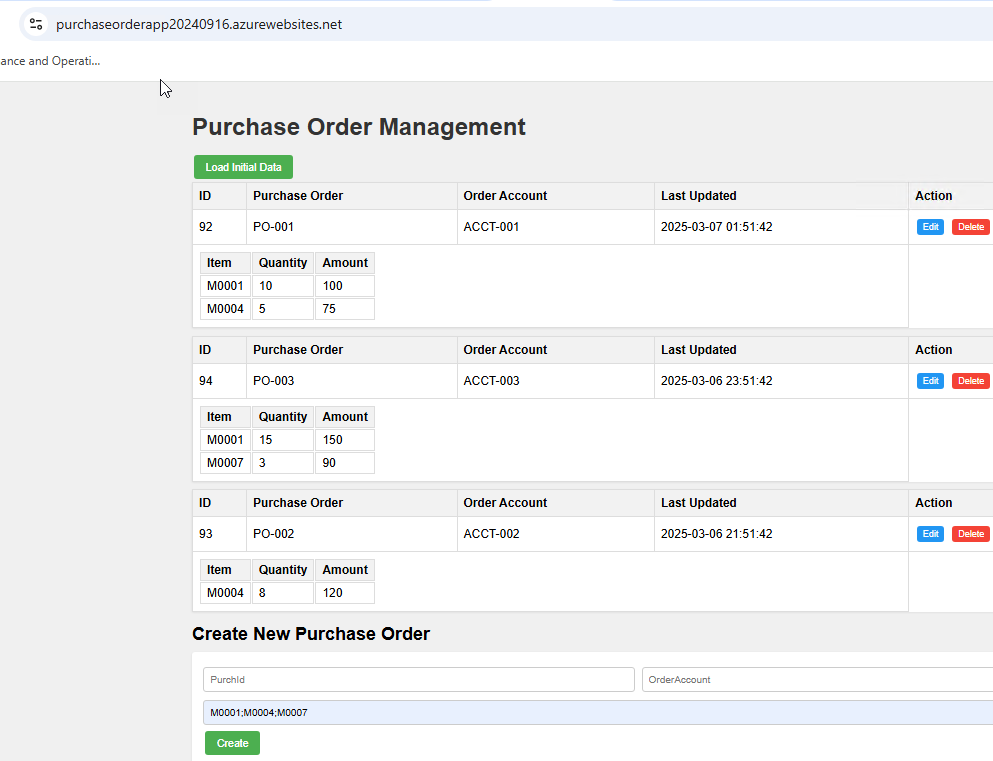

2. **Backend API:** Exposes a REST API endpoint to retrieve orders created or updated after a specified date.

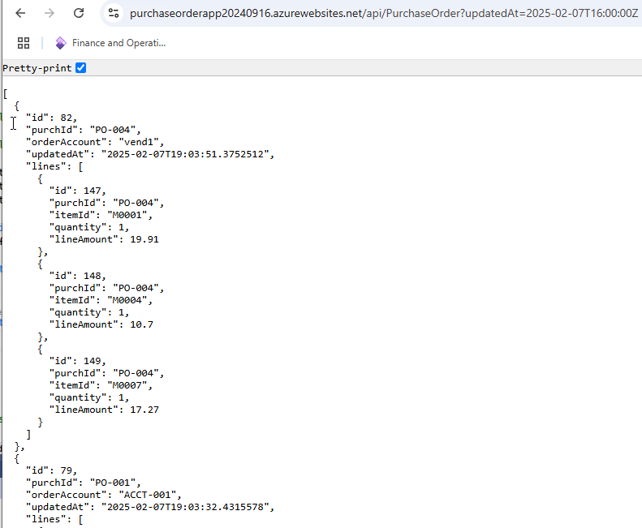

The API requires an **UpdatedAt** date parameter and returns all orders created or modified after this timestamp. Our integration task is to retrieve these orders and load them into Dynamics 365 Finance.

## Planning and Scoping Integration Project

Before diving into the technical implementation, I recommend organising a kickoff meeting involving key stakeholders from both the Dynamics 365 Finance and Operations (D365FO) team and the external Web application provider. During this meeting, ensure you cover the following critical points:

### Define the Web API Endpoint and Parameters

Most web applications have well-defined endpoints that accept multiple parameters and return structured data. In our scenario, the API endpoint retrieves orders modified after a specified date using the **updatedAt** parameter. For example:

```
https://purchaseorderapp20240916.azurewebsites.net/api/PurchaseOrder?updatedAt=2025-02-07T16:00:00Z
```

Discuss what authentication should be used; in a typical scenario, a token-based approach is used.

### Confirm the Scope of Returned Documents

At this stage, it's essential to clearly define and document exactly which documents the API will return based on the provided parameters. In my experience, API sometimes may also return internal or irrelevant documents—such as orders for locations not managed in D365FO or internal transfer documents. This can significantly complicate integration logic and data validation processes. To avoid these issues, ensure you obtain a confirmation from the external Web application team that only documents relevant to Dynamics 365 Finance will be returned by the API.

### Establish Rules for Handling Updated Documents

A document may be modified after it is retrieved via an API. Typically, when a document is updated, the **updatedAt** timestamp changes, while the document's unique **ID** remains constant. It's important to define when these updates happen and to understand how often they occur. Ideally, updates after initial retrieval should be minimized or avoided altogether, but this may be a business requirement.

To manage document updates effectively, consider requesting the external Web application team to implement a clear status indicator. This indicator should explicitly mark when a document has been finalized and exposed via the API. For example, users might initially create an order, add necessary details, and then explicitly mark it as "Confirmed" or "Completed." Only after this explicit action the order should become available through the API.

On the Dynamics 365 Finance side, you must establish clear rules for processing updated documents. For sales orders, common approaches include reversing or deleting the original order and creating a new one. Keep in mind that reversing transactions can introduce complexities, e.g. the ledger period for the original order may be closed. In such cases, you might need to use the nearest available open date or implement alternative business logic to handle these scenarios.

In this blog post, I use a simplified approach: I delete the original order if it remains open and generate an error if the order status is no longer open.

### Discuss the TEST Endpoint

Confirm whether a test version of the Web application is available and clarify what kind of data it contains. Typically, a test environment exists, but may include dummy data. This can cause issues because Dynamics 365 Finance integrations usually require close to production data. If the test data isn't suitable, you might need to perform some integration testing directly against the production endpoint.

### Request a Guide for Creating Documents via the User Interface

Ensure someone from the D365FO team knows how to create documents using the external Web application's user interface. These documents should then appear in the API—for example, creating a sales order that will be imported into D365FO. This step is essential for testing, so request clear instructions on how to perform this task.

### Resolving Mapping Errors

It's common for certain entity codes to need mapping between systems. Define which system will handle this mapping and discuss the steps for adding new mappings values.

In our example, I'll store the Customer account mappings in a separate table.

### Create a Data Mapping document

Mapping documents is a key integration document that defines how fields from the Web application API will be mapped to D365FO fields.

In our case, it will look like [this](https://github.com/TrudAX/denistrunin-blog/tree/master/src/posts/integration-inboundwebsales/FieldMappingWebAPI.xlsx):

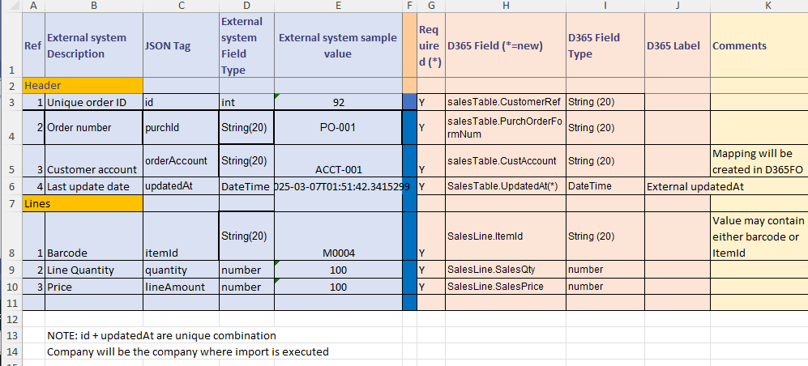

## High-level Design Description

A single web service call might return multiple unrelated orders, but we still need clear traceability from each individual order back to the original web request. To achieve this, I introduced the concept of a **parent message**. Here's how the processing logic works:

- The load class sends a request to the Web service using the current message's **UpdatedAt** date.

- The response from the web service creates a parent message. The returned JSON data is attached to this parent message, and processing begins.

- To process the parent message, we parse the attached JSON data and create multiple child messages—one for each order. Each child message contains parsed data stored in staging tables. During this step, we also perform basic cleanup actions based on unique identifiers, such as deleting previous messages with an "Error" status that share the same ID. This step is executed as a single transaction in a single thread.

- If the parent message processing completes successfully, we update the message's **UpdatedAt** date to the new value. (If paging is used, we update the paging information instead).

- Finally, each child message is processed separately in batch tasks. These tasks can run in parallel (multithreaded mode) and use the staged data to create the final documents in Dynamics 365 Finance and Operations. Errors encountered during this stage do not affect the parent message.

## Setting Up the Integration

Let's walk through the steps to set up and validate our integration solution.

### Configuring Connection Types

First, we need to create a connection to our web service. To do this, go to **External integration > Connection types**.

Here, we define the connection details for our web application:

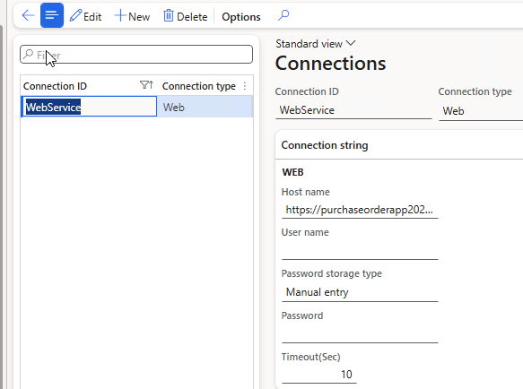

Provide the following information:

- **URL**: The web address of our application (for example, https://purchaseorderapp20240916.azurewebsites.net/)
- **Timeout**: How long the system waits for a response before timing out
- **Credentials**: Username and password details for authentication

Dynamics 365 Finance offers several ways to store passwords securely:

1. **Manual entry**: An unencrypted string, suitable for development. It will persist even after database restores.
2. **Encrypted**: A secure option that encrypts the password value.
3. **Azure Key Vault**: Links to the standard D365FO key vault for the most secure password storage.

### Defining Inbound Message Types

Next, we'll set up the import parameters using the **Inbound message types** form.

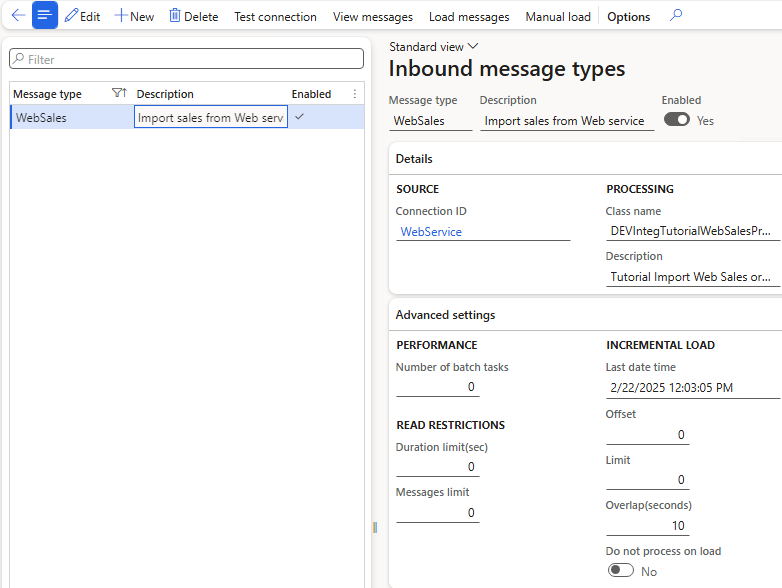

This form includes the following key sections:

**Connection Details**

Here, you link the message type to the previously created connection and specify the processing class (**DEVIntegTutorialWebSalesProcess**).

**INCREMENTAL LOAD**

- **Last date time**: The date and time used for the data load. This value (adjusted by the Overlap setting) is passed as the **UpdatedAt** parameter in the next request. After each successful load, this value updates to the current time.
- **Overlap (seconds)**: The number of seconds subtracted from the **Last date time** when making a request. This helps account for delays between data being written and the transaction being committed in the source database, ensuring no data is missed.
- **Offset**: Indicates the current page number if paging is enabled. This value updates automatically during the load process.
- **Limit**: Defines the maximum number of records returned per page if paging is used. If the number of records returned equals this limit, the system increments the Offset by one(goes to the next page) and does not update the Last date time.
- **Do not process on load**: This is a debug option that prevents messages from being processed immediately after import.

### Mapping Setup

In real-world integration scenarios, you'll likely need to map certain fields between systems. The **External Integration** module provides a simple form and table to handle these mappings. Let's walk through an example.

We'll map the **Order account** from the Web service to the corresponding **Customer account** in D365FO. You can configure this mapping under **External integration > Setup > Mapping setup**.

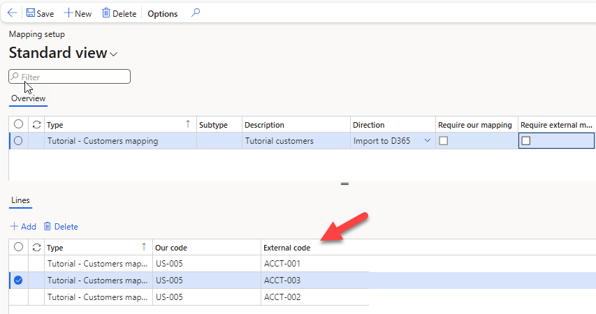

## Running the Integration

### Generating Test Data

To test our integration, we'll first generate some sample data. Enter three or more item numbers (for example, M0001; M0004; M0007) and click **Load initial data**.

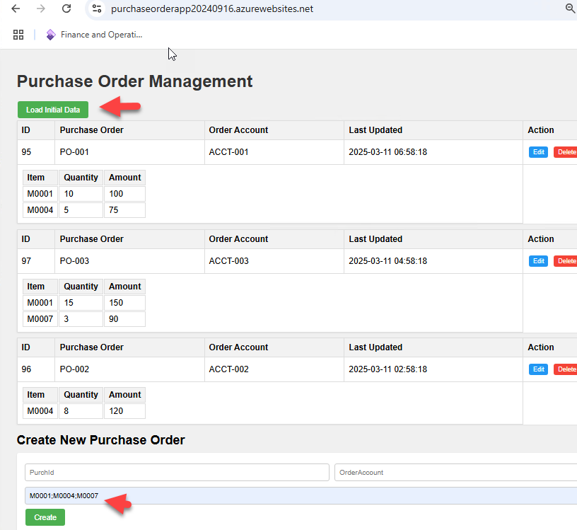

The web application will generate three orders based on these items.

Once you've completed all setup steps, you can run the **Load messages** batch job.

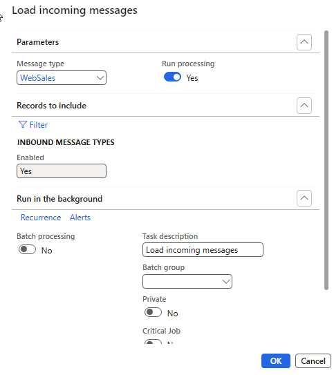

This batch job executes the processing class linked to your inbound message type. As a result, four initial messages will be created and processed:

- One parent message containing the original API data.
- Three child messages created from parsing the parent message data into staging tables.

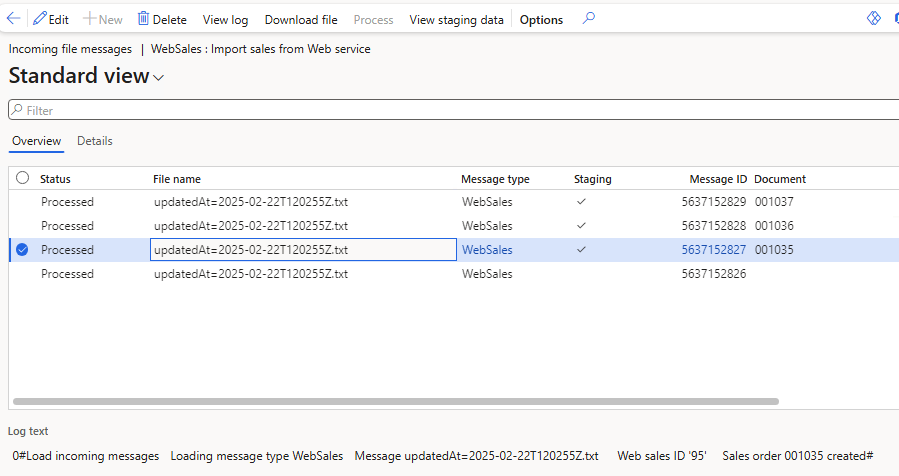

From this form, you can:

- View the original data from the web application by clicking the **Download file** button.

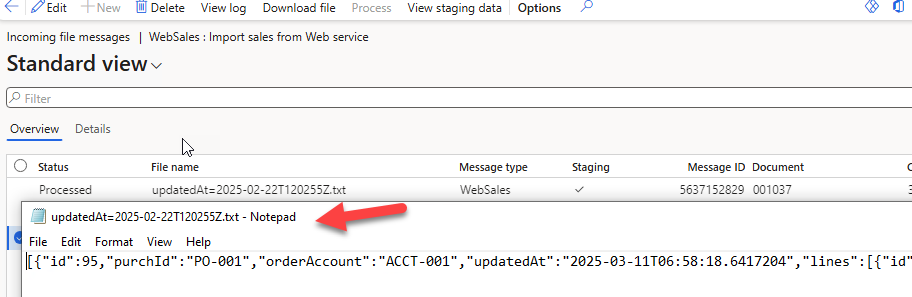

- View the staging data associated with each individual message.

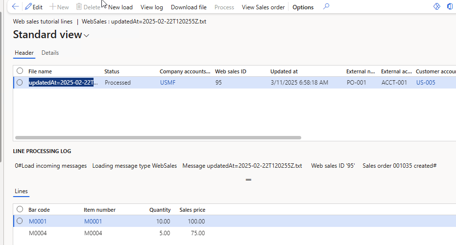

- Check the infolog for detailed processing information, reprocess messages if needed, or open the created Sales order.

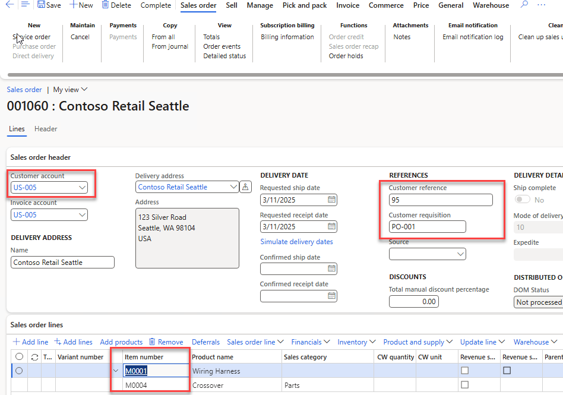

### Running an Incremental Load

To test how an incremental load works, I'll create a new order in my web application using a new account (**ACCT-004**) that doesn't yet exist in our mapping setup. I'll also update an existing order (order number 95).

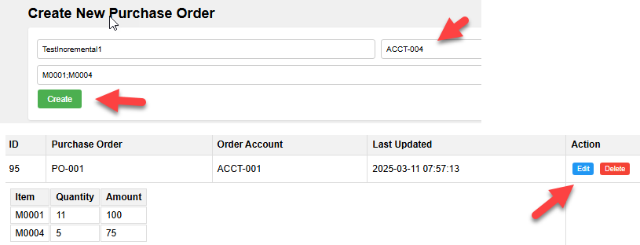

After running the **Load messages** job again, you'll notice two new records in the web staging data:

- One record will show an **Error** status because we haven't set up mapping for the new account (**ACCT-004**).
- Another record will reflect the updated details for order 95.

Additionally, the system automatically removes the sales order (**001035**) linked to the original message, as it has now been replaced by the updated data.

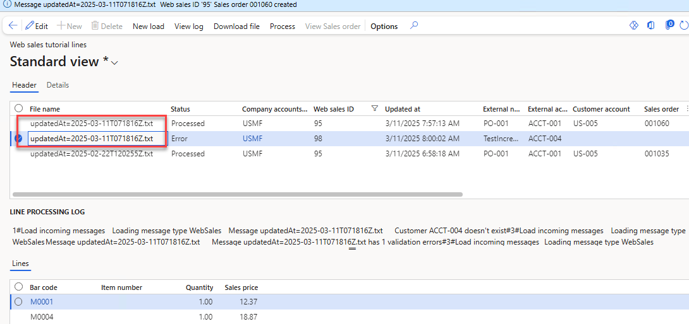

## Monitoring and Error Handling

For any integration, it's essential to monitor each step and have a clear plan to handle potential issues.

### Connection Errors

If Dynamics 365 Finance and Operations (D365FO) can't connect to the specified API, an exception occurs. This exception stops the **Load messages** batch job, and the batch job status changes to **Error**.

Another common issue is when the **Load messages** batch job isn't running at all.

You can detect both situations by setting up an alert on the **Last Date Time** field. If this timestamp is outdated, it indicates a problem.

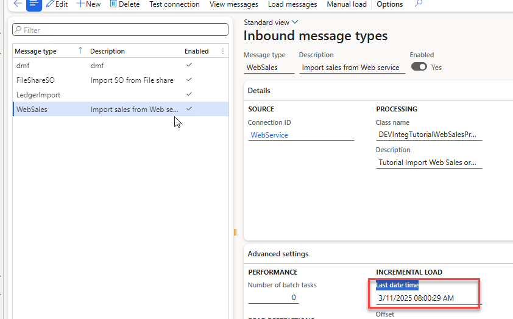

### Parsing Errors

Parsing errors happen when the **Load messages** job receives data but can't correctly interpret it.

To monitor parsing errors, you can create an alert on the **Incoming messages** table for records with a status of **Error**.

When a parsing error occurs, the system creates a parent message containing the original data. You can analyze this data and forward it to a developer, who can then use the **Manual load** function to troubleshoot and process the message.

### Manual Load Function

The **Manual load** function is a valuable feature of the External Integration Framework. It allows you to process messages without connecting to the Web application. You simply provide JSON data as text, and the system processes it exactly as if it came from the API.

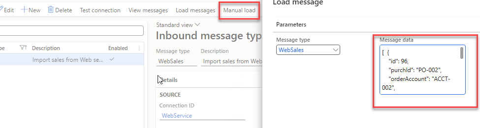

For example by providing the following JSON data

```json
[  {
    "id": 96,
    "purchId": "PO-002",
    "orderAccount": "ACCT-002",
    "updatedAt": "2025-03-12T02:58:18.641909",
    "lines": [
      {
        "id": 172,
        "purchId": "PO-002",
        "itemId": "M0004",
        "quantity": 8,
        "lineAmount": 120
      }
    ]
  } ]
```

We can create a new sales order, which will be marked as **Manual** in the Messages table.

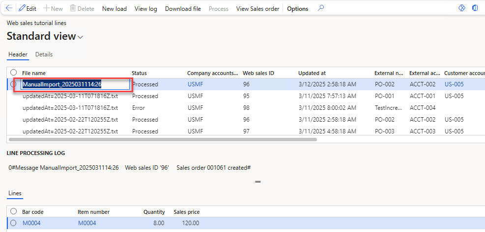

This feature is also helpful for testing different processing scenarios.

### New Load Function

You can manually start loading orders from the user interface by clicking the **New load** button.

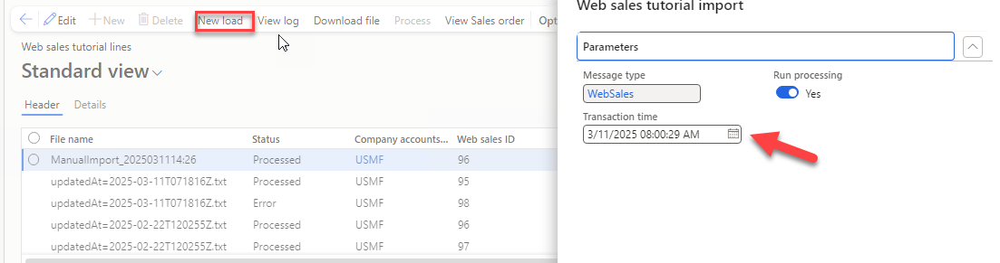

In the load dialog, the **Transaction time** field is automatically populated with the last loaded timestamp. However, you can change this value if needed. A typical scenario for changing this timestamp is when you need to reload data from a specific period.

### Handling Repeated Errors

Each time the system attempts to process a message but encounters a failure, the **Processing attempts** counter for that message increases.

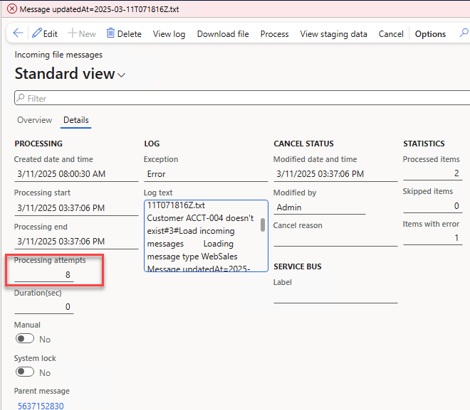

When running the **Process incoming messages** batch job, you can set a filter on this field to limit the number of times the system tries to process messages with errors.

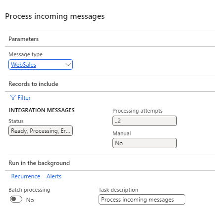

This approach helps prevent the system from repeatedly trying to process error messages that no one is addressing, which could slow down overall performance. A good practice is to set this filter to allow several processing attempts. This way, temporary issues, such as a missing customer record, can be resolved automatically once the required data becomes available.

### Canceling Messages

If a message can't be processed because it contains invalid data, you can choose to **Cancel** it.

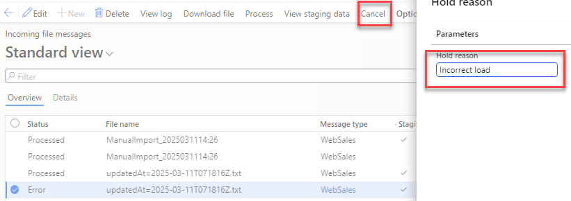

The main goal of this feature is to ensure that messages don't remain in an **Error** status indefinitely. Ideally, all messages should either be **Processed** or **Cancelled**.

### Full Traceability

The system provides complete traceability, from the initial JSON message to the final Sales order, and from the Sales order back to the original Web request.

Starting from the sales order:

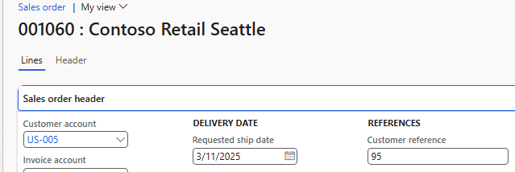

You can view the staging data with parsed values:

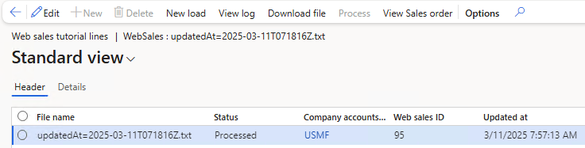

And also, access the original message with the attached JSON payload:

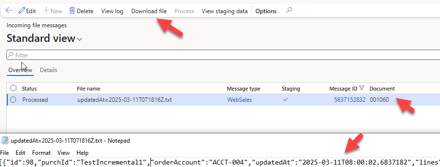

Each of these steps can be performed without direct access to the Web API in a development environment, either by using the **Manual load** function or by manually changing the status of individual messages.

## Resources for This Blog Post

All resources mentioned in this blog post are available on [GitHub](https://github.com/TrudAX/XppTools/tree/master/DEVTutorial/DEVExternalIntegrationSamples). Let's briefly review what's included and how you can use these resources as a starting point for your integration projects.


The main components are:

1. A **Load class**, similar to [DEVIntegTutorialWebSalesLoad](https://github.com/TrudAX/XppTools/blob/master/DEVTutorial/DEVExternalIntegrationSamples/AxClass/DEVIntegTutorialWebSalesLoad.xml), which connects to a custom API.
2. A **Processing class**, [DEVIntegTutorialWebSalesProcess](https://github.com/TrudAX/XppTools/blob/master/DEVTutorial/DEVExternalIntegrationSamples/AxClass/DEVIntegTutorialWebSalesProcess.xml), which contains the logic for processing incoming data.
3. Tables and forms to manage staging data.
4. A mapping extension to implement mapping between Web application and Dynamics 365 Finance and Operations.

Once these components are set up, the External Integration framework will automatically handle the rest of the integration process.

### Sample Web App

For testing purposes, I've set up a sample web app. At the time of publishing this post, it is deployed at the following address: [https://purchaseorderapp20240916.azurewebsites.net/](https://purchaseorderapp20240916.azurewebsites.net/)

The source code for this sample web service is also available on [GitHub](https://github.com/TrudAX/TestWebService_PurchaseOrderApp).

## Summary

In this post, I've explained how to implement a complex document integration from a REST API web service into Dynamics 365 Finance and Operations using the **External Integration** framework. We covered these key topics:

- Designing an integration solution.
- Examples of querying a Web application and creating sales orders in Dynamics 365 Finance and Operations.
- Monitoring and troubleshooting common integration issues.

I hope you found this information helpful. If you have any questions, suggestions, or improvements, please feel free to reach out.
