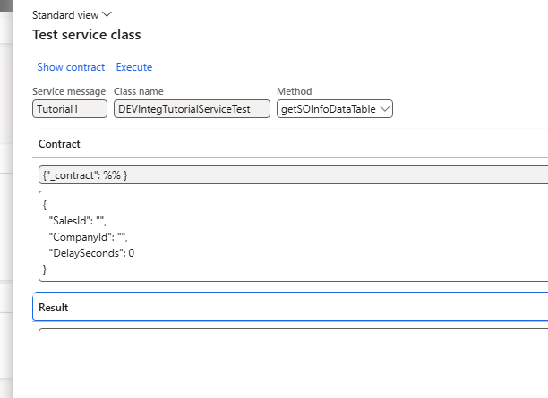

---
title: "Implement Service-based integration in D365FO"
date: "2026-03-02T22:12:03.284Z"
tags: ["Integration", "XppDEVTutorial"]
path: "/integration-services"
featuredImage: "./logo.png"
excerpt: "This blog post describes how to implement a synchronous integration with D365FO by creating a service using the External Integration framework."
---

The **External Integration** framework is an open-source [solution](https://github.com/TrudAX/XppTools?tab=readme-ov-file#devexternalintegration-submodel) designed for inbound and outbound integrations in D365FO. 

In this blog post, I will describe how to implement a service endpoint using the External Integration framework.

## Key Design Principles

X++ services are created using a standard service class and the [Service and Service group objects](https://learn.microsoft.com/en-us/dynamics365/fin-ops-core/dev-itpro/data-entities/custom-services#json-based-custom-services).

Please note that a service is a synchronous integration pattern that increases system coupling. It should only be used when an asynchronous approach is not an option.

Before starting development, I analyzed several projects to see how different developers implemented their services. My key observations were:

- The input parameters vary by integration and cannot be universal.
- The output parameters look very similar: typically a dataset containing one or more tables, along with some error flags. Additionally, most implementations included some kind of logging table, which usually varied per implementation.

Based on these observations, the following concept was implemented:

1. The service input contract will be a new class for each integration, providing maximum flexibility.
2. The output contract will be a unified class containing the following data: a .NET dataset (with 0 to n tables), an output string, an error flag, and an error message.
3. A common logging option will be provided.
4. It must be possible to test the class directly inside D365FO.


## Implementation details: X++ code

I have provided sample code in the following [class](https://github.com/TrudAX/XppTools/blob/master/DEVTutorial/DEVExternalIntegrationSamples/AxClass/DEVIntegTutorialServiceTest.xml).


To create a new service using the External Integration framework:

1. Create a new class that extends **DEVIntegServiceExportBase**.
2. Create an entry point that is always a single line—just a call referencing the main method.
3. Implement the main method to contain only the service's business logic.

A code sample looks like this:

```c#
public class DEVIntegTutorialServiceTest extends DEVIntegServiceExportBase
{
/// DEMO #1 (DataTables / DataSet):
	public DEVIntegServiceExportResponseContract getSOInfoDataTable(DEVIntegTutorialServiceTestContract _contract)
    {
        return this.serviceCallProcess(methodStr(DEVIntegTutorialServiceTest, calculateGetSOInfoDataTable), _contract);
    }

    public void calculateGetSOInfoDataTable(DEVIntegTutorialServiceTestContract _contract, DEVIntegServiceExportResponseContract _response)
    {
        this.validateAndDelay(_contract);

        changecompany(_contract.parmCompanyId())
        {
            SalesTable salesTable = SalesTable::find(_contract.parmSalesId(), true);
            if (!salesTable.RecId)
            {
                throw error(strFmt("Sales order %1 not found in company %2", _contract.parmSalesId(), _contract.parmCompanyId()));
            }

            this.initDataTableHelper();

            dataTableHelper.addDataTable('SOHeader');
            dataTableHelper.addRowItem('SalesId',     salesTable.SalesId);
            dataTableHelper.addRowItem('CustAccount', salesTable.CustAccount);
            dataTableHelper.addRow();

            // Lines table: multiple rows with sales lines
            dataTableHelper.addDataTable('SOLine');

            SalesLine salesLine;
            while select salesLine
                where salesLine.SalesId == salesTable.SalesId
            {
                dataTableHelper.addRowItem('SalesId',  salesLine.SalesId);
                dataTableHelper.addRowItem('ItemId',   salesLine.ItemId);
                dataTableHelper.addRowItem('SalesQty', salesLine.SalesQty);
                dataTableHelper.addRow();
            }

            this.addDataTableHelperToResponse(_response);
        }
    }

    /// DEMO #2 (Temp table / DataSet):
    public DEVIntegServiceExportResponseContract getSOInfoTempTable(DEVIntegTutorialServiceTestContract _contract)
    {
        return this.serviceCallProcess(methodStr(DEVIntegTutorialServiceTest, calculateGetSOInfoTempTable), _contract);
    }

    public void calculateGetSOInfoTempTable(DEVIntegTutorialServiceTestContract _contract, DEVIntegServiceExportResponseContract _response)
    {
        this.validateAndDelay(_contract);

        changecompany(_contract.parmCompanyId())
        {
            SalesTable salesTable = SalesTable::find(_contract.parmSalesId(), true);
            if (!salesTable.RecId)
            {
                throw error(strFmt("Sales order %1 not found in company %2", _contract.parmSalesId(), _contract.parmCompanyId()));
            }

            SalesTable tmpSalesTable;
            tmpSalesTable.setTmp();
            tmpSalesTable.SalesId     = salesTable.SalesId;
            tmpSalesTable.CustAccount = salesTable.CustAccount;
            tmpSalesTable.doinsert();

            this.initDataTableHelper();

            // Return temp table as a dataset DataTable (SOHeaderTmp)
            dataTableHelper.addTmpTable('SOHeaderTmp', tmpSalesTable,
                [
                    fieldNum(SalesTable, SalesId),
                    fieldNum(SalesTable, CustAccount)
                ]);

            this.addDataTableHelperToResponse(_response);
        }
    }
```

In case of errors, simply throw an exception, and the framework will handle it automatically. There are also a few helper methods available that can return either a temporary table or a dataset.

On the caller side, if the calling system is .NET-based, it needs to analyze the result by following these steps:

1. Check the **IsSuccess** flag, and review the error details in **ErrorMessage** if it failed.
2. If successful, deserialize the **MessageDataSet** parameter into a **System.Data.DataSet** object and read the required data.

## Implementation details: User configuration

After creating a service class, it must be added to the **External Integration > Setup > Service message type** form.


From this form, we can also test the service class using the **Test** button.



The system will automatically create an empty contract. We just need to specify the parameter values and press the **Execute** button.


If the call is unsuccessful, an error message will be generated.


## Logging

The framework provides different logging options tailored to various business use cases.


The following logging options are available:

- **None** – No logging.
- **Statistics & Errors** – Creates one summary record per day for successful calls (showing the total number of calls and lines processed), PLUS detailed records for all calls that encounter errors during execution.
- **Errors only** – Only failed calls are logged.
- **Request** – Logs each request, including its parameters, status, and statistics (start/end date and number of lines).
- **Full** – Same as **Request**, but also logs the response payload (note: this may consume significant storage space).

Recommended values for production environments are **"Request"** or **"Statistics & Errors"**.

## Notes on consuming services

Services can be consumed directly by connecting to the D365FO instance using an AppId. However, in recent projects, we have utilized the **Azure API Management** service. Adrià has written an [excellent article](https://ariste.info/2022/02/azure-api-management-dynamics-365-fo/) detailing this approach.

In short, you will need to create an HTTP endpoint:

```xml
https://testsystemlink.sandbox.operations.dynamics.com/api/services/

With a new operation:
Display name: getSOInfoDataTable
Name: getsoinfodatatable
URL:  /DEVIntegTutorialServiceTestGroup/DEVIntegTutorialServiceTest/getsoinfodatatable
```

and apply the following policy

```xml
<policies>
    <inbound>
        <send-request mode="new" response-variable-name="bearerToken" timeout="20" ignore-error="false">
            <set-url>https://login.microsoftonline.com/{{TenantId}}/oauth2/token</set-url>
            <set-method>POST</set-method>
            <set-header name="Content-Type" exists-action="override">
                <value>application/x-www-form-urlencoded</value>
            </set-header>
            <set-body>@{return "client_ID=4989d73b-1e25&client_secret=jSv8Q~m~jmO0QtZFmi_h4di&resource=https://testsystemlink.sandbox.operations.dynamics.com/&grant_type=client_credentials";}</set-body>
        </send-request>
        <set-backend-service base-url="https://testsystemlink.sandbox.operations.dynamics.com/api/services/DEVIntegTutorialServiceTestGroup" />
        <set-header name="Authorization" exists-action="override">
            <value>@("Bearer " + (String)((IResponse)context.Variables["bearerToken"]).Body.As<JObject>()["access_token"])</value>
        </set-header>
        <base />
    </inbound>
    <backend>
        <base />
    </backend>
    <outbound>
        <base />
    </outbound>
    <on-error>
        <base />
    </on-error>
</policies>

```

Next, test the API using the following parameters:

```json
{"_contract": {"CompanyId":"USMF","DelaySeconds":1,"SalesId":"001036"}}
```

Alternatively, if you are using Postman:

```json
https://d365apiserv.azure-api.net/mytest/DEVIntegTutorialServiceTest/getSOInfoDataTable

POST
subscription-key 
991874b1c..

Body raw
{
    "_contract": {"CompanyId":"USMF","DelaySeconds":1,"SalesId":"001036"}
}

```

## Summary

The External Integration framework offers the following benefits for service development:

- A standard output contract that includes workload statistics and error flags.
- Automatic exception handling.
- Flexible logging options.

All the classes discussed can be found on [GitHub](https://github.com/TrudAX/XppTools/tree/master/DEVTutorial/DEVExternalIntegrationSamples) and serve as a great starting point for your own integrations.

I hope you found this post helpful. As always, if you have any suggestions for improvements or questions regarding this implementation, please don't hesitate to reach out.
