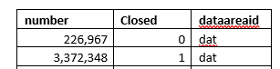

## Introduction

Are your Dynamics AX users complaining about slow system performance? You started a research, found many tips on what to do, and still don’t know where to start.
In this post I will discuss how to perform Dynamics AX performance audit to resolve performance problems.
I will cover the following areas:

- Current hardware analysis

- SQL Server settings and blocking monitoring
  
- AOS settings

- X++ code optimization

I will also outline common performance myths and mistakes based on real-life scenarios.

The main principle of the performance audit is to start from the highest level(that allows to identify the performance problem with the minimum effort) and to continue by going deeper in the analysis. The described technique was used for more than ten customers with a number of users from 50 to 500 and database size from 100GB to 1TB. For all these customers, basic steps were the same and helped to identify and solve the problems.

## Current hardware analysis

The initial task to begin with is to compare the used hardware with the specified one in a project Technical design document. It will not be good if you see a server design specification like "8-core CPU". Such phrases in Technical design means that you don't have a proper technical design. "8-core CPU" can mean any performance level. Try to filter "8 core CPU" on the Amazon, and you will see a considerable price variation

For a CPU price defines the performance level, and there will be noticeable differences of a system working on 10$ CPU compared to 10K$ CPU.

> One of the clients complained about slow overall system performance. While comparing recommended hardware with the actual one, I have found that instead of 4-core 3.5GHz CPU, they had used 20-core 2.0GHz CPU. The client's original intention was correct, they thought that more cores mean more performance, but in that case, 4 cores were more than enough, but these should be the fast cores.

### Hardware recommendations

For Ax2012 use the following guidance as a baseline.

#### AOS and Terminal servers

For AOS and Terminal server - CPU with the single thread performance equal to Azure Dv3 series. Memory - about 300-500MB per user

These are the average values. The current Intel CPU [models](https://www.cpubenchmark.net/singleThread.html) give you about 30-50% more speed than Azure Dv3.

If your current CPU speed is below these D3 values, upgrading your servers can give you some noticeable performance boost. <https://www.cpubenchmark.net/> is a web site where you can check the CPU performance level(you need to check single thread performance and total performance). If you don't like comparing these numbers, search on Amazon or eBay your current CPU price.

#### SQL Server

The same principles apply to SQL Server CPU, but they are not so simple. SQL Server is licensed by cores. For the wrong selected CPU model, your SQL Server license can cost more than the actual hardware. Check this [blog post](https://sqlperformance.com/2014/01/system-configuration/selecting-a-processor-for-sql-server-2014-1) that explains the process in details. It is old, but the basic idea is that in every Intel model line there is a 4-core CPU with the maximum performance-per-core value, the more cores you get, the less performance per core there will be, so you should not use CPUs with more cores than your system needs.

As AX is an OLTP system, current CPU power for a SQL Server should allow processing data from a certain amount of memory. The amount of this memory is either the maximum amount supported by the SQL Server standard edition(64GB - pre-2016 and 128GB - for SQL 2016) or the maximum "active data" in the database.

From the practical experience modern 2 * 4 cores CPU can easily handle 128GB memory. 2 * 8 cores can work with 512GB. If you need more memory, probably it's time to think about 4-sockets server.

#### Storage system

Nowadays we have HDD, SSD, and NVMe storage. The main difference is the number IOPS they can handle(very simple 1K+, 20k+ 200k+). So if you have some storage problem(the main indication for this is IO related SQL waits), you can just upgrade to the next level.

## AOS settings

There are several blog posts that cover optimal settings for the AOS.

<https://community.dynamics.com/365/financeandoperations/b/axsupport/archive/2014/09/05/ax-performance-troubleshooting-checklist-part-1b-application-and-aos-configuration>

<https://blogs.msdn.microsoft.com/axinthefield/dynamics-ax-performance-step/>

## SQL Server analysis

The first thing to check is the current AX database size per table.

### Analyzing database size

You don't need an exact table size(that takes time to perform), but you can get the size using the saved statistics from the **sp_space_used** procedure(execution time is quite fast). This [script](https://github.com/TrudAX/TRUDScripts/blob/master/Performance/AX%20Technical%20Audit.md#database-size) provides you the size per table. Copy the result to Excel and sort by size. Sometimes you see the picture like this:

in this case, a lot of space consumed by some temporary/tracing data and can be deleted.

Check the number of closed records in InventSum. If most of the records are closed, removing them can considerably increase the performance.

For example, if you get the following results, you can drop closed records(the only problem here is that some reports, for example, "On hand by date" can use closed records to display historical data, check this before deleting)

Also, check some system [statistics](https://github.com/TrudAX/TRUDScripts/blob/master/Performance/AX%20Technical%20Audit.md#table-statistics). Often, you need to know the following:

- Transactions per day(for logistics companies it will be a number of sales lines or invent trans per day) and the difference between peek and regular days)
- Active users per day, per hour
- Batch jobs and their timings

Compare these numbers with the numbers from the technical design, very often clients exceed them but "forget" to upgrade the hardware.

### SQL server settings

To check the current SQL server settings, you need just one script - [sp_Blitz](https://github.com/TrudAX/TRUDScripts/blob/master/Performance/AX%20Technical%20Audit.md#sp_blitz). it performs thousands of checks and displays summarized recommendations with explanation links.

### Missing indexes

Missing indexes [script](https://github.com/TrudAX/TRUDScripts/blob/master/Performance/AX%20Technical%20Audit.md#missing-indexes) provides an overview of indexes that are considered missed by the plan guide engine

Output contains the following columns:

- Table name
- Equality columns: ''='' condition in the WHERE clause
- Inequality columns: some logical condition(<", "!=") in the WHERE clause

Don't just follow these recommendations, every recommendation should be analysed from a logical point of view, and only indexes that really limit the actual search should be created. You don't need to analyse the whole output, often 30-50 top recommendations are enough.

Sometimes you can see recommendations that were caused by wrong conditions(mandatory fields missed in the SQL statement). In this case it is better to find and correct the statement, rather than trying to create an index(in the example below RefCompanyId field is missing for DocuRef selection)

### Unused indexes

[The script](https://github.com/TrudAX/TRUDScripts/blob/master/Performance/AX%20Technical%20Audit.md#unused-indexes) provides some unused indexes statistics for the large tables.

Remove the indexes only if they are related to not used functionality or a different country. In some specific cases for large tables, you can also consider disabling Partition and DataArea fields.

### Wait statistics

[Script](https://github.com/TrudAX/TRUDScripts/blob/master/Performance/AX%20Technical%20Audit.md#wait-statistics) gives you an overview of current wait events. If you see some IO related events here, [analyze](https://github.com/TrudAX/TRUDScripts/blob/master/Performance/AX%20Technical%20Audit.md#disk-i--o) disk activity by disk and by file.

### Top SQL analysis

[The script](https://github.com/TrudAX/TRUDScripts/blob/master/Performance/AX%20Technical%20Audit.md#get-top-sql) provides active Top SQL commands, their statistics and saved plan from the SQL server statistics(to clear the list use **DBCC FREEPROCCACHE** command).

Ideally, you should know first 5-10 statements from this list and analyse the following:

- They logically make sense for the current implementation - the number of executions and the statement itself relate to the current system functions. Very often I saw some statements here caused by incorrect system setup, by not used functionality or they are not related to AX at all.
- They use optimal plans and indexes

FETCH_API_CURSOR here means some query from an AX form. To find the original query use [Cursors for the session](https://github.com/TrudAX/TRUDScripts/blob/master/Performance/AX%20Technical%20Audit.md#cursors-for-the-session) script.

### AX long SQL statements tracing

You can enable tracing of long SQL statements in the user options. Use this [job](https://github.com/TrudAX/TRUDScripts/blob/master/Performance/AX%20Technical%20Audit.md#enabling-tracing) to enable it for all users. Often you need to analyse statements with the execution time more than 2-5 seconds.

A great advantage of this in AX is that you can see a stack trace of the statement. Also, keep in mind that a long execution time can be caused by 2 reasons:

- A statement is heavy and it takes a long time to execute it
- A statement is blocked by another session

## Blocking analysis

The following reasons can cause unwanted blocking:

- Group update operation(like **update_recordset**) in X++. Check this [article](https://denistrunin.com/understanding-sql-blocking/) that explains the problem in detail. To resolve this, you need either replace "**update_recordset**" with "**while select forupdate**" or adjust indexes 
- Blocking escalation - if you modify more than 5000 records in one transaction sometimes, SQL Server decides to escalate the blocking level. If you have a lot of memory, you can disable this behaviour(ALTER TABLE myTable set (LOCK_ESCALATION = DISABLE)), but first, check that you really need to update all records in one transaction.

A great instrument to deal with the blocking is to enable AX long SQL statements tracing(see above) - in this case, you will see the statement, user and actual operation(by using X++ stack trace).

It is also useful to enable [context_info](https://github.com/TrudAX/TRUDScripts/blob/master/Performance/AX%20Technical%20Audit.md#show-sql-query-for-the-ax-user) for the SQL session. This allows you to link AX session with the SQL Server SPID and find a blocked user.

The most challenging part of resolving blocking problems is to find an operation that causes blocking. The primary technique is to try to search blocking on the TEST version. In this case, you run the client, execute the operation(for example, post the sales order) and put a breakpoint to the last **ttscommit** statement for this operation. Then run another client and start executing operations(like another sales order or journal posting). If you catch a SQL block, you can easily implement and test a fix for it.

### Parameters sniffing

Parameters sniffing quite often becomes a reason for performance problems. For example, you have a warehouse where most of the items have one batch ID, but there are some Items and Batches with generic names (like “No batch”, “Empty”). In this situation, when you query item by batch, your actual plan depends on the first query values. If your query contains “generic” batch values, SQL Server creates a plan, that starts execution with the ItemId, as a “generic batch value” is not selective in this case. But for most of your items, it will be wrong and gives a huge overhead, as in most cases Batch is a unique value.

There is no universal way to resolve Parameters sniffing issues(refer to the excellent BrentOzar post that describes this https://www.brentozar.com/archive/2013/06/the-elephant-and-the-mouse-or-parameter-sniffing-in-sql-server/ ), but there are several ways to deal with it in AX:

- Create new indexes – you can create new indexes, to help SQL server always choose the best plan. This often works only if you have conditions to one table only
  
- Use the **sp_create_plan_guide** [command](https://github.com/TrudAX/TRUDScripts/blob/master/Performance/AX%20Technical%20Audit.md#create-a-plan-guide) to force the actual plan – using this option creates a big admin overhead as you need to maintain these created plans. If you add a new field to the AX table you will need to change all the plan guides in which this table is used. Often you need to provide just a OPTIMIZE FOR UNKNOWN hint to disable sniffing for the  SQL statement, better do not specify specific indexes

- **forceLiterals** X++ hint –you send actual values to the SQL Server, and it chooses the best plan for these values. The overhead is that the plan will need to be compiled every time

- Use index hint (new feature D365FO only)

You can view created plan guides in the Programmability section:

As a basic rule add **forceliterals** hint(or **query.literals(true)**) for the single SQL statements and create a plan guide(with the OPTIMIZE FOR UNKNOWN hint) for small SQL statements. **Forceliterals** usage can slow down your server. Check this [article](https://denistrunin.com/forceliterals-forcePlaceholders/) for the details.

Determining which statements are affected by parameters sniffing also can be tricky. Often you analyse statements from the Top SQL output(see above), then compare the actual plan with the estimated plan and if they are different, check the XML representation of the actual plan. At the end of this XML you can find initial(sniffed) parameter values and basing on them decide is that an issue and how it should be fixed.

## Index rebuild and statistics update

Rebuild index and statistics update jobs can cause a lot of problems.

The main misconception is that these operations can improve system performance but in reality they can't. The side effect of these operations is that they clear the plan cache(the same can be done just with DBCC FREEPROCCACHE command) and due to parameters sniffing this is often considered as an improvement.

The typical scenario of going into this trap(Brent call it Index Maintenance Madness, but in my experience, the same relates to statistics update):

1. System suddenly becomes very slow(due to parameters sniffing issue)

2. Someone decides to run an index rebuild or/and a statistics update job

3. This magically helps and these operations started to be executed daily(but you can't resolve parameters sniffing issue with this)

4. Then system slowness happens during the day and statistics update also helps.

5. Frequency changes to 2 times a day, then 3 times a day and so on...

At the end of these events, a customer decides that index rebuild or/and statistics update job should run constantly and the server load they produce can even exceed the AX business logic load, cause blocking and slow down the system.

Check this article([Index Maintenance Madness](https://www.brentozar.com/archive/2017/12/index-maintenance-madness/) and a great [video](https://www.youtube.com/watch?v=iEa6_QnCFMU) from Brent Ozar that explains the theory and psychology in details.

Recommendations here is that you should not execute these operations in any way they can affect system performance. If you have a free maintenance window, run them once a week using Ola Hallengren‘s [IndexOptimize](https://ola.hallengren.com/sql-server-index-and-statistics-maintenance.html) procedure. It is more efficient than the standard SQL agent tasks as they allow you to execute UPDATE STATISTICS command without "WITH PERCENTAGE" clause and for the index rebuild you can specify fragmentation limits.

Don't use rebuild index and statistics update jobs to resolve any performance problems.

## Code optimization

Before individual operations optimization(x++ code) you need to know the following:

- Detailed problem description

- Reproduction steps. That is the most complicated part, sometimes reproducing the problem can take more time than the optimization

- What is the current and what is the required execution time

- How you can test the optimization

Testing is quite easy for reports or operations that don't modify the data, but can be complex for posting operations. Try to minimize the number of manual testing steps, ideally, the test should be possible to run  by one click(in this case you can try different ideas during the optimization process). For posting often you write a job that opens a transaction at the beginning and then generate a **ttsabort** at the end.

Trace Parser is a great tool for analysing operations execution. It will trace all sessions in the AOS and provides detailed output. For production tracing better to have a dedicated AOS as trace file can grow very rapidly when you have a lot of user sessions.

The advice here is to install and setup it before the actual problem happens. In this case, you can easily run the trace when needed.

## Summary

Using these basic steps you can resolve your Dynamics AX performance problems and make your users happy. All scripts related to this post are available on my [GitHub](https://github.com/TrudAX/TRUDScripts/blob/master/Performance/AX%20Technical%20Audit.md). If you see that some useful staff is missing, feel free to post a comment.

There are some Microsoft blog posts about performance: [Managing general performance issues in Microsoft Dynamics AX](https://cloudblogs.microsoft.com/dynamics365/no-audience/2014/09/11/managing-general-performance-issues-in-microsoft-dynamics-ax/?source=axsupport), [Analysis scripts for Performance Analyzer v2.0](https://cloudblogs.microsoft.com/dynamics365/no-audience/2016/09/08/analysis-scripts-for-performance-analyzer-v2-0/?source=axsupport).

Also worth to check this great SQL Server resources collection - [SQL Server KIT](https://github.com/ktaranov/sqlserver-kit).
