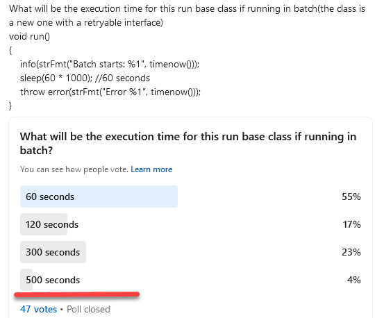
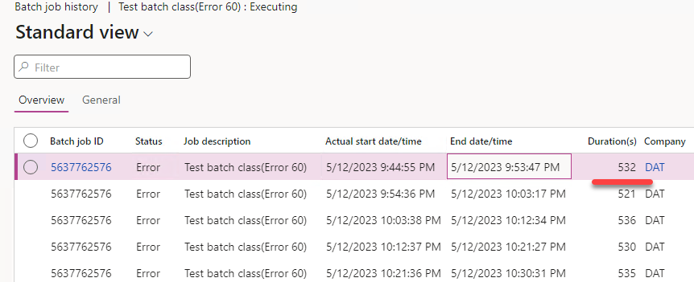
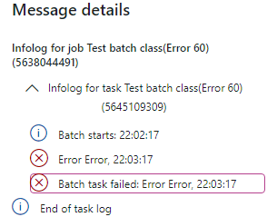
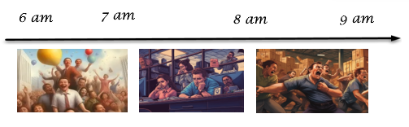
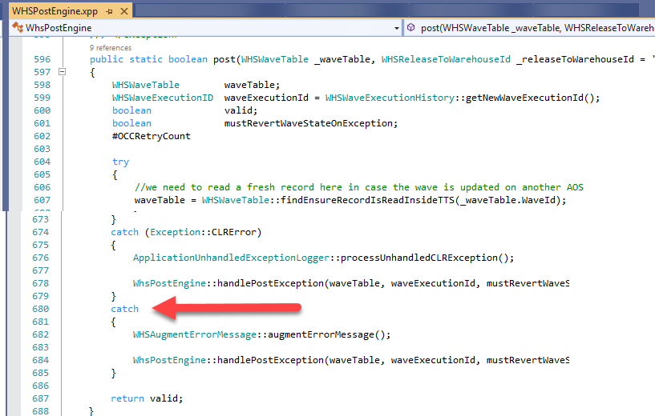

---
title: "Batch Job errors in D365FO: How they can ruin the performance and how to fix them"
date: "2023-05-13T22:12:03.284Z"
tags: ["Performance"]
path: "/performance-d365batch"
featuredImage: "./logo.png"
excerpt: "The blog post describes how D365FO batch framework handle errors and what kind of problems it may cause"
---

In the current version of Dynamics 365 for Finance and Operation, Microsoft introduced an updated batch job processing logic with several main changes:

- No dedicated AOS services
- Batch retries concept

D365FO batch jobs run in the cloud, and sometimes due to this, they may fail. For example, the batch job may be moved to a different batch server, or the SQL database may be migrated to another pool. In both cases, the execution fails with a system error. To handle these cases, Microsoft has introduced the Batch Retryable feature.

The concept is not complex and is explained in this presentation, [Introduction to the BatchRetryable Feature](https://community.dynamics.com/365/dynamics-365-fasttrack/b/techtalks/posts/introduction-to-the-batchretryable-feature-august-2-2021). However, it may be very confusing when you see it in real life. In this post, I will demonstrate the concept with a sample class and discuss its potential impact on real-life batch processing scenarios.
)
## Exploring with a Simple Test Class

I recently posted a question on my [LinkedIn page](https://www.linkedin.com/posts/denis-trunin-3b73a213_working-on-a-new-blog-post-regarding-d365fo-activity-7048833802206412800-QMlR?utm_source=share&utm_medium=member_desktop) (many thanks to all who responded), and the results were intriguing:

Only 4% answered correctly: the correct time would be 500 seconds. Feel free to download the [sample class](https://github.com/TrudAX/XppTools/blob/master/DEVTools/DEVBatchControlUtil/AxClass/DEVBatchControlTestClass.xml) and play with it.

Let’s discuss why this happens.

When a batch job starts and encounters an error after 60 seconds, the batch framework checks the number of retries. If this is less than the max retries (5), it executes the batch job again. This cycle(with some queue waits) extends the total execution time to about 500 seconds.

It then raises an interesting question: how many errors do you see in the Batch job execution history for this long-running batch job?

And the answer is more surprising - you don’t see any errors generated during execution and only see one final error(instead of 5) at the end.

## A Real-life scenario

Now, let's explore how this behaviour can affect real-life batch job execution in D365FO.

### Batch job stuck in Executing status

This is a performance problem. Imagine you have a critical bath job that should be completed within 1 hour. For example, you do some order reservations at 6 am and at 8 am your warehouse starts processing these reserved orders. You did all the performance testing (and verified that it always takes 1 hour) and have 1 hour between 7 am and 8 am as a buffer time. But someday, you notice that the job is still executing at 7 am and continues to execute at 8 am, which is when the problems begin. It keeps executing at 9 am, involving management in the troubleshooting process.

The root cause of this issue could be a simple error, such as a new unit of measure without a conversion setup. When the batch job encounters this error, the batch framework retries the job five times. The confusing part is that you don't see any errors in the log. Even if you ask Microsoft to check the top queries or server load, they won't find any unusual values.

To troubleshoot this issue, check the number of retries. If the number exceeds one, cancel the current execution, run it without batch mode, and investigate the error.

### Email send procedure

Another scenario involves a batch job that sends reports as emails to customers. This job runs daily to execute the report. However, due to a problem with one email, some customers might receive five copies on a certain day while others receive none.

Fixing this behaviour may be complex. In one of our projects, we implemented an email send log to track what was sent and what was not, providing better visibility and control.

### The opposite case - process waves procedure

Some developers are aware of this behaviour and try to avoid it (by using catch-all logic). For example, let’s review the process wave logic:

- Some activities (e.g. running Release to warehouse from the user interface) automatically create multiple batch jobs to process waves.
- Each batch job runs wave processing, which includes the picking step, where the system tries to find available on-hand inventory.
- Since we have parallel jobs, they might select the same on-hand data, resulting in the error "Not available on-hand" for some jobs(which is a typical and expected situation).
  
The problem exists in WHSPostEngine::post(waveTable); method.

In this method, a try/catch block catches all errors and marks the batch job as "Processed" even if the processing failed.

In this case, a retry feature may be helpful, as the second run may find free items without affecting parallel jobs, but it is not used here.

## Conclusion

The current implementation of D365FO batch jobs error handling is very confusing. The main problems are the default retry count of 5 (which would be more reasonable to set to 2 or 3) and that no log is saved for failed runs. Also, it would be great if the framework provided some default behaviour instead of developers having to write boilerplate code to set up retry logic.

I hope the examples presented in this blog post have helped you better understand the batch job process and its potential challenges. If you have any questions or want to share your D365FO batch job cases, please feel free to contact me.
