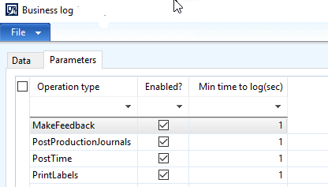
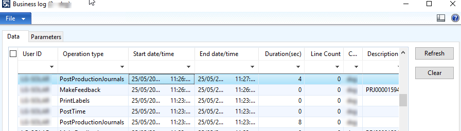
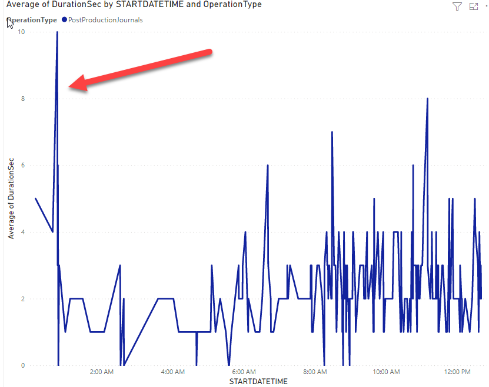
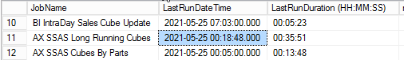
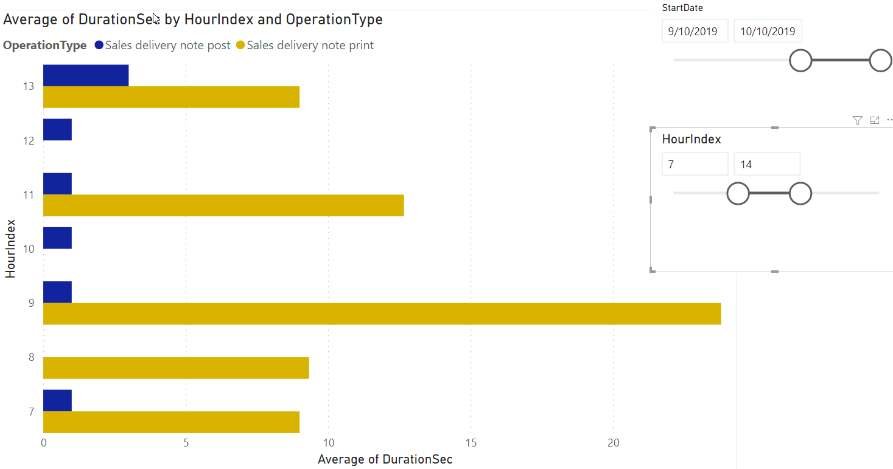

Business operations monitoring is used when you have some important processes in your Dynamics AX system and you want to control/measure the performance of them. It is an activity that may be done after the main Dynamics AX [performance optimization project](https://denistrunin.com/performance-audit) and usually it happens when some processes show unstable behaviour. Usually, the reasons for this are the following:

- Parameters sniffing 
- Some external processes that overload hardware

Also, you can get a wrong input from the users, who  are complaining that the system is slow, but refering to a wrong process. So having and discussing some numbers instead of general words like slow/fast can greatly improve the communication process.

## Performance log implementation detail

I will describe the implementation for Dynamics AX 2012, but probably for all other systems (AX2009 and D365FO) it will be the same.

First you need to create a setup table that defines which Operations to monitor and logging threshold:



Then you create a table that stores performance log data(like Start/End time, Duration, Number of lines, User, etc..)



And you need to write a code that actually creates log data(using a helper class):

```c#
    DEV_ProcMetrics     procMetrics = DEV_ProcMetrics::construct();
    ;
    procMetrics.beginTrace();
    // HERE MAIN OPERATION;
    // can use procMetrics.incLineCount();
    procMetrics.endTrace(DEV_BMLogOperation::SalesInvoicePost,
                 int642int(salesParmLineLocal.RecId), // or procMetrics.getLineCounter()
                 "document ref");
```

## Practical examples

Creating the log is quite a simple task, the main difficulty is how to analyse this data to get some valuable insights. And for this purpose Power BI is a great tool, that allows you to view the data from different angles. Let's check some practical examples:

The first one is the case where the users complained about slow production journal posting. To examine this problem we implemented a log and then analysed average posting time. There was some slowness around 1am and it happened almost every day:



Further analysis showed that during this time a complex SQL Agent SSAS cube update job was [executed](https://github.com/TrudAX/TRUDScripts/blob/master/Performance/AX%20Technical%20Audit.md#sql-agent-jobs) and this slowed down journal posting. 



Another interesting case was when the users complained about slow Dynamics AX Sales order posting. This coudn't be replicated on Test system and we implemented a log for 2 main processes that took place when the user pressed a **Post** button. It was the actual posting and a printing report to a printer. Analysis showed that most of the time system was busy printing documents and this time increased during some hours (like 9am on the graph below) 



This allowed us to switch a conversation from "AX performance" to "Network printers performance" and involve proper people to resolve this. 

## Conclusion

In this blog post I provided some samples on how to implement performance monitoring in Dynamics AX and analyse performance of Dynamics AX operations with Power BI. Sample files(xpo that contains log table, form and a helper class) can be found in the following [folder](https://github.com/TrudAX/TRUDScripts/tree/master/Performance/Jobs/TimeLogTable).

I hope you find this information useful. Don't hesitate to contact me in case of any questions or if you want to share your Dynamics AX/D365FO operations monitoring approach. 

