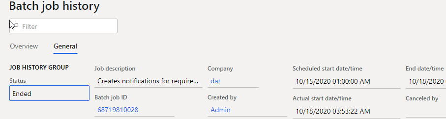

---
title: "Analysing Dynamics AX / Dynamics 365FO batch performance using Power BI"
date: "2020-11-19T22:12:03.284Z"
tags: ["Performance", "PowerBI"]
path: "/performance-powerbibatch"
featuredImage: "./logo.png"
excerpt: "The blog post describes how to analyse batch tasks execution in Power BI Desktop"
---

Batch task processing is playing an important role during Dynamics AX / Dynamics 365FO performance analysis.  Batch tasks executed on a separate server but may affect system performance producing a load to SQL Server database. In this post, I show how to use Power BI to analyse batch performance.

## Getting the data

The source data for our report is a **Batch execution history** table(BATCHHISTORY) where the system logs all batch runs(you need to check that **"Save job to history"** flag is enabled for a batch job).

 

In a lot of clients, you can't install additional software on SQL server to query this data directly. So the easiest way to get the required data is to execute a query in SQL Management Studio and copy/paste its result into the local Excel file. Then this file can be used as a source data for our Power BI report.

See below the sample query that I use for AX2012

```sql
DECLARE  @m int
set @m = DATEDIFF(mi,SYSUTCDATETIME(), SYSDATETIME())
SELECT
CASE
  WHEN [BATCHHISTORY].[STATUS] = 3 THEN N'Error'
  WHEN [BATCHHISTORY].[STATUS] = 4 THEN N'Finished'
  WHEN [BATCHHISTORY].[STATUS] = 8 THEN N'Canceled'
  ELSE CONVERT(nvarchar, [BATCHHISTORY].[STATUS])
END as [STATUS]
      ,[BATCHJOBHISTORY].[CAPTION] as [BatchCaption]
      ,[BATCHHISTORY].[CAPTION]    as [TaskCaption]
      ,[BATCHHISTORY].[BATCHJOBID]
      ,[BATCHHISTORY].SERVERID
      ,(SELECT TOP 1 [Name] FROM [DynamicsAXProd_model].[dbo].[ModelElement] where axid = [BATCHHISTORY].CLASSNUMBER and ElementType = 45) as ClassName
      ,[BATCHHISTORY].CLASSNUMBER
      ,DATEADD(minute, @m, ORIGSTARTDATETIME) as [ORIGSTARTDATETIME]
      ,DATEADD(minute, @m, [BATCHHISTORY].[STARTDATETIME]) as [STARTDATETIME]
      ,DATEADD(minute, @m, [BATCHHISTORY].[ENDDATETIME]) as [ENDDATETIME]
      ,DATEDIFF(ss, [BATCHHISTORY].STARTDATETIME, [BATCHHISTORY].enddatetime) as [DurationSec]
      ,[BATCHHISTORY].[COMPANY]
      ,[ALERTSPROCESSED]
      ,[BATCHCREATEDBY]
      ,[CANCELEDBY]
      ,DATEDIFF(mi, [BATCHJOBHISTORY].ORIGSTARTDATETIME, [BATCHJOBHISTORY].STARTDATETIME) as [StartDelayMin]
  FROM [dbo].[BATCHJOBHISTORY], [dbo].[BATCHHISTORY]
where
[BATCHHISTORY].BATCHJOBHISTORYID = [BATCHJOBHISTORY].RECID and
DATEADD(minute, @m, [BATCHJOBHISTORY].[STARTDATETIME]) > CONVERT(datetime, '2019-08-12', 120)

```

You need to adjust STARTDATETIME filtering, limiting the number of rows to 100-200k(start with one previous week for example). For D365 Fin Ops you can also create a data entity for it or just run this query for a PROD database copy.

## Batch analysis reports

Let's see what kind of report we can build from this dataset:

### - Total duration

The first report we can build analysing **Total duration of  batch tasks** from the different measures


The first visual here displays **Total duration by task name**, where we can find what are our longest tasks and then invest our time into optimizing top tasks from this list.

The second visual displays how busy were our batch servers(**Duration by ServerID**). In the example above we can see that the amount of work executed on AOS01 is way less than on AOS02, so maybe a good idea to relocate some tasks to it.  

And the third visual displays the number of batch tasks and their duration by company, so we can define our top companies.

### - Delayed batch tasks

There can be a situation where a batch task is scheduled for a particular time but was not executed on this time because there won't be free threads available. We can calculate the delay as the differences between **StartDateTime** and **OrigStartDateTime** columns.

One of the main parts of configuring a batch server is to specify a "Maximum batch threads" that it can handle and the situation where you have delayed tasks is not normal, on a properly configured system this should never happen.  

> From the practical experience: don't set this value to low. A modern 8 core server can handle 50-200 batch threads, so start with this interval.  


The second report displays such delayed tasks.


It allows identifying which tasks were delayed, on what server and at what time. In the example above we see that there are a lot of tasks were delayed around 9 pm every day. It was a project case when we have found that "Customer ageing report" was incorrectly configured that overloaded batch server with multiple tasks.

### Batch tasks schedule

Another important part of AX performance analysis is analysing how batch tasks are scheduled during the day. Usually, it is not a problem if a large task is executed at night, but if it runs during the day it may affect users' work.

The third report displays how the top batch jobs executed during the day.


We see that there are 2 big tasks executed after 7 pm and one big task executed around 1 pm. Then it is worth discussing whether we need it in the middle of the day and how we can optimize it.

## Conclusion

With the help of Power BI you can analyse 3 main points of Dynamics AX/ D365FO batch tasks performance: Longest tasks, Delayed tasks and Schedule during the day. I upload files used for this post to the following [folder](https://github.com/TrudAX/TRUDScripts/tree/master/Performance/Jobs/PowerBI)

I hope you find this information useful. As always, if you see any improvements or suggestions, don't hesitate to contact me.
