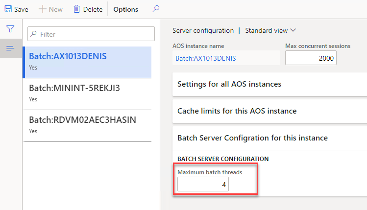

Batch 

## Getting the data

In a lot of clients you can't install additional software on SQL server. So the easiest way to get the required data is to execute the SQL query in SQL Management Studio and copy/paste its result into the local Excel file. Then this file can be used as a source for our PowerBI report. 

See below the sample query that I use for AX2012

```sql
DECLARE  @m int
set @m = DATEDIFF(mi,SYSUTCDATETIME(), SYSDATETIME())
SELECT 
	CASE
		WHEN [BATCHHISTORY].[STATUS] = 3 THEN N'Error'
		WHEN [BATCHHISTORY].[STATUS] = 4 THEN N'Finished'
		WHEN [BATCHHISTORY].[STATUS] = 8 THEN N'Canceled'
		ELSE CONVERT(nvarchar, [BATCHHISTORY].[STATUS])
	END as [STATUS]
      ,[BATCHJOBHISTORY].[CAPTION] as [BatchCaption]
      ,[BATCHHISTORY].[CAPTION]    as [TaskCaption]
      ,[BATCHHISTORY].[BATCHJOBID]
	  ,[BATCHHISTORY].SERVERID
	  ,(SELECT TOP 1 [Name] FROM [DynamicsAXProd_model].[dbo].[ModelElement] where axid = [BATCHHISTORY].CLASSNUMBER and ElementType = 45) as ClassName
	  ,[BATCHHISTORY].CLASSNUMBER
	  ,DATEADD(minute, @m, ORIGSTARTDATETIME) as [ORIGSTARTDATETIME]
      ,DATEADD(minute, @m, [BATCHHISTORY].[STARTDATETIME]) as [STARTDATETIME]	  
      ,DATEADD(minute, @m, [BATCHHISTORY].[ENDDATETIME]) as [ENDDATETIME]
	  ,DATEDIFF(ss, [BATCHHISTORY].STARTDATETIME, [BATCHHISTORY].enddatetime) as [DurationSec]
      ,[BATCHHISTORY].[COMPANY]
      ,[ALERTSPROCESSED]
      ,[BATCHCREATEDBY]
      ,[CANCELEDBY]
	  ,DATEDIFF(mi, [BATCHJOBHISTORY].ORIGSTARTDATETIME, [BATCHJOBHISTORY].STARTDATETIME) as [StartDelayMin]
  FROM [dbo].[BATCHJOBHISTORY], [dbo].[BATCHHISTORY]
where 
[BATCHHISTORY].BATCHJOBHISTORYID = [BATCHJOBHISTORY].RECID and
DATEADD(minute, @m, [BATCHJOBHISTORY].[STARTDATETIME]) > CONVERT(datetime, '2019-08-12', 120)

```

You need to play with Date filtering, limiting the number of rows to 100-200k(start with one previous week for example). For D365 FinOps you can also create a data entity for it or just run it for a PROD database copy.

Lets consider what kind of report we can build from this dataset

### Total duration

The first report we can build is total duration per task from different measures 


The first visual here displays **Total duration by task name**, where we can find what is our longest tasks and then invest our time into optimizing top tasks from this list.

The second visual displays how busy were our batch servers(**Duration by ServerID**). On the example above we can see that the amount of work executed on AOS01 is a way less than on AOS02, so maybe a good idea to move some tasks to it.  

And the visual that display number of batch tasks and their duration by company

### Delayed batch tasks

One of the main part of configuring a batch server is to specify a "Maximum batch threads" that is can handle 



If you set this number to low there can be a situation where a batch task is scheduled for particular time but was executed with some delay because there were not free threads available. We can calculate the delay as the differences between **StartDateTime** and **OrigStartDateTime** columns.

The situation where you have delayed tasks is not normal, on a properly configured this should never happen. The second report displays such delayed tasks. 


It allows to identify which tasks were delayed, on what server and at what time. In the example above we see that there are a lot of tasks were delayed around 9pm every day. Then we have found that customer ageing report was incorrectly configured that overloaded batch server with multiple tasks.

### Batch tasks schedule

Another important part of AX performance analysis is analysing the way how batch tasks were scheduled during the day. Usually it is not a problem if large task executed at night, but if it runs during the day it may affect users work.

The third report displays how top batch jobs executed during the day. 


We see that there are 2 big tasks executed after 7pm and one big task executed around 1pm. Then is worth do discuss to we need it in the middle of the day and how we can optimize it.

## Conclusion

Power BI can help  

I hope you find this information useful and will use it in case of any AX2009, AX2012, Dynamics 365FO performance troubleshooting. As always, in case of any problem, suggestion or improvement, do not hesitate to contact me.
