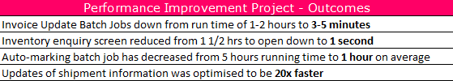
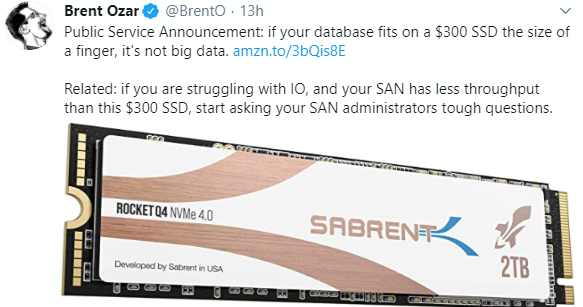
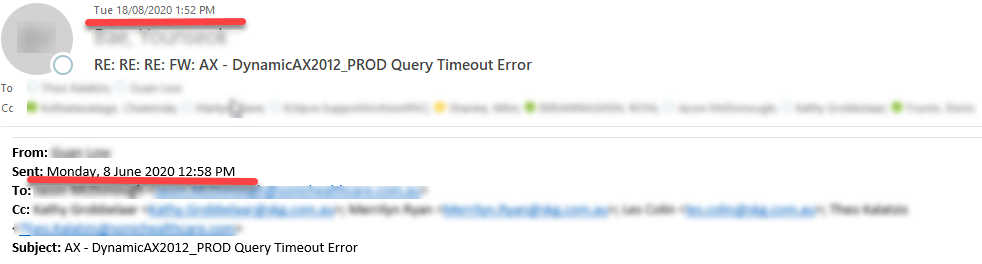
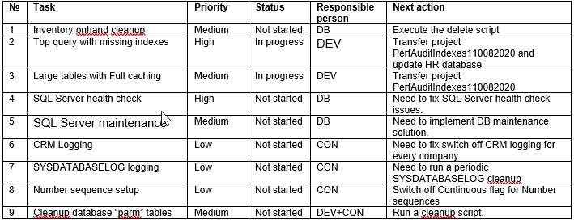

---
title: "How to manage a Dynamics AX performance optimization project"
date: "2020-10-07T22:12:03.284Z"
tags: ["Performance"]
path: "/performance-projmanage"
featuredImage: "./logo.png"
excerpt: "The blog post describes how to organize a Dynamics AX performance optimization project, who should be involved, and how the process should be organized"
---

Your Dynamics AX system(AX2009/AX2012 or Dynamics 365 for Finance and Operations) is slow, the users are complaining about performance and it is not clear what to do to fix that. The solution is to start a performance optimization project. How to organize this project, who should be involved, and how the process should be managed is explained in this blog post.

We recently finished quite a successful performance optimization project and I will use it as an example for this post. The similar approach described here was used on dozens of different AX2009/AX2012 projects. I also describe common mistakes to avoid.

## Project overview

The client was a big retail company running AX2009 for about 10 years with 80 users and 1TB database size. With the COVID-19 situation, they saw an increase in their sales and the performance of Dynamics AX, that had been average before this, became critical.

As a final result, they saw a great improvement in AX performance.

System stability was greatly improved, here are some measurable results:

In total, we did 43 different performance tasks and the project length was 3 months. So these results were quite amazing.

As an AX technical consultant, I can say that the project flow and organization were great and contained all typical interaction types that exist in similar projects. The project size due to system complexity was above average(for example Technical consultant time was 45 days, that is more than usual).

I want to describe the pieces of success and common mistakes that I saw on other projects like this.

## Performance project team

The main factor for success is the proper project team. A typical project team should have the following people:

- IT manager
- Functional consultant
- Infrastructure manager
- SQL administrator
- Project manager
- AX Technical consultant

One person can combine several roles but **all these roles** should be a part of the project.

### Typical mistakes of organizing a team

Let's discuss what can happen if we don't configure a team as recommended:

#### - No project manager allocated

Initially that seems reasonable: the system is critically slow, you need just technical people who tell you what to do and not managers. But this became an important factor later.

A lot of performance tasks are complex, have no direct impact on users and require efforts from different people to be solved.

> Probably the most typical example here is a recurring batch job that tries to reserve quantity for open orders, but some orders are old, will never be reserved and the process happens again and again. Or an integration task that tries to process wrong messages every time it runs and does not mark them with an error flag.

Such jobs can produce a huge constant load on AOSes and SQL Server and are quite complex to resolve. You need to contact business users, understand the reason for such multiple processing, find a solution, develop and test a fix(this can be complex for a procedure that was developed 5 years ago and nobody wants to touch it). So a good project manager should allocate resources for tasks like this and control the execution.

#### - Only SQL DBA/Infrastructure team is involved

This is a typical situation in the beginning. Users complaining about performance, you ask you DBA to check servers and find the reason. Often this doesn't work and ends up with more statistics or index updates. A lot of performance problems are related to parameter sniffing issues or Dynamics AX settings/code, and it is hard for SQL DBA to fix that, without knowing what is the logical purpose of these tables and what should be the correct SQL plans for long queries.

#### - SQL DBA/Infrastructure team is not involved

This is the opposite situation to the previous case. Sometimes performance problems are related to SQL Server or hardware configuration.

This tweet probably represents a common problem. Hardware used for multimillion ERP implementations is less powerful than a typical gaming laptop.

If you don't include SQL/Infrastructure team into the project team, there is a high chance they just push back any recommendations.

Even for the most obvious performance counters, it is quite easy to reject recommendations, let's take a CPU load as an example. If the load on AOS is 80%(that is really big) and the recommendation is to add more CPU cores, it can be argued that almost 20% are not used and everything is OK. Or if the CPU load is 100% for 10 minutes and then 20% for 10minutes - the average will be 60%. Such discussions are very time consuming and not productive, and may be simplified if all participants are within one team.

#### - Only AX technical consultant involved

Your Dynamics AX is slow and you ask AX technical consultant to check why and give their recommendations. A typical example of this: a company hires a Microsoft Services consultant, they do a 3 days analysis with [DynamicsPerf](https://github.com/PFEDynamics/DynamicsPerf) tool and at the end give you a very nice looking report.

This may solve simple issues, but may not work in some difficult cases.

> For example, for this project one of the problems was related to slow shipment processing. When we started analysis we have found that a shipment module was using a lot of cross-companies queries, but the actual company was always defined in the business process, so these cross-companies queries were removed and it gave quite a considerable performance boost.

Finding and fixing issues like this involves a lot of communications and may not be resolved just by a single person sitting and running some queries.

## The Project flow and tasks

The team should meet on a very regular basis(like once a week) to discuss what **changes** and tasks should be done in the system to make it faster.

Quite an important point here is that each task should be testable, tracked and have a status. Don't allow email chains like in this screenshot, where one problem was being discussed for 2 months with more and more people getting involved.

The initial set of tasks usually comes from a [Performance audit](https://denistrunin.com/performance-audit), here is a "typical" example:

Other tasks come from 2 sources:

- User complaints (e.g. an operation works slowly)
- Periodic servers monitoring(Top SQL queries, Blocking, missing indexes, etc..)

For user complaints, the first question that should be asked is "Can we replicate this issue in a Test environment?". If we can do this it means that the task is quite simple, we allocate it to a developer for the tracing and investigating. If the answer is "No" then the team should discuss the plan to proceed. Probably the first thing to do in this case is to implement a tracing solution that will allow us to operate some numbers(e.g. how often the issue happens, at what time, what are the delays and so on) rather than just general "the system is slow".

Also, before discussing any optimizations it is worth finding what business task users are trying to resolve, maybe there is another more efficient way to do it.

> The classic example here is a case where the whole accounting department complained about slow Dynamics AX2012 performance. The Client had already upgraded SQL hardware, installed a new AOS, but nothing helped. When we discussed the issue we found that a part of users daily work was to update clients information. In order to do this, they opened "All customers" list page, filtered it by the required customer, double clicked on it to open "CustTable" form, edited the information, then closed CustTable form, filtered "All customers" list page again by the next customer and so on... "CustTable" is a very heavy form that takes about 5 seconds to load and such delay was very annoying if you need to update 20-50 customers. The solution was quite simple: we just showed them that they don't need to close "CustTable" form to switch the active customer, there is a Grid view in this form where you can almost instantly search for it. The users were very happy.

## Ready to change and forward only approach

That is what I suggest to discuss with a customer at the beginning of the project. The only way to fix performance problems is to **change** something. There is no magic flag "Run faster" in Dynamics AX or SQL Server.

These changes can be done in multiple areas, but as with any change, there is always a chance that it can affect the system in a negative way. We try our best to avoid this, but such issues are happening on almost every project. Even a positive change(you created a new index or cleaned up some tables) can produce a negative effect due to parameters sniffing.

The only correct way to deal with such issues is to continue the system monitoring, identify and fix them quickly. Not a correct way is to perform a rollback.

Some practical recommendations:

- Have someone from the customer team to apply any changes to Production. There were a lot of situations like this: you created an index and the next day some users can't print documents(totally unlinked events). Then there were usually a lot of emails trying to find the reason and blame someone and the person who did the last change is a perfect candidate for this.
- Allocate a day to monitor the system after the changes were applied. This is needed to [catch and fix](https://denistrunin.com/performance-sniffing) parameters sniffing issues.
- For the first round of changes include as many as possible. The strategy "one change in a time" doesn't work well in the beginning. Often the first positive feedback from users creates a lot of trust, that makes the project flow simpler later.

## Prepare a separate LAB version for the project

Often the most complex problem in performance optimization is to replicate an issue. There are a lot of cases where the operation(for example Sales orders posting or some batch job) is working without any issues during the day, but becomes slow during a certain hour. The reason may be in other parallel processes that caused blocking or the high system load, but very often this depends on the particular data used in this process.

> Typical example: warehouse operations where for some period you can have zero lines ready for shipment, but an hour later there are 10k lines.  

To trace such issues quickly, a database point-in-time restore(like restoring the Database at 11.32 am) can provide valuable information. So organizing a separate environment where such backups can be restored and traced can save a lot of time allowing to quickly replicate an issue and test the fix later.

You don't need to replicate full Production hardware for this. In this project, we used a separate one-box environment(that included AOS, SQL and all other components) with 8 CPUs cores, 48GB of memory and 3TB drive(to keep 2 copies of database backup). Also, an important tip is to run this environment under a user that doesn't have any Production access to avoid situations of sending e-mails to the real customers or to the production integration folders.

## Deployment and communication channel

This process of Dynamics AX performance optimization is iterative: we fix first top current issues, then continue monitoring, provide a new set of actions and so on... It is quite important to minimize the time that is needed to deploy the changes to Production. For some customers, it is not a problem, but may be challenging for others.

I suggest reviewing the deployment process and try to simplify it if possible. Ideally, we should be able to do deployments every day if needed.

Also, a great role in project success plays a good communication channel(other than e-mail). A group in Microsoft Teams is probably the best solution for this, however, sometimes it is tricky to create it due to different users' domains(check this [trick](https://github.com/Zerg00s/MultipleTeamsInstances) if you want to run multiple Teams on one computer).

## Deal with external integrations

Some integration types can often cause performance problems. In AX2009/AX2012 such "dangerous" types are:

- SQL access to the Dynamics AX database for the 3-party application.
- AIF or Service endpoint to query some information

The common problem is that these 3-party applications can easily stop the whole system by calling these services or running SQL in an uncontrolled manner. The main problem here is that you can’t control or change these 3-party applications, they often belong to a different team that doesn’t care about ERP problems.

> Examples that we had: SQL query to get customer information(Address, Contact info) with some missing DataAreaId field in joins, that leads to full table scan for each call, or frequently calling AX service that returns On-hand data for the whole store.

In cloud D365FO version, Microsoft faced exactly the same problems(OData replaces SQL access for the cloud) and the solution they proposed is a [Priority based throttling](https://docs.microsoft.com/en-us/dynamics365/fin-ops-core/dev-itpro/data-entities/priority-based-throttling). That means when the system is highly loaded such queries will get an exception. There were some negative comments about this feature on Yammer, but when you see how the whole Dynamics AX performance is affected just by one incorrectly written query, your opinion may be changed. So throttling can help in this case(at least start the dialog about optimization).

The best solution is probably not using such integration types if you can't control the external system. If you need to provide some information to the 3-party system, just unload it to the separate database(like BYOD in Dynamics 365FO).

But it is very hard to change the integration process that is already implemented, so a typical approach is optimizing X++ code related to the service, and discussing call frequency with the external team(that is where you need an "IT manager" person).

## Conclusion

So to deal with Dynamics AX performance problems you need the following:

- Organize a team with the right people
- Properly manage performance issues
- Prepare a test version
- Do a good integration design

This allows you to quickly resolve and fix any problem.

I hope you find this information useful and will use it in case of any AX2009, AX2012, Dynamics 365FO performance troubleshooting. As always, in case of any problem, suggestion or improvement, do not hesitate to contact me, I will be happy to discuss it.
