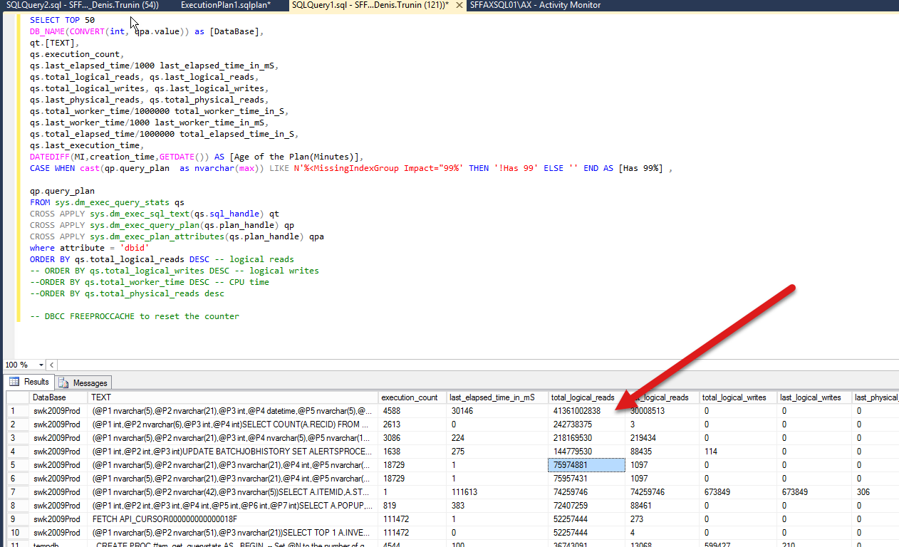
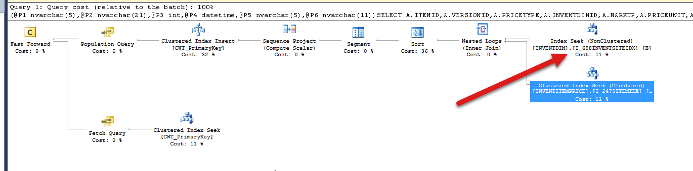
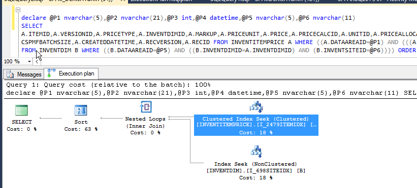
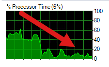
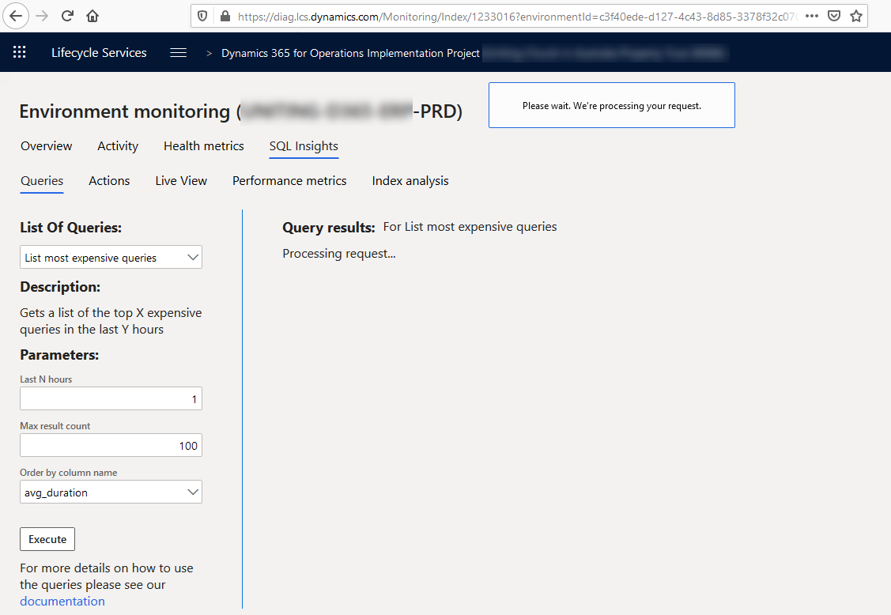
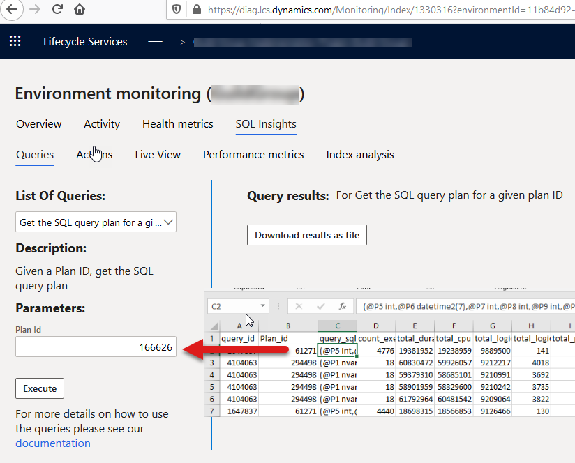

Let's discuss how AX performance problems caused by "parameters sniffing" may be resolved when you have on-premise system and access to SQL Server and for Dynamics 365 Finance and Operations.

## AX2009/AX2012 on-premise

One of our clients reported a problem that his users complained about a slow AX performance. There was not just one operation, the general complain was something like: "System is very slow today - Posting is slow and invoicing is slow". When I logged in to the SQL box, the first metric I saw was a high CPU utilization that was above normal for this client.  

After executing a [top SQL query](https://github.com/TrudAX/TRUDScripts/blob/master/Performance/AX%20Technical%20Audit.md#get-top-sql), I saw the following result. The first query took more than ten times logical reads than the second one.



The query was quite simple - get the last cost price for the item

```sql
@P1 nvarchar(5),@P2 nvarchar(21),@P3 int,@P4 datetime,@P5 nvarchar(5),@P6 nvarchar(11))SELECT A.ITEMID,A.VERSIONID,A.PRICETYPE,A.INVENTDIMID,A.MARKUP,A.PRICEUNIT,A.PRICE,A.PRICECALCID,A.UNITID,A.PRICEALLOCATEMARKUP,A.PRICEQTY,A.STDCOSTTRANSDATE,A.STDCOSTVOUCHER,A.COSTINGTYPE,A.ACTIVATIONDATE,A.MCSPMFBATCHSIZE,A.CREATEDDATETIME,A.RECVERSION,A.RECID FROM INVENTITEMPRICE A WHERE ((A.DATAAREAID=@P1) AND (((A.ITEMID=@P2) AND (A.PRICETYPE=@P3)) AND (A.ACTIVATIONDATE>@P4))) AND EXISTS (SELECT 'x' FROM INVENTDIM B WHERE ((B.DATAAREAID=@P5) AND ((B.INVENTDIMID=A.INVENTDIMID) AND (B.INVENTSITEID=@P6)))) ORDER BY A.DATAAREAID,A.ACTIVATIONDATE,A.CREATEDDATETIME DESC
```

But when I clicked on "query_plan" column in the output, I saw the reason why it took so much time – the wrong plan that started with **InventDim** table.



Probably recently they created a new location, and this new location was the first parameter for this query and SQL Server based on the current statistics decided to start the plan with **InventDim**(that was probably OK for this new location with no data), the plan was cached and caused a performance problem for all other locations.

The correct plan should be the following - start the search by **ItemId** and then check **InventDim**(it can be obtained by running **Display Estimated Execution plan** for the query above)



To avoid such situations in the future, I created a custom plan with a "force order" hint

```SQL
EXEC sp_create_plan_guide @name = N'[AX_InventItemPriceDimSite]', @stmt = N'SELECT A.ITEMID,A.VERSIONID,A.PRICETYPE,A.INVENTDIMID,A.MARKUP,A.PRICEUNIT,A.PRICE,A.PRICECALCID,A.UNITID,A.PRICEALLOCATEMARKUP,A.PRICEQTY,A.STDCOSTTRANSDATE,A.STDCOSTVOUCHER,A.COSTINGTYPE,A.ACTIVATIONDATE,A.MCSPMFBATCHSIZE,A.CREATEDDATETIME,A.RECVERSION,A.RECID FROM INVENTITEMPRICE A WHERE ((A.DATAAREAID=@P1) AND (((A.ITEMID=@P2) AND (A.PRICETYPE=@P3)) AND (A.ACTIVATIONDATE>@P4))) AND EXISTS (SELECT ''x'' FROM INVENTDIM B WHERE ((B.DATAAREAID=@P5) AND ((B.INVENTDIMID=A.INVENTDIMID) AND (B.INVENTSITEID=@P6)))) ORDER BY A.DATAAREAID,A.ACTIVATIONDATE,A.CREATEDDATETIME DESC',
@type = N'SQL',
@module_or_batch = null,
@params = N'@P1 nvarchar(5),@P2 nvarchar(21),@P3 int,@P4 datetime,@P5 nvarchar(5),@P6 nvarchar(11)',
@hints = N'OPTION(force order, loop join)'
```

After that, the system performance restored to normal, and the CPU load was considerably reduced.



So the troubleshooting was quite easy to perform, the problem was fixed, and this issue will not happen again. The complexity of these steps is that you need someone who understands Dynamics AX DB structure and has access to the SQL Server.

If you have just a SQL administrator who doesn't know AX Database structure, you can create a simple instruction to deal with such problems:  

- Run a top SQL [query](https://github.com/TrudAX/TRUDScripts/blob/master/Performance/AX%20Technical%20Audit.md#get-top-sql) and copy results to Excel(you can copy all columns except the last one - "query_plan")
- Click on the last column - "query_plan" for the first 3-5 rows
- Save them to separate files with  **.sqlplan** extension
- Try to clear the SQL cache with **DBCC FREEPROCCACHE** command

Then this information may be passed to AX developer in order to fix the problem.

The wrong way to resolve such problems is to perform one of these actions:

- Restart the system

- Run reindexing

- Run statistics update

These actions will clear the current cache, and there is a high chance that the problem will disappear, but it will not be resolved.

## Dynamics 365 Finance and Operations - cloud version

In the above situation, we had access to the SQL box, let's discuss how this can work when we don't have direct access to the SQL Server - in the new cloud D365FO.

Microsoft proposes to use LCS for this. On the Environment monitoring page you have a "SQL Insights" tab where you can execute the predefined **"List most expensive queries"** command(full documentation is [here](https://docs.microsoft.com/en-us/dynamics365/fin-ops-core/dev-itpro/lifecycle-services/performancetroubleshooting))



And to check the actual plan you need to get a result of this command and paste it to **"Get the SQL query plan for a given plan ID"** and this will give you a **.sqlplan** file that you can open in a local SQL Management studio.



Then there is another command to fix the plan.

So **in theory,** we should have almost the same tools as we have with on-premise system. But the current problem is that every action in LCS is very slow. I tested these functions on several production environments and typical response time was about **5-10 minutes**(you just see "Please wait" message). This time is huge, and the whole system is quite unusable due to this. Moreover, you can't run this in different windows, only one request in time is allowed.

From the practical experience queries that work with SQL plan cache are almost instant even for huge databases, so the current problem is somewhere in communication between LCS and Azure SQL.

## Conclusion

If you use the on-premise system(AX2009, AX2012) and have access to SQL Server, make sure that your administrators know how to diagnose and solve parameters sniffing issues. It may happen even for an old system, for example, a case from this blog happened to a seven year old system.

If you are in the cloud - vote for the [idea](https://experience.dynamics.com/ideas/idea/?ideaid=2a4ab902-5690-ea11-99e5-0003ff68aebe) to fix LCS Insights response time

Any comments are welcome
