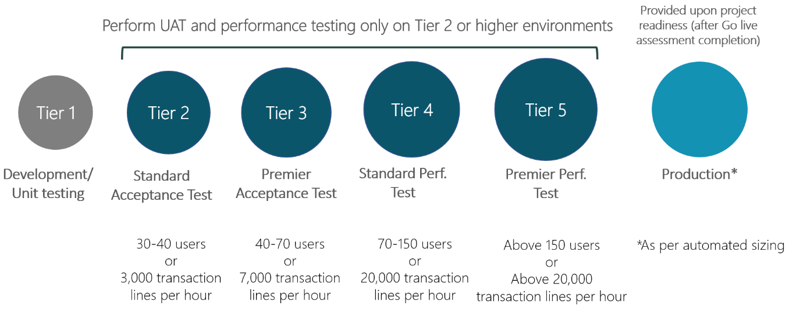
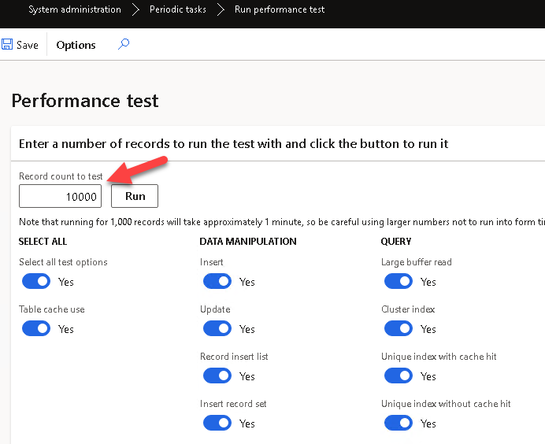
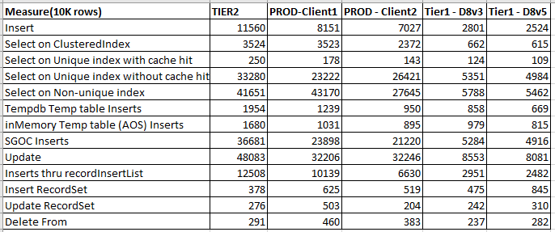
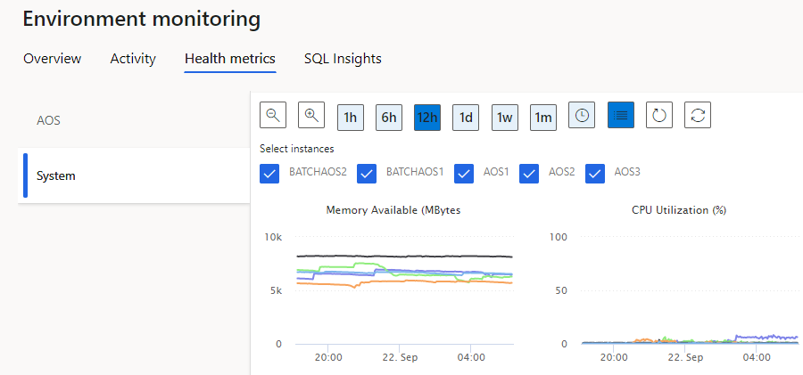

---
title: "Understanding Dynamics 365FO different Tiers performance"
date: "2022-11-03T22:12:03.284Z"
tags: ["Performance"]
path: "/performanceD365-tierperf"
featuredImage: "./logo.png"
excerpt: "The blog post describes performance differences between various environments Tiers in D365FO."
---

ERP system performance is always an essential topic in system implementation. And with the cloud systems, it is even more complex as we have different system tiers. General planning is described in the following docs article:   [Environment Planning](https://learn.microsoft.com/en-us/dynamics365/fin-ops-core/fin-ops/imp-lifecycle/environment-planning)  and we have the following environments:



But there is not much publicly available information related to D365FO hardware configuration for these Tiers. In this blog post, I describe some cases that help to understand Dynamics 365FO performance basics.

## Different tiers and their performance

D365FO, as a backend, uses different database types: **SQL Sever** for Tier1 and **SQL Server Azure** for Tier2+ and PROD.

In the standard system, there is a **Run performance test** form that allows seeing the execution speed for different SQL queries. This is a single-threaded test that measures the speed of individual queries and not the overall capacity of the system.



I used 10k rows instead of the default 1k, ran it on several clients/environments and got the following results (to present the data in a table view, copy them to Excel and run Data > Text to Columns with ":" delimiter)



I also ran the test in Tier3 and Tier4, and it seems they are similar to Tier2.

Let's discuss these results:

### Single-row operations

In operations that include many small calls **SQL Azure** is slower(4-8 times) than a standard SQL Server. This is probably happening due to a large latency. The difference looks dramatic(as a typical X++ code often contains many small select statements), but in the latest releases, Microsoft implemented a lot of caching classes, so for business operations, it is not so critical in general.

One of the real-life examples where you can see this difference is a display method with multiple SQL statements that is used in a form grid. Even with the caching, it may dramatically slow down the form behaviour. For example, 1 second overhead that is not even noticeable on the development VM may become 8 seconds on PROD and create "system is very slow" effects for users.

### Multiple rows operations

There is not much difference between environments in bulk operations(like **update_recordset**). They are also faster compared to individual operations (e.g. row-by-row updates). You can often see advice to use these bulk operations by default, but I recommend avoiding this. The main issue is that **update_recordset** and **delete_recordset** are blocking operations and may stop the whole system if used in the wrong way. And for the cloud system, it will be very hard to troubleshoot and fix that. 

I wrote an article regarding this [Blocking in D365FO and why you shouldn't always follow MS recommendations](https://denistrunin.com/understanding-sql-blocking), and my advice is to use them only if you can measure the business operation benefit.

Also, the fun fact is for the small/mid clients, your laptop probably is more performant than a PROD instance of a multi-million ERP system. Keep this in mind while discussing performance issues with Microsoft support

## Environment planning

Let's discuss some considerations used for environment planning.

### Pricing

The actual price depends on your agreements with Microsoft, but some indicative values are the following:
A typical Tier1 is ~500$/month. Tier2 is 1400$/month, Tier3 is 4000$/month and Tier5 ~12000$/month.

But what is important is a billing period. For Tier1, it is per hour(you can stop the environment when it is not needed), but higher tiers are billed per month.

Microsoft is also preparing a new ["Online development"](https://learn.microsoft.com/en-us/power-platform-release-plan/2022wave2/power-platform-pro-development/cloud-runtime-fo-dataverse-application-development) environment that looks like a simplified Tier2, but its price is unknown now.

### Tier1 or Tier2+ for large data load processes

If we check the performance, in most cases, Tier1 will be faster than Tier2. For one customer, we measured data load time for Released products/Product/Customers entities that ran in multiple threads. The time difference between Tier1(D8v3) and Tier2 was 200-250%  (e.g. load run for 1h on Tier1 and 2-2.5h on Tier2)

Another point to consider is stability. Tier2+ databases are located on Azure SQL Database elastic pools, you can even execute the following command and see who your neighbours are:

```SQL
SELECT * from sys.dm_user_db_resource_governance

```

It allows to scale dynamically, but when the Database is migrated to a different instance [SQL TransientSqlConnectionError](https://learn.microsoft.com/en-us/dynamics365/fin-ops-core/dev-itpro/dev-ref/sql-connection-error) will be generated.

Another point is ongoing maintenance. A table may be reindexed by DAMS service during the data load [Running 1M databases on Azure SQL for a large SaaS provider: Microsoft Dynamics 365 and Power Platform](https://devblogs.microsoft.com/azure-sql/running-1m-databases-on-azure-sql-for-a-large-saas-provider-microsoft-dynamics-365-and-power-platform/). This leads to "*Could not complete cursor operation because the table schema changed after the cursor was declared*" X++ error.

Some D365FO functions can’t handle such errors properly(on one project with 10.0.20, DAMS actions stopped multithreaded DIXF job after 3 hours of execution).

### PROD performance

Microsoft may dynamically scale the PROD database level, depending on customer workload. The exact scale-up/down criteria are unknown, but I saw some cases where the PROD database was allocated even to a lower database tier than a standard Tier2 environment. So you need to be able to measure and compare the performance for critical operations to communicate with support properly.

### Performance testing

You will see this advice in every Microsoft presentation: if you need to measure performance, always use Tier2+ instances. Also, performance testing should not be considered as a one-time exercise, the test should define some measures and a way to monitor them.

The overall flow for D365FO performance testing works this way:

- You calculate the planned workload.

- You submit it using the **LCS Estimator** tool.

- Before GoLive, you need to fill out a GoLive readiness checklist. One of the questions will be whether you tested your system on exactly the same number of lines you specified in the **LCS Estimator** and whether you are happy with the results(on some projects they even required an official paper). You also need to provide dates of the  testing and environment ID

- Microsoft saves the monitoring data from this Environment during the specified dates

So after GoLive, they have this data for any arguments that the PROD is “not fast enough”. You also need this data to register a case if you have general performance issues

### Applications servers

Now application servers are similar to 4-core CPUs and 16GB of RAM VMs. ~~You can't get better AOSes, but~~ Microsoft may add more servers if needed. **Update 07/11/2022** - Several people [reported](https://twitter.com/IevgenMir/status/1589014609029378048) that for the large number of users, AOSes may contain up to 50GB of RAM, so it seems it is possible to have a different config.

LCS provides a view for AOS CPU load and AOSes free memory, so it is quite easy to check if you have reached your capacity



One of the CPU-intensive operations on AOS is a Data management import. For every record, it scans all record fields with all extensions in all modules, which produces a significant workload on application server CPUs.

## Summary

I described some performance measures related to different Dynamics 365 F&O environments. I hope you find this information useful for project planning. As usual, don't hesitate to contact me in case of any questions or comments.

Also, I can't find a working **Tier5** environment. If you have **Tier5** available, it would be great if you could share the "Performance form" results on this environment(with 10k records and when the system is not loaded).**Update 04/11/2022 - it seems from a DB level Tier5 has the same speed as Tier2**
