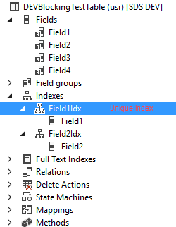
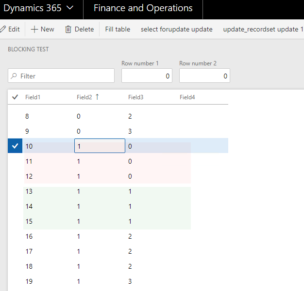

Understanding blocking is a key component of resolving performance issues. You can have fast CPU, a lot of memory, but if you face SQL blocking problem, all these will not be used. Moreover, some tips from the Performance webcasts can actually lead to the blocking. In this post, I describe the most common reasons for blocking and how to avoid them.

## History

SQL Server engine doesn't support "true" row-level blocking, and this was a big problem in the days of Axapta 3.0. But starting from AX 4.0 and SQL Server 2005 situation has changed. SQL Server 2005 introduced  *Read Committed Snapshot Isolation* feature, and in AX 4.0 "Occ enabled" table property was added. Both these components significantly reduced the chance of blocking.

More info can be found in this article

https://blogs.msdn.microsoft.com/emeadaxsupport/2009/07/08/about-locking-and-blocking-in-dynamics-ax-and-how-to-prevent-it/

## Test example

Let's test the common blocking scenario. We will use the following table **DEVBlockingTestTable** , that has 4 fields, Field1 is a unique Alternate Key, Field2 is included into the non-unique index.



We create a form DEVBlockingTest with a set of actions. Initial data will be the following



We need to run 2 sessions(for OneBox VMs using the following link

https://usnconeboxax1aos.cloud.onebox.dynamics.com/?f=DEVBlockingTest ) to test whether we have blocking or not. The first session will update the rows marked in red, second session - marked in green.

### Test 1 - select forupdate

The first test is using **select forupdate** statement

For the first session enter Row number 1 = "1" and Row number 2 = "0" and press "select forupdate" button. For the second session enter "1" and "1" and press the same button

```csharp
ttsbegin;
while select forupdate blockingTableLocal
    where blockingTableLocal.Field2 == updateRow1 &&
          blockingTableLocal.Field3 == updateRow2
{
    blockingTableLocal.Field4 += "u1";
    blockingTableLocal.update();
}
Box::okCancel("Select forupdate has been done", DialogButton::Ok);
ttsabort;
```

**Results:** both sessions will show an OK message. Actually, it doesn't matter, what fields or conditions we are using in the **forupdate** statement, sessions will not block each other in any case. Even in a worst case scenario, when 2 sessions will update the same row, blocking doesn't happen, instead, the **UpdateConflict** exception will be generated(this is the drawback of "Occ enabled" property, it doesn't fit for tables where concurrent updates are normal, like InventSum)

### Common mistakes

Blocking are sometimes not taken into account when discussing performance best practices. One of the recent examples can be found in the **"Performance Patterns and Anti-patterns"** webcast, that can be found at the following link: https://infopedia.eventbuilder.com/index?landingpageid=92tzhl


In this webcast, you can see the following advice(on the 17th minute)


What happens if we use this advice and switch to set-based command?

### Test 2 - update_recordset

let's test this. The same example, 2 sessions, updating a different set of records, but using the **update_recordset** statement:

```csharp
ttsbegin;

update_recordset blockingTableLocal
    setting Field4 = "u1"
    where blockingTableLocal.Field2 == updateRow1
     &&   blockingTableLocal.Field3 == updateRow2;

Box::okCancel(strFmt("update_recordset has been done. Rows: %1", blockingTableLocal.RowCount()), DialogButton::Ok);

ttsabort;
```

When we run the second session, we will see "Please wait.." message. So we just switched our system to "single user mode" using the best practice advice.  


### Ways to resolve this blocking

The best advice based on practical experience - try to avoid set-based operation where possible(this is exactly the opposite of what is recommended in this Microsoft webcast). On the next slide, they show the time of these operations - update 1000 records one by one takes 300ms versus 6ms in the **update_recordset** case.


But in any case it fast. Time to post a typical AX document with 1000 lines can be around 1 to 10 minutes. It will not be noticeable for the user either you add 6ms or 300ms to this time. But it will be very noticeable if the sessions will block each other.

Another option is to create an index, that includes all fields used in the WHERE clause. You can test it using the following command.

```sql
CREATE NONCLUSTERED INDEX [I_TEST1] ON [dbo].[DEVBLOCKINGTESTTABLE]
(
    [PARTITION] ASC, [DATAAREAID] ASC, [FIELD2] ASC, [FIELD3] ASC
)ON [PRIMARY]  
```

Field3 may be added as a normal or "include" index field. This will resolve our example in test 2. But when someone tries to update the same table using a different set of fields(for example Field2 and Field4) we'll get the blocking again.

## Summary

Following some performance tips(even if they are given by Microsoft experts) without knowing the drawbacks can sometimes slow down your system.

- Try to avoid any **update_recordset** and **delete_from** usage by default(especially in document posting operations). Use it only when you are 100% sure that it will not cause blocking and you really need to reduce the operation time

- If you still want to use **update_recordset**, check that all fields, used in WHERE condition, are covered by the existing indexes

I put objects used in this article to GitHub (form **DEVBlockingTest**, table **DEVBlockingTestTable** - https://github.com/TrudAX/XppTools/tree/master/DEVTutorial). Fill free to experiment with it.