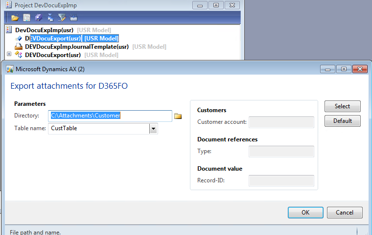
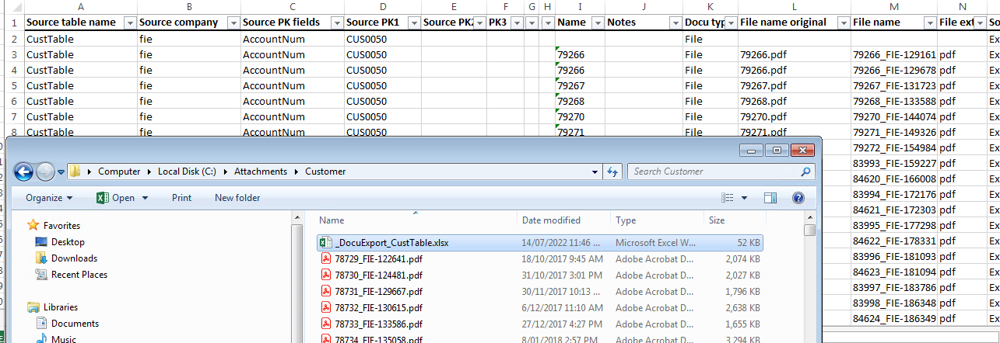
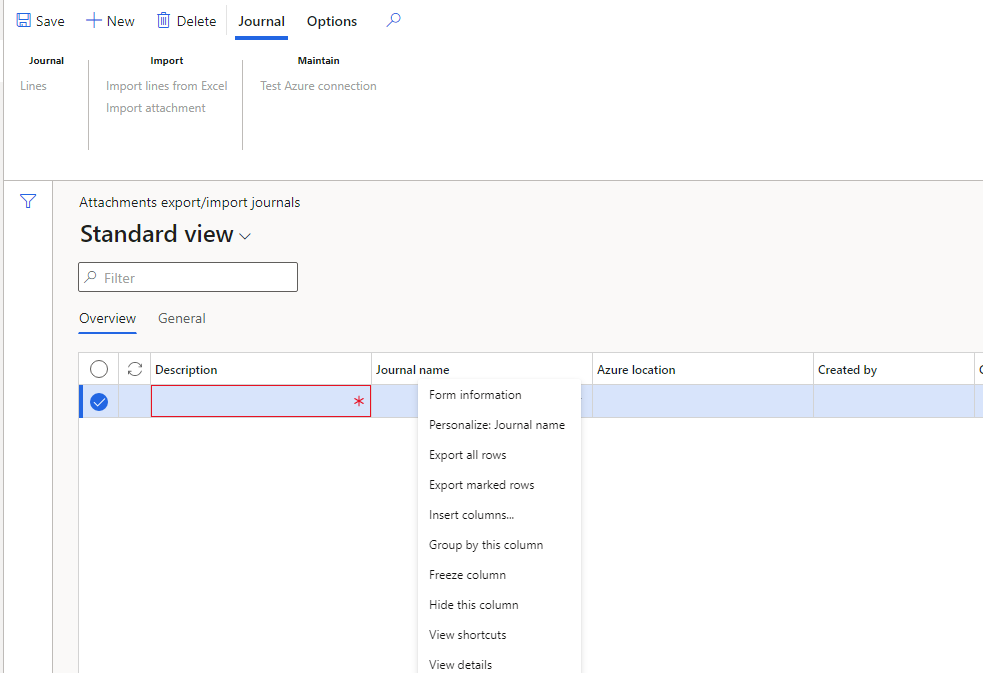
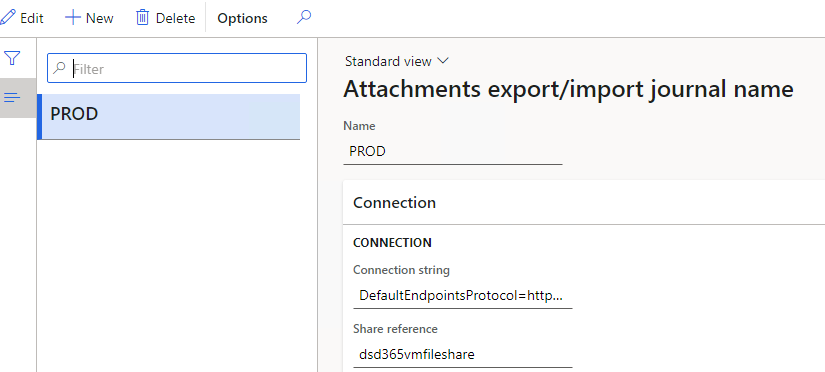
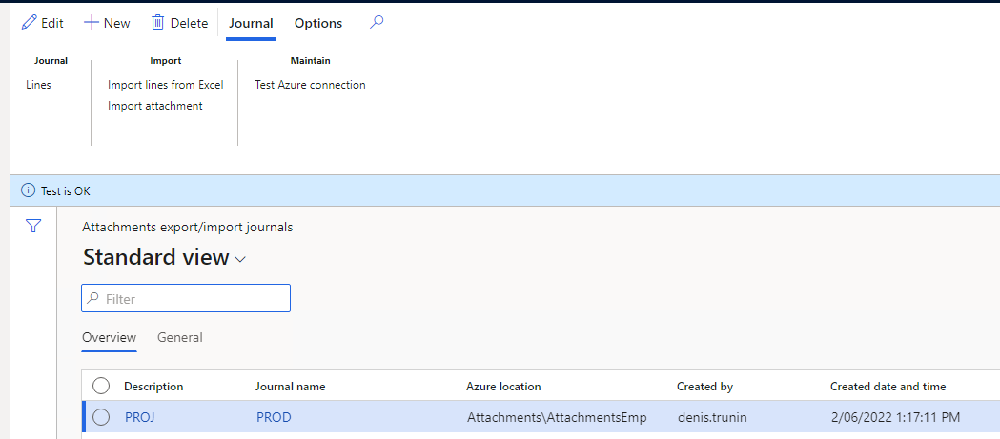
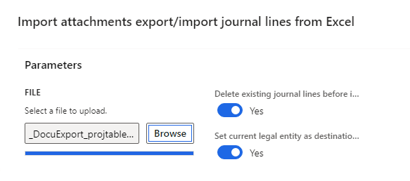
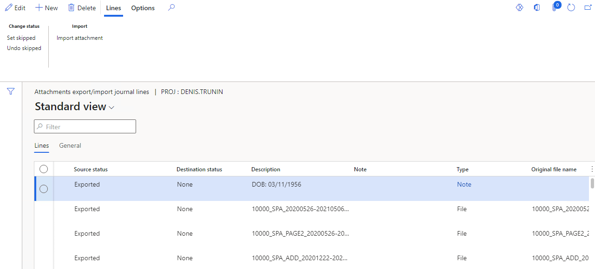
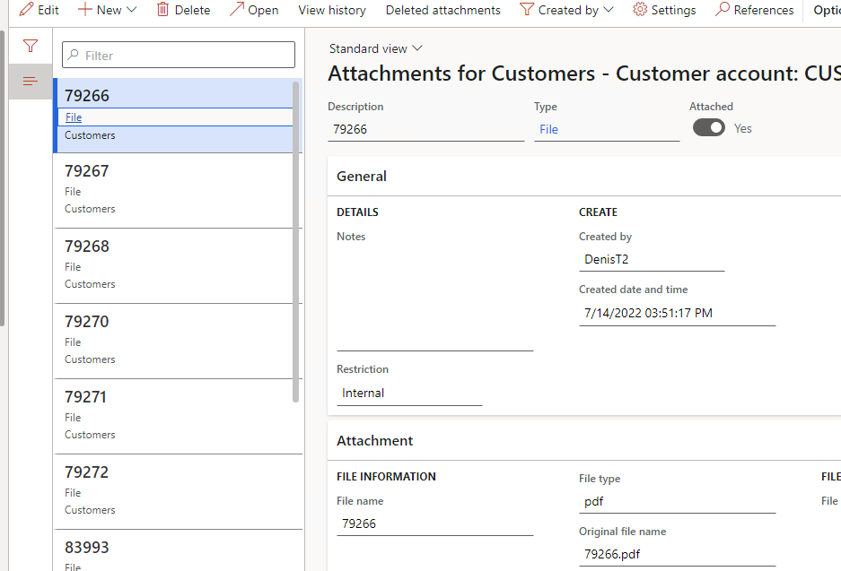

---
title: "D365FO upgrade. Transfer attachments from AX2012"
date: "2022-09-21T22:12:03.284Z"
tags: ["XppDEVTutorial", "D365FO Upgrade"]
path: "/upgradeD365-attachments"
featuredImage: "./logo.png"
excerpt: "The blog post describes a procedure to transfer attachments from AX2012 to D365FO"
---

An attachment migration procedure is one of the tricky parts you may face during the AX2012 - D365FO project upgrade. In this post, I describe an **Attachment export/import journal** solution for doing such migration.


## D365FO Attachments types

As D365FO is a cloud-based system, attachment storage types may be different from what users get used to previously. So, let's discuss D365FO attachments types and the pros/cons of each of them:

- **Database**: attachments are stored in the database in a blob field. This is perfect for text attachments, like notes. You can edit the attachment content, but only from the D365FO user interface. It increases the D365FO database size.
- **Azure storage**: attachments are stored inside an internal Azure storage, managed by Microsoft. Users can't edit attachments directly(only download and upload files) as this storage account is accessible only from the D365FO user interface. This approach does not consume Database space, Microsoft charges for the storage separately.
- **SharePoint**: attachments are stored on the SharePoint site, managed by clients. Users can edit attachments, and documents are available outside of the D365FO interface(for example, you may use a group in Teams and link a SharePoint folder to it). But in this case, the customer needs to maintain the SharePoint site.

## Transfer attachment module description

There are already several ways of transferring attachments while doing a migration project from AX2012 to D365FO, but in this post, I will describe the additional method, and probably it can be called "yet another way to transfer attachments from AX2012".

Some of the out-of-the-box ways for attachment migration are:

- [MoveDocumentsToDatabase](https://github.com/microsoft/Dynamics-365-FastTrack-Implementation-Assets/blob/master/AX2012DataUpgrade/MoveDocumentsToDatabase ) job from the FastTrack team. It moves all attachments to the AX2012 database that can be used in the upgrade process.

- Standard entities for attachments creation(e.g. CustomerAttachmentsV2Entity). In the case of entity usage, you need to create a ZIP data package that contains all files and entity data.

The reason for the module development is to provide more flexibility and control over AX2012 attachment transfer. Let's check how it works.

The module consists of AX2012 and D365FO parts.

## AX2012 functionality

It is an XPO project that needs to be imported into an AX2012 live application. After the import, you need to run the **DEVDocuExport** menu item.

It will display the following window:



This dialog allows you to specify a table and set up some filters for it(e.g. export attachments only for not blocked customers).

As a result of this run, the system exports all attachments for the selected table to the directory and creates a **Descriptor file** that links the primary table key to an attachment file.



The **Descriptor file** gives you great flexibility, e.g. you can rename table keys or change document types mapping.

The next step is to copy the created directory with AX2012 attachments to Azure storage. It can be done by using the following power shell command.

```powershell
cmd.exe /C "cmdkey /add:`"aaavmstorage.file.core.windows.net`" /user:`"localhost\aaavmstorage`" /pass:`"BQubgv1NlZE+LtbbL8jKLrkVSwBlLHGuygbu9fy6gDv+UiRTiw63cpmVlAEVhSLCup1XRbbVajt6ww==`""
#Mount the drive
New-PSDrive -Name Z -PSProvider FileSystem -Root \\aaavmstorage.file.core.windows.net\aaavmfileshare

Copy-Item "C:\Attachments" -Destination "Z:\Attachments" -Recurse
```

## D365FO part

At that stage, we have our attachments in the cloud, and it is time to import them into D365FO.

After installing the required X++ objects, open the following link

```html
https://mycompany.operations.dynamics.com/?cmp=CMP&mi=DEVDocuExpImpJournalTable
```

It will open the Import attachment form.



The first step is to go to the **Journal name** field(View detail) and create a new **Journal type**. A **Journal type** defines a reference to Azure file share (a connection string and a share reference).



Then you need to specify the Azure location(folder with files) for our import and press the **Test connection** button to validate the settings.



After Journal creation, the next step is to import lines from the Excel **Descriptor file** generated previously during the AX2012 export(**Import lines from Excel** button).



It will create journal lines(one line per file).



The final step is to load attachments to D365FO, you can do this only for one line(to test the process) or for the whole journal. It will use the standard "Attach document" procedure, which creates attachments according to the document type settings.


And as a result, you get a destination table record with attachments(e.g. attachments for the customer)



## Summary

The described solution provides excellent flexibility for moving attachments from AX2012 to D365FO. You can find all code used in this post in the following folder(AX2012 project saved as a resource): [https://github.com/TrudAX/XppTools/tree/master/DEVTutorial/DEVDocuExpImp](https://github.com/TrudAX/XppTools/tree/master/DEVTutorial/DEVDocuExpImp).

I hope you find this information useful. As always, if you see any improvements, suggestions or have some questions about this work, don't hesitate to contact me.
