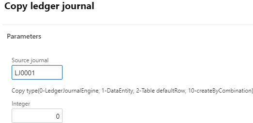

Programmatically create LedgerJournalTrans using X++ is quite a common task, but sometimes I still see the incorrect code(mostly related to fields initialization from account/offset account and voucher assignment). In this post, I try to describe possible options to create ledger journals in D365FO.

## Test scenario

To test different methods I created a Runnable class [DEVTutorialCreateLedgerJournal](https://github.com/TrudAX/XppTools/blob/master/DEVTutorial/DEVTutorial/AxClass/DEVTutorialCreateLedgerJournal.xml) that creates a new journal based on the data from the existing source journal using different create methods. The dialog looks like this



Lets discuss possible copy options(*Copy type* parameter):

## LedgerJournalEngine class

This method is using LedgerJournalEngine class(the same class that is used when the user creates the journal manually on the Journal lines form). This increases the chances that the resulting line will be the same as a manually created line.

```csharp
while select ledgerJournalTransOrig
    order by RecId
            where ledgerJournalTransOrig.JournalNum == _ledgerJournalTableOrig.JournalNum
{
    numLines++;
    if (!ledgerJournalTable.RecId)
    {
        //Often journal name from parameters is specified here
        DEV::validateCursorField(ledgerJournalName, fieldNum(LedgerJournalName, JournalName));

        ledgerJournalTable.clear();
        ledgerJournalTable.initValue();
        ledgerJournalTable.JournalName = ledgerJournalName.JournalName;
        ledgerJournalTable.initFromLedgerJournalName();
        ledgerJournalTable.JournalNum = JournalTableData::newTable(ledgerJournalTable).nextJournalId();
        ledgerJournalTable.Name = strFmt("Copy of %1, Date %2", _ledgerJournalTableOrig.JournalNum, DEV::systemdateget());
        ledgerJournalTable.insert();

        info(strFmt("Journal %1 created", ledgerJournalTable.JournalNum));

        ledgerJournalEngine = LedgerJournalEngine::construct(ledgerJournalTable.JournalType); // highlight-line

        ledgerJournalEngine.newJournalActive(ledgerJournalTable); // highlight-line
    }

    ledgerJournalTrans.clear();
    ledgerJournalTrans.initValue();
    ledgerJournalEngine.initValue(ledgerJournalTrans); // highlight-line

    ledgerJournalTrans.JournalNum           =   ledgerJournalTable.JournalNum;
    ledgerJournalTrans.TransDate            =   DEV::systemdateget();
    ledgerJournalTrans.AccountType          =   ledgerJournalTransOrig.AccountType;
    ledgerJournalTrans.modifiedField(fieldNum(LedgerJournalTrans, AccountType));

    ledgerJournalTrans.LedgerDimension = ledgerJournalTransOrig.LedgerDimension;
    if (!ledgerJournalTrans.LedgerDimension)
    {
        throw error("Missing or invalid ledger dimension for journal process");
    }
    ledgerJournalTrans.modifiedField(fieldNum(LedgerJournalTrans, LedgerDimension));  // highlight-line

    ledgerJournalEngine.accountModified(LedgerJournalTrans);  // highlight-line

    ledgerJournalTrans.OffsetAccountType = ledgerJournalTransOrig.OffsetAccountType;
    ledgerJournalTrans.modifiedField(fieldNum(LedgerJournalTrans, OffsetAccountType));
    ledgerJournalTrans.OffsetLedgerDimension = ledgerJournalTransOrig.OffsetLedgerDimension;
    ledgerJournalTrans.modifiedField(fieldNum(LedgerJournalTrans, OffsetLedgerDimension));  // highlight-line

    ledgerJournalEngine.offsetAccountModified(ledgerJournalTrans);  // highlight-line


    //amounts
    LedgerJournalTrans.CurrencyCode         =   ledgerJournalTransOrig.CurrencyCode;
    ledgerJournalEngine.currencyModified(LedgerJournalTrans);
    LedgerJournalTrans.AmountCurCredit      =   ledgerJournalTransOrig.AmountCurCredit;
    LedgerJournalTrans.AmountCurDebit       =   ledgerJournalTransOrig.AmountCurDebit;

    //additional fields
    LedgerJournalTrans.Approver           = HcmWorker::userId2Worker(curuserid());
    LedgerJournalTrans.Approved           = NoYes::Yes;
    ledgerJournalTrans.Txt                = ledgerJournalTransOrig.Txt;
    LedgerJournalTrans.SkipBlockedForManualEntryCheck = true;

    DEV::validateWriteRecordCheck(ledgerJournalTrans);
    ledgerJournalTrans.insert();  // highlight-line

    ledgerJournalEngine.write(ledgerJournalTrans);  // highlight-line
}
```

When you modify Account/Offset account fields in this example you need to call two methods(on *ledgerJournalTrans* and *ledgerJournalEngine*). This ensures, that the line will be properly initialized from the Account field

```csharp
ledgerJournalTrans.modifiedField(fieldNum(LedgerJournalTrans, LedgerDimension));  
ledgerJournalEngine.accountModified(LedgerJournalTrans);
```

Voucher assignment here processed in *ledgerJournalEngine.write().*

Also, an interesting flag here is LedgerJournalTrans.SkipBlockedForManualEntryCheck. It is useful when you don't what to allow users post manually to the same accounts as your procedure.

### LedgerJournalTrans defaultRow() method

This is a new approach in D365FO and it is using a new *defaultRow()* table method. This method is also called by the data entity during the import process. Its idea is that we don't control the sequence of different *modifiedField* methods calls, we just populate the fields that we know, all other logic happens in the *defaultRow()* method.

Code for journal creation in this case

```csharp
while select ledgerJournalTransOrig
    order by RecId
    where ledgerJournalTransOrig.JournalNum == _ledgerJournalTableOrig.JournalNum
{
    numLines++;

    if (!ledgerJournalTable.RecId)
    {
        ledgerJournalTable.clear();
        ledgerJournalTable.initValue();
        ledgerJournalTable.JournalName = _ledgerJournalTableOrig.JournalName;
        ledgerJournalTable.initFromLedgerJournalName();
        ledgerJournalTable.JournalNum = JournalTableData::newTable(ledgerJournalTable).nextJournalId();
        ledgerJournalTable.Name = strFmt("Copy of %1, Date %2", _ledgerJournalTableOrig.JournalNum, DEV::systemdateget());
        ledgerJournalTable.insert();

        info(strFmt("Journal %1 created", ledgerJournalTable.JournalNum));
    }

    ledgerJournalTrans.clear();
    ledgerJournalTrans.initValue();

    ledgerJournalTrans.JournalNum             = ledgerJournalTable.JournalNum;
    ledgerJournalTrans.TransDate              = DEV::systemdateget();
    ledgerJournalTrans.AccountType            = ledgerJournalTransOrig.AccountType;
    ledgerJournalTrans.LedgerDimension        = ledgerJournalTransOrig.LedgerDimension;
    ledgerJournalTrans.DefaultDimension       = ledgerJournalTransOrig.DefaultDimension;

    ledgerJournalTrans.OffsetAccountType      = ledgerJournalTransOrig.OffsetAccountType;
    ledgerJournalTrans.OffsetLedgerDimension  = ledgerJournalTransOrig.OffsetLedgerDimension;
    ledgerJournalTrans.OffsetDefaultDimension = ledgerJournalTransOrig.OffsetDefaultDimension;

    ledgerJournalTrans.CurrencyCode           =   ledgerJournalTransOrig.CurrencyCode;
    ledgerJournalTrans.AmountCurCredit        =   ledgerJournalTransOrig.AmountCurCredit;
    ledgerJournalTrans.AmountCurDebit         =   ledgerJournalTransOrig.AmountCurDebit;

    //addition fields
    ledgerJournalTrans.Approver           = HcmWorker::userId2Worker(curuserid());
    ledgerJournalTrans.Approved           = NoYes::Yes;
    ledgerJournalTrans.Txt                = ledgerJournalTransOrig.Txt;
    ledgerJournalTrans.SkipBlockedForManualEntryCheck = true;

    ledgerJournalTrans.defaultRow(); // highlight-line

    DEV::validateWriteRecordCheck(ledgerJournalTrans);
    ledgerJournalTrans.insert();
}
```

You can find an example of this approach in the **MCRLedgerJournal** class (and the usage is [here](https://www.linkedin.com/pulse/simplest-way-create-general-journal-d365-using-code-udoye-samuel/))

### Data entity

We can also use data entity for journal creation. Technically is produces the same result as the previous method because data entity at the end will call table defaultRow() method.

```csharp
while select ledgerJournalTransOrig
    order by RecId
    where ledgerJournalTransOrig.JournalNum == _ledgerJournalTableOrig.JournalNum
{
    numLines++;
    select dimensionCombinationEntity
        where dimensionCombinationEntity.RecId == ledgerJournalTransOrig.LedgerDimension;
    select dimensionCombinationEntityOffset
        where dimensionCombinationEntityOffset.RecId == ledgerJournalTransOrig.OffsetLedgerDimension;

    ledgerJournalEntity.initValue();
    ledgerJournalEntity.JournalBatchNumber     = journalNum;
    ledgerJournalEntity.Description            = strFmt("Copy of %1, Date %2", _ledgerJournalTableOrig.JournalNum, DEV::systemdateget());
    ledgerJournalEntity.JournalName            = _ledgerJournalTableOrig.JournalName;
    ledgerJournalEntity.LineNumber++;

    //if you have string and want to convert to ID - DimensionDefaultResolver::newResolver(_dimensionDisplayValue).resolve();
    //AX > General ledge > Chart of accounts > Dimensions > Financial dimension configuration for integrating applications
    ledgerJournalEntity.AccountType                 = ledgerJournalTransOrig.AccountType;
    ledgerJournalEntity.AccountDisplayValue         = dimensionCombinationEntity.DisplayValue;

    ledgerJournalEntity.OffsetAccountType           = ledgerJournalTransOrig.OffsetAccountType;
    ledgerJournalEntity.OffsetAccountDisplayValue   = dimensionCombinationEntityOffset.DisplayValue;

    ledgerJournalEntity.CreditAmount                = ledgerJournalTransOrig.AmountCurCredit;
    ledgerJournalEntity.DebitAmount                 = ledgerJournalTransOrig.AmountCurDebit;
    ledgerJournalEntity.CurrencyCode                = ledgerJournalTransOrig.CurrencyCode;
    ledgerJournalEntity.TEXT                        = ledgerJournalTransOrig.Txt;
    ledgerJournalEntity.TRANSDATE                   = ledgerJournalTransOrig.TransDate;

    ledgerJournalEntity.defaultRow(); // highlight-line

    DEV::validateWriteRecordCheck(ledgerJournalEntity);
    ledgerJournalEntity.insert(); // highlight-line


    journalNum = ledgerJournalEntity.JournalBatchNumber;
}
```

As you see this method requires less code, we don't even need to write code for the journal header creation, it is all handled by the data entity insert() method. Dimensions can be also used as strings. Limitations here is that data entity doesn't contain all the table fields and entity does not support all account types.

## Performance testing

Les't test the performance. First I created a test journal with the 1000 lines(***createByCombination* method) and then copied it using these 3 different methods. Results I got:

| Method                        | Time to create 1000 lines(sec) |      |
| :---------------------------- | :----------------------------- | ---- |
| Using ledgerJournalEngine     | 30.54                          |      |
| Using DataEntity              | 33.09                          |      |
| Using Table defaultRow method | 15.18                          |      |

There are some differences between the copy speed in my example, but it is caused by the different logic for the dimension creation, so the result is that all methods are almost equal and quite fast. In a real life scenario, you can expect insert speed 10-30 lines per second.

## Choosing the right method and things to avoid

In general, you have 2 options - create journal similar to the manual user entry or create it similar to the import procedure(for the second scenario choice between entity and table is mostly depends on what data do you have as input and does the entity support all required fields). So the choice between these two should be done by answering the question - if the user wants to create the same journal manually - does he use manual entry or data import.  

Probably in D365FO better to avoid creation using *JournalTransData* classes or when you simple populate *ledgerJournalTrans* fields and call *insert()*. This initially can work, but later users may complain about this - like _"Why when I create journal manually and specify a vendor account Due date field is calculated, but your procedure doesn't fill it"._

## Summary

You can download this class using the following link https://github.com/TrudAX/XppTools/blob/master/DEVTutorial/DEVTutorial/AxClass/DEVTutorialCreateLedgerJournal.xml. The idea that you can use this code as a template when you have a task to create(or post) a ledger journal using X++.
Comments are welcome.