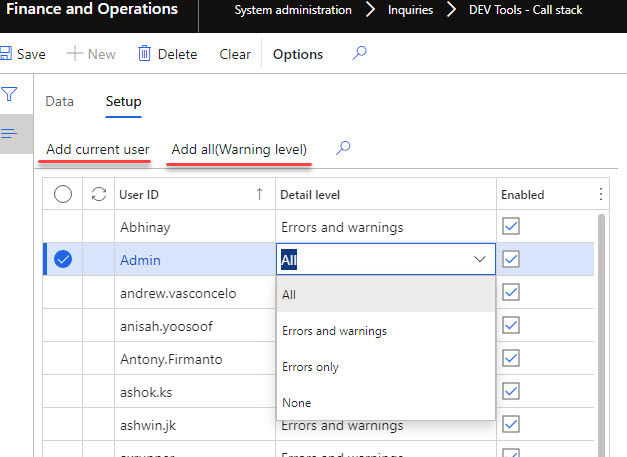
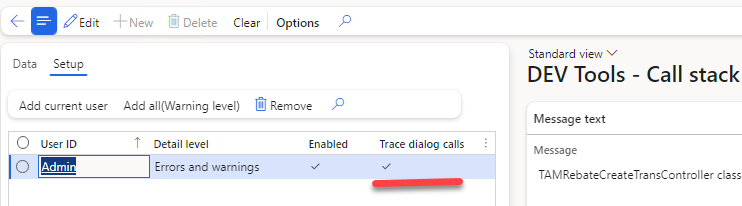
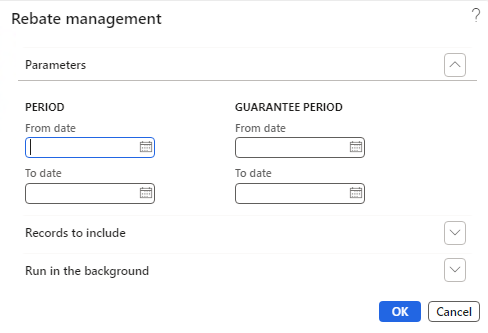
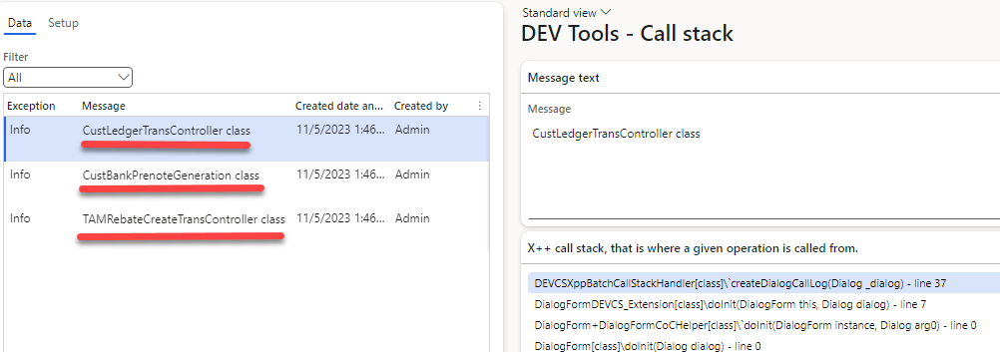

Infolog is a primary message display system in Dynamics 365 FO. And '**infolog.add()**' is probably the most favourite place for developers to insert breakpoints. The reason for this is that the source of some messages may be unclear and you need to use the debugger to understand the reason for a particular message.

In this post, I describe an X++ utility that saves stack traces for every infolog message. It allows, in some cases, understanding the source of the message without debugging.
The idea of this post is based on the following post on [AxForum](http://axforum.info/forums/showthread.php?t=78119).

### Functional description

In order to display the last infolog messages, a new form was created in ***System administration - Inquiries - DEV Tools - Call stack***

The form has 2 tabs:

**Data tab** that displays saved infolog messages and X++ call stack for the current message


**Setup tab** that allows setting up a logging level per user. You can also setup logging to all users for Warning and Error messages



### Technical description

The modification is executed by subscribing to **Info.onInfoLogMessageAdd()** delegate. Then Call stack is saved by using **xSession::xppCallStack();** method. Below is the sample code for this

```c#
class DEVCSXppCallStackHandler
{
    [SubscribesTo(classStr(Info), delegateStr(Info, onInfoLogMessageAdd))]
    public static void Info_onInfoLogMessageAdd(InfoLogMessageAddEventArgs _eventArgs)
    {
        DEVCSXppCallStackTable       callStackTable;
        boolean                      isEnabled;
        DEVCSXppCallStackUserSetup   callStackUserSetup;
        callStackUserSetup = DEVCSXppCallStackUserSetup::findCurrent();
        if (callStackUserSetup.RecId && callStackUserSetup.IsEnabled)
        {
            isEnabled = true;
            switch (callStackUserSetup.SysInfologLevel)
            {
                case SysInfologLevel::None:
                    isEnabled = false;
                    break;
                case SysInfologLevel::Warning:
                    if (_eventArgs.exception== Exception::Info)
                    isEnabled = false;
                    break;
                case SysInfologLevel::Error:
                    if (_eventArgs.exception == Exception::Info ||
                        _eventArgs.exception == Exception::Warning)
                    isEnabled = false;
                    break;
            }
        }
        if (isEnabled)
        {
            UserConnection       userConnection = new UserConnection();
            callStackTable.setConnection(userConnection);
            callStackTable.clear();
            callStackTable.initValue();
            callStackTable.Exception = _eventArgs.exception;
            callStackTable.InfologStr = _eventArgs.message;
            callStackTable.CallStack = xSession::xp CallStack();
            callStackTable.insert();
```

Then form **DEVCSXppCallStackTable** displays the saved data.

An additional tool that may be combined with this one is [Arbela AOT Browser](https://arbelatech.github.io/aotbrowser/) that allows viewing the code on Tier1 environments without Visual Studio usage.

## Trace dialog calls (update 05.11.2023)

The Trace dialog calls option allows you to see the class and the stack trace information of any dialog form in D365FO. You can enable or disable this option for each user by checking or unchecking the Trace dialog calls checkbox in the “Dev Tools – Call stack” form.



To demonstrate how this feature works, I ran some periodic operations that use dialogs, such as:

- History by transaction report
- Create prenotes
- Rebate management

These operations use different types of dialogs, such as Reports, Runbase classes, and SysOperation classes.



After running the operations, I opened the Trace form and saw the class and the X++ stack trace information for each dialog



This feature is very handy when you need to quickly identify the related classes and operations in D365FO. I have used it several times during calls with business users and it works very nicely.

## Summary

You can download the tool using the following link - https://github.com/TrudAX/XppTools#installation. I hope you may find this tool useful, also feel free to comment if you see something is missing.