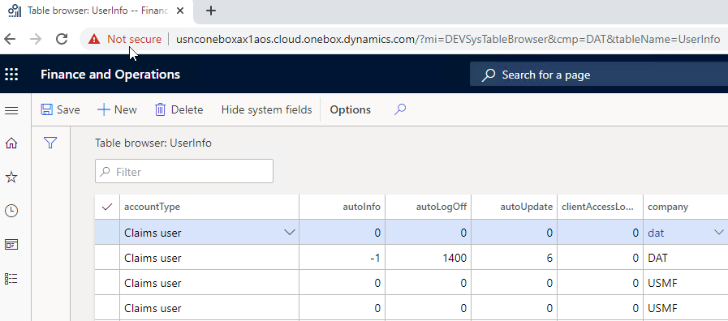
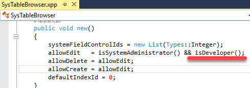
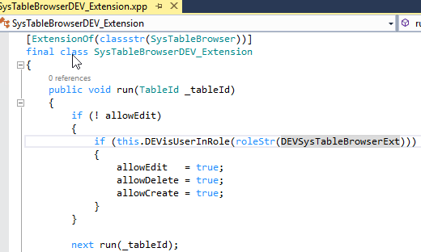

The idea of this post is based on Alex Meyer's post [How to Continue to Use the Table Browser Functionality Within D365FO](https://alexdmeyer.com/2020/02/27/how-to-continue-to-use-the-table-browser-functionality-within-d365fo/). I created a new X++ utility - Table browser extension. It contains the following changes:

### -Allow root navigation

As Alex suggested in his post, I created a new menu item that allows running the table browser for a specific table:

**https://usnconeboxax1aos.cloud.onebox.dynamics.com**/?mi=DEVSysTableBrowser&cmp=DAT&tableName=UserInfo

### -Allow editing

The standard table browser doesn't allow editing in non-development environments. This is controlled via the following standard code:

I created an extension that overrides this behaviour. If a user belongs to the new role "**DEV Editable table browser**", the table browser editing function is not blocked.

As I know the only way to edit data directly in tables for non-development Dynamics 365 Finance and Operation environment is either become the master of [Electronic reporting](https://erconsult.eu/blog/electronic-reporting-in-data-migration/) or create a support request. These options may take some time, so it is good to have an "emergency" tool like this.

## Summary

You can download the Editable table browser tool using the following link - https://github.com/TrudAX/XppTools#installation. I hope you may find this tool useful, also feel free to comment if you see something is missing
