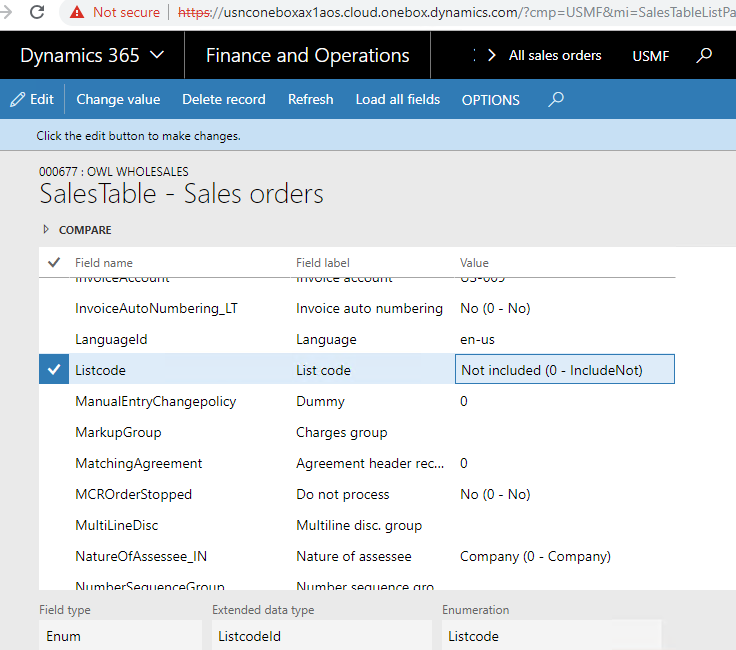
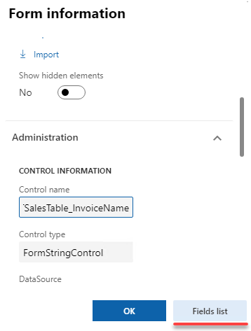

This post describes the custom X++ Fields list form.

Currently, you have the following standard options to work with the D365FO data, that are not visible in the user interface

- SQL via **SQL Management Studio**
- **Table browser** form
- Record info - **Show all fields** form

Typical problems when using these tools:

- Table fields that have *Visible = false* are not shown in D365 forms
- If the table has many columns it is hard to find the required column
- D365 doesn't allow to change values for the columns that have *AllowEdit=false*

**Fields list** form provides a convenient way to view current record data with the following options:

- Data is shown in the list view with Name and Label for each field(even with *Visible = false*) that allows you to quickly find the field value
- Additional field information(like EDT name, Enum value, Enum name..) is displayed
- You can view data for the current record even it is not saved into the database
- You can compare records
- You can update or delete the current record with or without validation(it is not that you should use on test data, but sometimes it can be useful during the development or debugging process)

## Fields list form usage

Open All sales orders form and go to the **Options-Record info** and then press **Fields list** button

Fields list form will run and show the current data for the selected sales order

Another way to run this form - Right click on the form field, press **Form information** and then **Field list** button. This action doesn't save the current form cursor, so you can view uncommitted data  

### Edit feature

You can edit a field value or delete the current record. To change a field value press the **Change value** button.

If you check **Ignore update** parameter, an update will be performed with doUpdate() method call. **Delete** provides the same option. Do not use editing feature on test/prod data, you can easily corrupt the data.

## Compare feature

You can compare different records. For example, we can compare 2 sales order lines.

Select the first line and press **Options - Record info - Fields list** button. Then expand the Compare group and Save the first line

Close this form, return to Sales order and select the second line. Run **Fields list** form again. Then you can compare previously saved Line1 and the Current record(sort by the Different columns to see all differences)

## Summary

**Fields list** tool in some cases can simplify and increase the development speed. You can download it using the following link - https://github.com/TrudAX/XppTools#installation

Feel free to post any comment(better as a GitHub issue) or ideas, what else can be improved.