---
title: "D365FO Performance. Periodic import of one million ledger journal lines"
date: "2021-01-20T22:12:03.284Z"
tags: ["XppDEVTutorial", "Integration", "Performance"]
path: "/xpptools-fileintegledgerperf"
featuredImage: "./logo.png"
excerpt: "The blog post describes sample steps to perform performance testing for file-based integration in D365FO using X++"
---

Sometimes you may see the following question related to D365FO performance: "Our customer has X transactions per day, can D365FO handle this?". The problem is that currently, Microsoft doesn't publish any D365FO performance tests and the current answer: "You need to test it with your specific setup". In this post, I try to provide sample steps to perform a D365FO performance test. It will be for a standard Demo database, so can be tested without big efforts.

## Test description

This test will be based on my previous post - [How to implement file-based integration in Dynamics 365 FinOps using X++](https://denistrunin.com/xpptools-fileintegledger/)  

I try to import 1000 files with 1000 lines each, so 1 million ledger journal lines will be created.

To generate test files I created a new form in the **Tutorial integration** module:

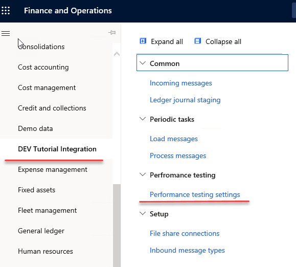

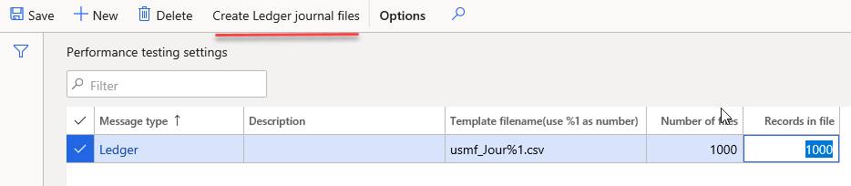

It allows specifying a link to the Azure file share, a template for a file name, number of files and number of records in each file.

When you press **Create ledger journal files** it creates the specified number of files in the **Incoming** Azure file share folder.

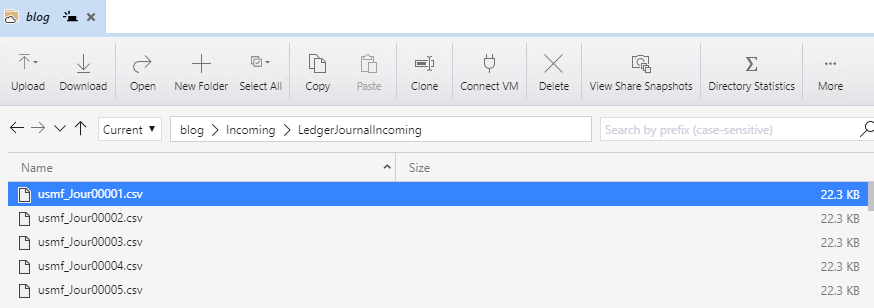

For a test data all possible values combinations for BusinessUnit, Department, CostCenter will be used combined with 60\* Main accounts for Credit, 50\* Main account for Debit.

Even in the Demo database, there are more than 1 million different combinations, so all files will have different values for ledger dimensions.

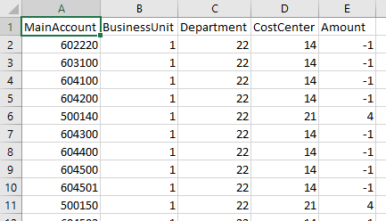

Then I run **Load messages** task as a batch job and measured its execution time. It creates and posts 1000 ledger journals(with 1000 lines each).

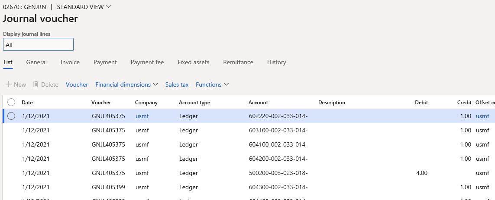

## Test setup and preparation

To run the test I used a standard cloud DEV VM with 16HDD and the Demo database.

I did the following preparation

1. Install DEVCommon and DEVTutorial models from [https://github.com/TrudAX/XppTools](https://github.com/TrudAX/XppTools) repository

2. Created a new Azure file share and created a ledger message type linked to it

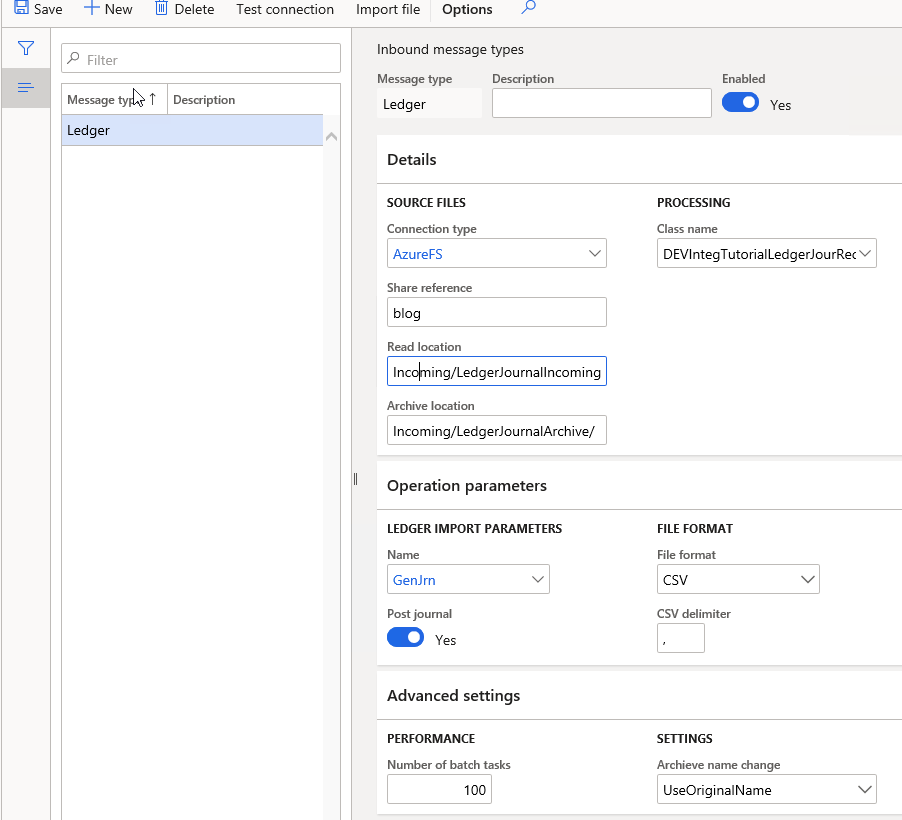

3. Switched off DEV VM monitoring. It was creating a lot of load to a file system, that was not quite fast for my VM

```powershell
K:\Monitoring\MonitoringInstall-Uninstall.ps1
```

4. Disabled Budget control. You probably will not use it for such large data loading.

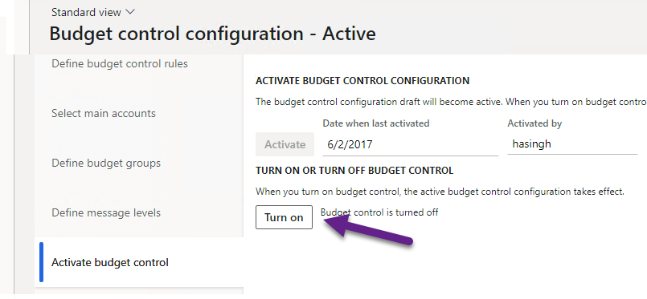

*Budgeting - Setup - Budget control configuration*

5. Adjusted Ledger account structure setup to allow any Business Unit, Department, Cost Center values for a used Main accounts

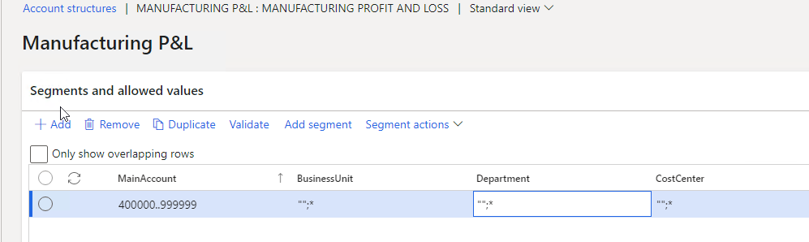

6. Set **Maximum batch threads** to 60. This allowed me to fully utilize my VM.

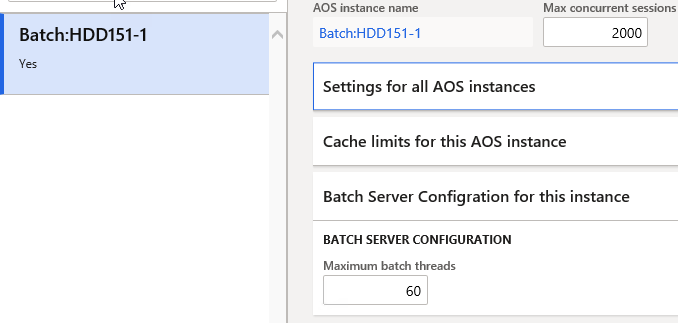

After that I generated 1000 files and ran the test.

## Test results

I used a standard cloud DEV VM with 16HDD and the Demo database. I tested on 2 VM sizes:

- Standard D8 v3 (8 vcpus, 32 GiB memory)
- Standard D16s v3 (16 vcpus, 64 GiB memory)

For each VM size I decided to perform 2 tests:

Start with a fresh Demo database. Load and post 1 million records, then generate the same set of files and load them again for a different date. So totally 2 million journal lines were created. The first test generated a new ledger dimension combination for every line, so it was like initial data load. The second test used existing dimensions combinations, so it was like a periodic load.

The load operation consists of 2 batch jobs. The first read files from Azure and put them into D365FO tables. It is a single-threaded job and for both tests, the time was around 1.5 minute for 1000 files. Then the processing job(which is multithreaded) reads files content from D365FO tables, generates and posts ledger journals.

I got the following times for load and post 1m ledger journal lines:

| VM type          | First load time | Second load time |
| ---------------- | --------------- | ---------------- |
| Standard D8 v3   | 4h 40 min       | 3h 40 min        |
| Standard D16s v3 | 3h 6 min        | 2h 29 min        |

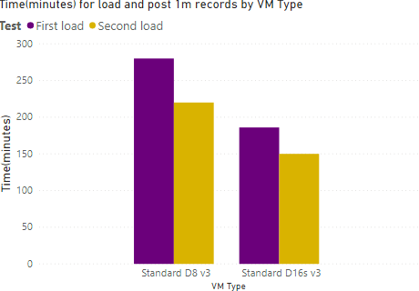

During both tests, CPU was used for 100%(about 25% for SQL Server and 75% for Batch service). Ledger journal classes contain a lot of caching and probably they are not optimized for different values for every single line as in this test.

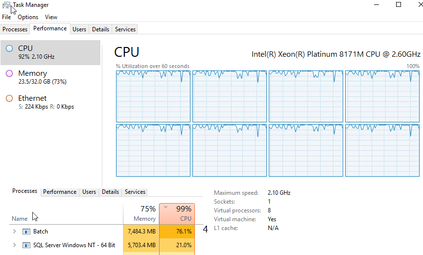

Of course, this test is quite simple, you should not use times from Tier-1 machines for Production planning, as Tier-2 VMs have a different architecture(SQL Azure instead of SQL Server), but I think the behaviour for Tier-2 will be the same: the more expensive service you use, the faster system will work.

I don't have access to Tier-2 VM now, also it is not clear what level of resources Microsoft gives you for Tier-5(Performance) and Production and how these resources operate compared to local DEV boxes. If you have any information regarding this, please share some comments.

## Summary

The cloud has some amazing capabilities. Even in this test by just one click(changing a VM size) I increased the load performance by almost 50%. But everything has a price. The current [Dynamics 365 Licensing Guide](https://go.microsoft.com/fwlink/?LinkId=866544&clcid=0xc09) has more than 50 pages, so the price structure is quite complex. And probably in the cloud word instead of asking "Can the system load 1m journal lines?" you should ask "What will be the cost of loading 1m lines in 2 hours?".

You can use the provided example for performance testing of File-based integration for D365FO. I uploaded files used for this post to the following [folder](https://github.com/TrudAX/XppTools#devtutorialintegration-submodel).

I hope you find this information useful. As always, if you see any improvements, suggestions or have some questions about this work don't hesitate to contact me.
