---
title: "XppInteg - Import purchase orders from XML files into D365FO"
date: "2022-05-04T22:12:04.284Z"
tags: ["XppDEVTutorial", "Integration"]
path: "/xpptools-integfilesharexmlpurch"
featuredImage: "./logo.png"    

excerpt: "The blog post describes a sample approach how to implement XML based integration by importing purchase orders from Azure File Share in D365FO using X++"
---

This post extends my several previous [posts](https://denistrunin.com/tags/integration/) but with another messages format. We use an XML format and try to import files in X++ from Azure File Share and create purchase orders.

I use a very simplified example of integration with the INFOR system. This system has an integration component that can export the data in XML format, and we will process(import) these files in D365FO.

### Reading XML data

What is good that a file generated from INFOR is probably the most complex format that you may see in XML integrations. It has a custom namespace, data in tags, data in attributes, data in the similar elements. Here is a sample file context:

```xml
<?xml version="1.0" encoding="UTF-8"?>
<SyncPurchaseOrder xmlns="http://schema.infor.com/InforOAGIS/2" languageCode="en-US">
  <DataArea>
    <PurchaseOrder>
      <PurchaseOrderHeader>
        <DocumentID>PO00001</DocumentID>
        <DocumentDateTime>2022-04-16</DocumentDateTime>
        <SupplierParty>
          <PartyIDs>
            <ID accountingEntity="USMF">1001</ID>
          </PartyIDs>
        </SupplierParty>
        <ShipToParty>
          <Location type="Warehouse">
            <ID accountingEntity="USMF">11</ID>
          </Location>
        </ShipToParty>
        <UserArea>
          <Property>
            <NameValue name="eam.UDFCHAR01" type="StringType">Requestor Name</NameValue>
          </Property>
        </UserArea>
      </PurchaseOrderHeader>
      <PurchaseOrderLine>
        <LineNumber>10</LineNumber>
        <Quantity unitCode="EA">15</Quantity>
        <UnitPrice>
          <Amount currencyID="AUD">10</Amount>
        </UnitPrice>
        <UserArea>
          <Property>
            <NameValue name="eam.UDFCHAR01" type="StringType">M0001</NameValue>
          </Property>
        </UserArea>
      </PurchaseOrderLine>
      <PurchaseOrderLine>
        <LineNumber>20</LineNumber>
        <Quantity unitCode="EA">2</Quantity>
        <UnitPrice>
          <Amount currencyID="AUD">10</Amount>
        </UnitPrice>
        <UserArea>
          <Property>
            <NameValue name="eam.UDFCHAR01" type="StringType">M0004</NameValue>
          </Property>
        </UserArea>
      </PurchaseOrderLine>
    </PurchaseOrder>
  </DataArea>
</SyncPurchaseOrder>
```

We will read this file into the two staging tables(header and lines) and then create a purchase order based on these tables.

In order to deal with such a complex format I created a helper class [**DEVIntegXMLReadHelper**](https://github.com/TrudAX/XppTools/blob/master/DEVTutorial/DEVExternalIntegration/AxClass/DEVIntegXMLReadHelper.xml). It uses the standard **System.Xml*** methods and provides several helper methods that simplify the code structure:

```csharp
//set up namespace alias(used in search)
readHelper.initNamespace(xmlDoc, 'infor', @'http://schema.infor.com/InforOAGIS/2');

//read a typed data from the specified tag
header.PurchId  = readHelper.xmlGetValueNodeStr(nodePOHeader, 'DocumentID');
line.PurchPrice = readHelper.xmlGetValueNodeReal(nodePOLine, 'UnitPrice/Amount');

//search node inside the specified node by path
node = readHelper.xmlGetNodeByPath(nodePOHeader, 'SupplierParty/PartyIDs/ID');
header.OrderAccount = node.get_InnerText();

//search node inside the specified node by search string
node = readHelper.xmlSelectSingleNode(nodePOHeader, 'infor:UserArea//infor:Property//infor:NameValue[@name=\'eam.UDFCHAR01\']');
header.RequestorName = node.get_InnerText();

//getting the data from the attribute
xmlAttributeCollection = node.get_Attributes();
xmlAttribute = xmlAttributeCollection.get_ItemOf("accountingEntity");
header.CompanyId    = xmlAttribute.get_InnerText();
        
```

The full class is here [DEVIntegTutorialProcessPurchConfirmXML]( https://github.com/TrudAX/XppTools/blob/master/DEVTutorial/DEVExternalIntegrationSamples/AxClass/DEVIntegTutorialProcessPurchConfirmXML.xml)

## Solution description

In this blog post, I describe a solution(with "Consuming external web services" [type](https://devblog.sertanyaman.com/2020/08/21/how-to-integrate-with-d365-for-finance-and-operations/#Consuming_external_web_services)) for a D365FO Custom Service that will talk to the Integration Platform. It will do the following:

1. Process purchase orders for different companies.
2. Avoid issues like OData or DMF like throttling, monitoring failed batch imports and rollback of partial failures.
3. Read a custom data format in XML format from Azure File share as messages (sourced from an external program).
4. Provide a solution to log and monitor the failures easily.
5. Perform custom transformations within D365FO as part of the import.

Our integration should read messages from the Azure file share and create purchase orders in D365FO.

The diagram that describes the process is below:

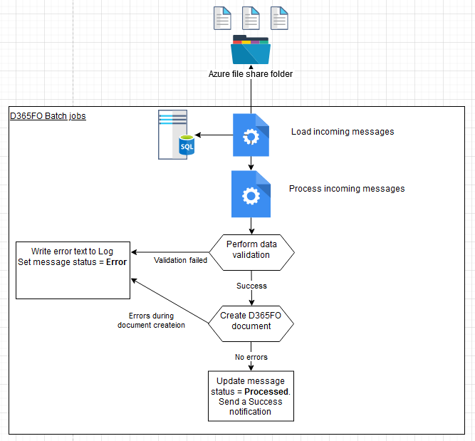

## Proposed solution

In the following section, I provide a solution that can be used as a starting point to import and process messages from Azure file share.

Initially, our XML files will be loaded to the Azure storage and then processed by D365FO.

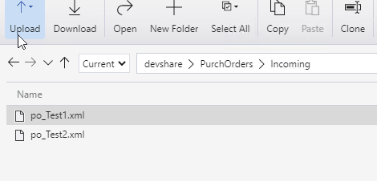

### Connection types form

**Connection types** form allows specifying the Connection type resource(currently, it supports Azure file share, Azure Service Bus and SFTP) and connection details for the selected resource.

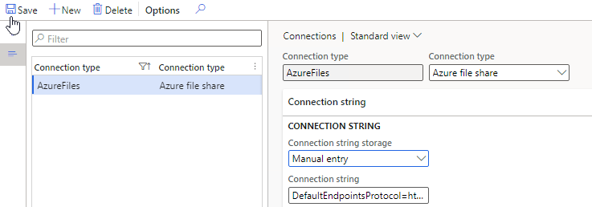

For storing a connection string, there can be three options:

- Enter the value in this form as plain text
- Use encrypted value
- Store the connection string value as a Secret in the **Azure Key Vault**. In this case, the user needs to provide a reference to the standard Key Vault name (steps to set up it are described in the following post: [Azure Key Vault & MSDyn365FO: Setup Certificates and Passwords](https://jatomas.com/en/2020/06/02/azure-key-vault-msdyn365fo-setup-certificates-passwords/)).

### Inbound message types form

The next form to describe our integration will be the **Inbound message types** form:

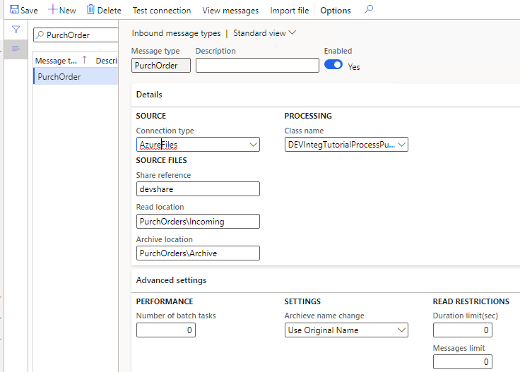

This form contains three main sections:

**1 - Details tab**

- Defines Azure file share connection and a path to folders to import messages.

- Contains a link to the custom Class that will do processing from the queue. The class should extend the base class **DEVIntegProcessMessageBase** and implement the following method:

```c#
abstract void  processMessage(DEVIntegMessageTable  _messageTable, DEVIntegMessageProcessResult _messageProcessResult)
{
...
}
```

The integration engine will call this method outside of a transaction so that all transaction control can be implemented per Message type. There can be different options here: one transaction per message, multiple transactions(for example, if a file contains several independent journals) or a single transaction per line. The result of processing and the current stage should be written to **_messageProcessResult** variable, so in case of an unhandled exception, this information can be saved for review. Also, this class will be created one time per entire import session so it can implement different caching options.

**2 - Operation parameters tab**

Contains parameters that are individual for the current operation. In our case, we don't have any parameters.

**3 - Advanced settings tab**

Contains some common parameters:

- The number of parallel threads to process incoming messages.

- Reading limits from the queue(e.g. to read only the first three messages, this is for testing purposes)

Also, this form contains service operations:

- **Test connection** button that tries to connect to the specified Azure file share directory and read files from it.
- **View messages** button that display messages with this type
- **Import file** button that can be used in testing scenarios to manually import a message from a user's computer without connecting to Azure file share.

### Incoming messages form

This table will store the details of each incoming message.

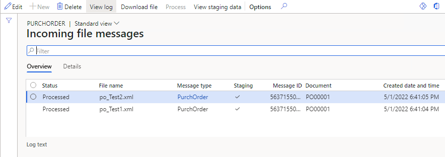

Every message has a status field that can contain the following values:

- **Ready** – a message was read to D365FO
- **Cancel** – The user has decided not to process the message. This is an alternative to a delete option
- **In process** – system-generated status, a message is processing now.
- **Error** – failed validation or errors during the processing
- **Processed** – completed successfully

In this form, it is also possible to do the following operations:

- View incoming message context
- Filter by different statuses
- View a detailed error message
- Change the status to process the message again
- View file processing statistics (processing duration, time, number of lines)
- View the processing attempt counter. It allows implementing scenarios like trying to process messages with "Error" status several times.

### Load incoming messages operation

It is a periodic batch job that we can run for one or multiple message types.

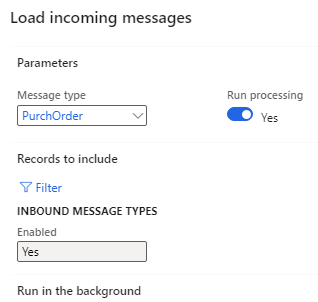

It connects to the Azure file storage, reads a file, creates a record in the **Incoming messages** table with **Ready** status and attaches a message content to this record. After this, the file is moved to the Archive folder. If **Run processing** is selected, the system will execute the processing of the loaded messages.

### Process incoming messages

Message processing may be executed as a separate operation - **Process incoming messages** that selects all not processed messages and calls the processing class for them.

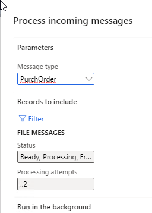

The logic of how to process the file is different per message type/class. For a simple scenario, the class can just read the message content and create some data in one transaction. For this blog post, I implemented two-step processing. Also, for the **Process** operation, you can specify the number of **Processing attempts** per file. The system tries to process a message and in case of any error, it increases the message **Processing attempts** counter. This allows retrying processing several times without a user involvement.

See a sample diagram below:

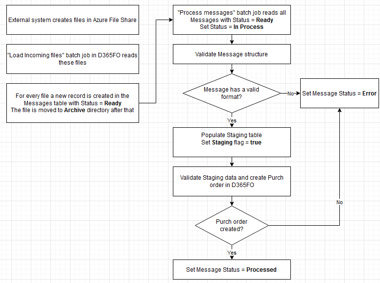

 The class reads the message data and writes data into a staging table during the first step. Then based on the staging data values, a new purchase order is created. It can be done using data entities or just directly writing to tables.

## Error types and how to handle them

It is not a big task to create a purchase order based on some data. The complexity of integration is often related to exception processing and error monitoring. Let's discuss typical errors and how users can deal with them.

### Connection errors

A batch job exception will be generated if our batch job can't connect to an Azure file share or read files. It is a configuration error requiring a system administrator's attention. Notification may be done using a batch job status. After troubleshooting, the system administrator can use the **"Test connection"** button to validate that the system can now read files from Azure file share.

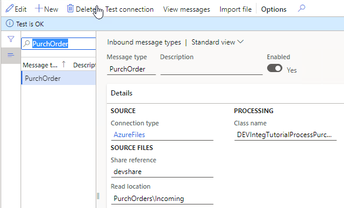

### File format errors

The next error type is the wrong file format, so we can't even read the data from a message.

To test this case, I renamed one XML element. After the import, users will see this message with the Error status. Notification may be done using standard filtering by the **Status** column.

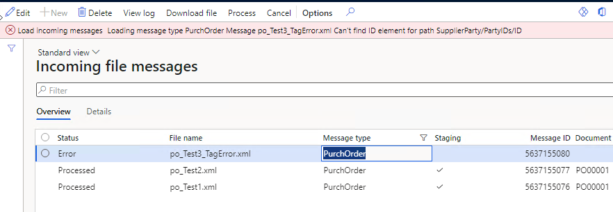

Users can view an error log, then download the message and check the reason for this error. For example, there may be the following reasons:

- Our code that processes messages contains some mistakes. In this case, we can download and send this message to a developer to fix the logic. The main advantage of this solution is that users can run processing without connecting to Azure by using the manual **Import message** button. After fixing the problem, we can rerun the Processing.
- External system sent a message in the wrong format. In this case, the user can send this file back to the external party and then change the message status to **Cancel**.

### Data errors

The message has a correct structure but contains incorrect data(e.g. values that don't exist). In this case, a Status of our Message will be **Error**, and an error log will be generated.

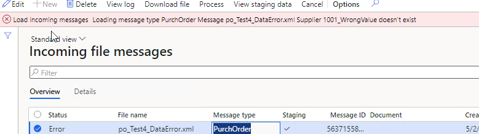

Users can view this error, display a **Staging data** to check the values from the message and take some actions(e.g. create missing values in the related tables if they are valid). After that, they can Process this message again.

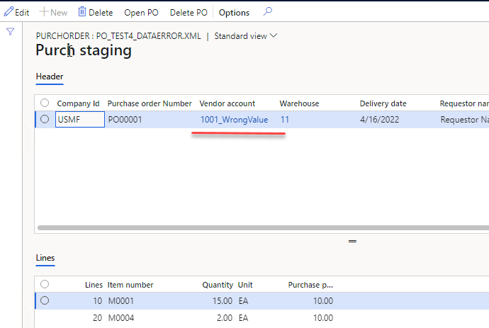

In some implementations(EDI), we can even allow staging data editing. A similar type of error is a posting error.

### Wrong result errors

That is probably the worst scenario. The message was processed successfully, but the resulting document contains some incorrect data.

Users can view the staging data and check that they are correct to analyse the result. Also, a message content can be sent to a developer, and they may trace the document processing using the manual **Import message** button

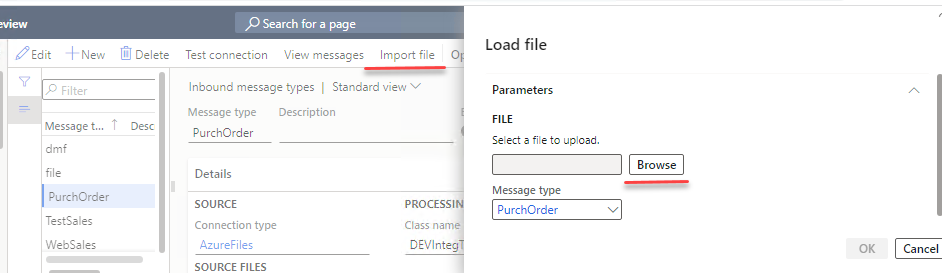

## Summary

I provided a sample implementation for an Azure File Share integration for D365FO. The main concept of it is to create a basic framework to simplify troubleshooting(most typical errors and all related data can be viewed in one form - **Incoming messages**) and provide some additional logging.

In the [series of posts](https://denistrunin.com/tags/integration/) I provided samples for different file formats used for import:

- XML
- CSV
- JSON

Different most complex D365FO documents:

- Sales order
- Purchase order
- Ledger journal
- Standard DMF project

And different exchange media:

- Azure File Share
- Azure Service Bus
- SFTP(in progress)

This may or may not be appropriate in your case(there are different options how to implement this). Anyway, I recommend using the following checklist while designing the integration: [Integration solution specification](https://github.com/TrudAX/TRUDScripts/blob/master/Documents/Integration/Integration%20Data%20Flow%20Requirements.md).

Files used for this post can be found in the following [folder](https://github.com/TrudAX/XppTools#devexternalintegration-submodel)

I hope you find this information useful. As always, if you see any improvements, suggestions or have some questions about this work, don't hesitate to contact me.
