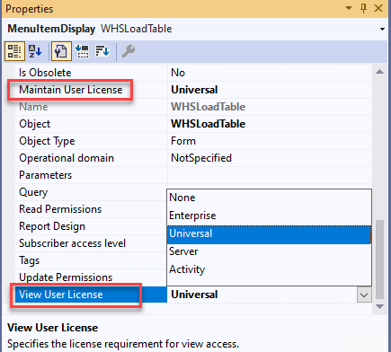
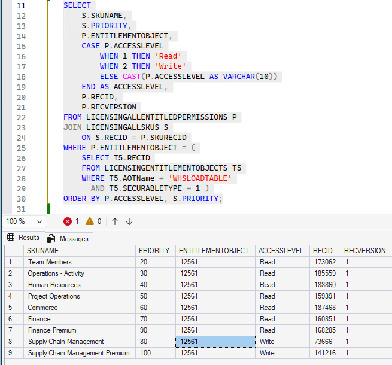
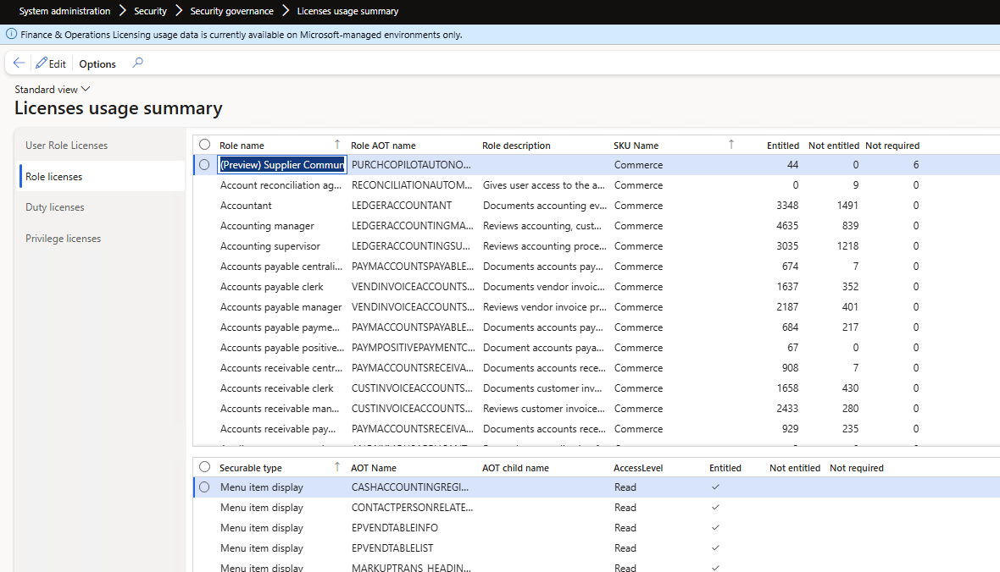
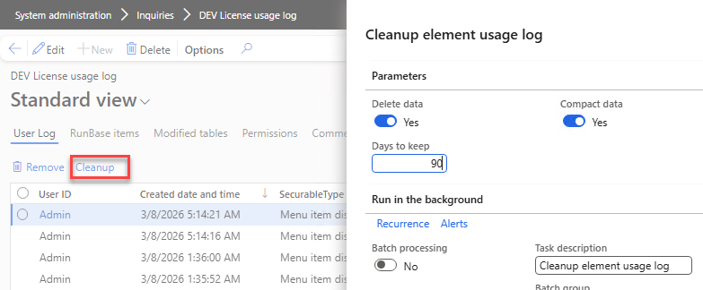
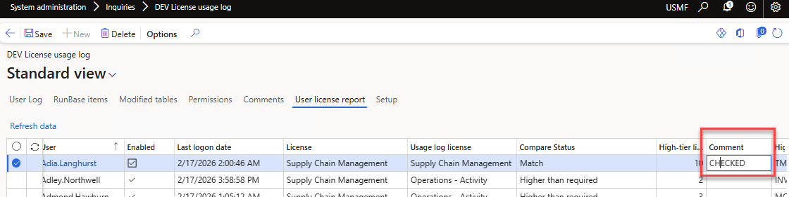
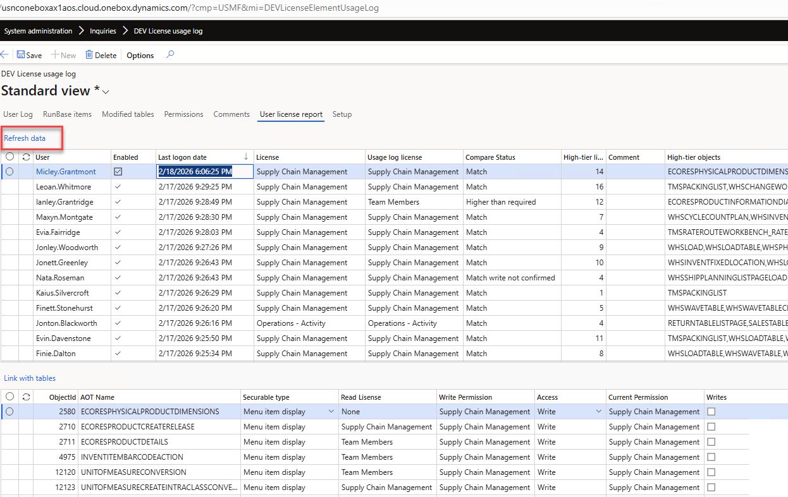
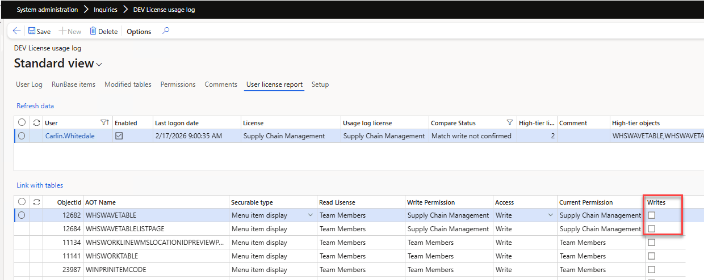
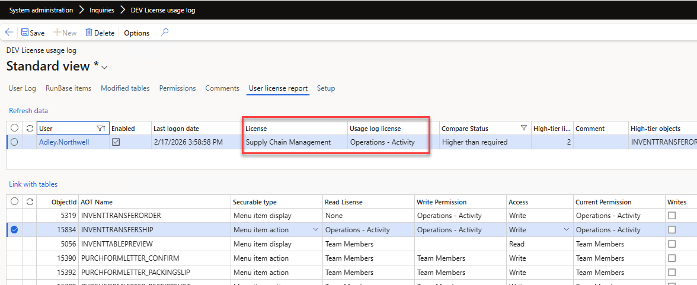

---
title: "D365FO License usage log utility"
date: "2026-03-08T22:12:03.284Z"
tags: ["XppTools"]
path: "/xpptools-licenseusagelog"
featuredImage: "./logo.png"
excerpt: "Learn how the new D365FO licensing model works and discover an open-source X++ utility to monitor actual user activity and optimize your license costs."
---

In this blog post, I will describe how the current licensing works in D365FO and introduce an open-source X++ utility that allows you to track the actual usage of elements and compare it with the elements assigned to users.

## Understanding the current licensing model

At first, the new licensing model may seem confusing. For example, what does "Entitled" or "not Entitled" mean? Here, I will describe my journey to understanding it.

The legacy model relied on AOT properties for MenuItems. For example, opening the **WHSLoadTable** MenuItem in Visual Studio shows two properties: one for the read-only license, and another for the write license.

This model obviously couldn't cover all the complexities of the current license model (e.g., whether you have Finance, SCM, or both). As a result, Microsoft released a new model where they store all the license information on their servers and provide it to users in `Licensing*` tables. The data for these tables is calculated internally by Microsoft services and periodically (e.g., every 8 hours) synchronized with the Tier 2 or PROD environments. In this model, all custom menu items are treated as Teams licenses.

Here are the license properties for the same menu item under the new model. 

The logic is now different: if a user has **Read** access to this **WHSLoadTable** menu, they must have one of the 7 specified licenses. If they have **Write** access, they must have an SCM or SCM Premium license. This is exactly what "Entitled" means.

Microsoft provides a form "**Licenses usage summary**" which displays the results of the above query, but in a different level of  granularity (Role - Duty - Privilege)

### Special roles

There are special roles that are exempt from the license report:

- **System administrator** - This role has access to everything and is currently excluded from the license report.
- **Device based licenses** - This is a common scenario in warehouse environments. For example, if you have a physical computer on the warehouse floor and five warehouse workers who periodically use it to perform various activities, instead of licensing these five people individually, you license just one device. You then assign the "Device-based" role to these users, which excludes them from the license report. It's my understanding that this is not currently strictly controlled by Microsoft, but they plan to introduce some level of control in the future.

After familiarizing yourself with the "**Licenses usage summary**" form, I also recommend reading this [series of articles](https://dynamicspedia.com/2025/11/dynamics-365-licensing-enforcement-advent-calendar/) by [André Arnaud de Calavon](https://www.linkedin.com/in/andreadc/), who has done a fantastic job of explaining various security topics. This will give you a solid foundation in the new licensing model.

### ISV solutions related to licensing 

There are several companies that focus on D365FO security and licensing optimization. When I originally asked a [question about user logging on LinkedIn](https://www.linkedin.com/posts/denis-trunin-3b73a213_d365fo-licensing-question-does-anyone-in-activity-7421742261249576961-Wnkl), I received a lot of insightful comments. I've saved them here for reference: 

- **André Arnaud de Calavon / Next365** — D365 expert and consultant, probably the top writer regarding security topics. Link: [André Arnaud de Calavon](https://dynamicspedia.com/2025/11/dynamics-365-licensing-enforcement-advent-calendar/)

- **D365RoleSecure / NoirSoft** — D365FO security and licensing-focused tool. Link: [NoirSoft / D365RoleSecure](https://www.noirsoft.net/)

- **Fastpath Assure / Alex Meyer** — Security, audit, compliance, and D365FO licensing governance. Link: [Fastpath Assure](https://marketplace.microsoft.com/en-us/product/fastpath.fastpath-assure-for-dynamics-365?tab=DetailsAndSupport)

- **Marco Romano / IT\|Fandango** — D365 F&O consultant offering licensing/right-sizing assessment services. Link: [IT\|Fandango](https://itfandango.com/d365-fo-licence-cost-optimiser/)

- **XPLUS Process Discovery / Anthonio Dixon** — User activity and process discovery for D365, with license optimisation angle. Link: [XPLUS Process Discovery](https://xplusglobal.com/products/security-and-compliance/)

## License usage log tool

The main limitation with Microsoft's standard solution is that it doesn't provide an actual activity-based license usage report.

*Consider a simple scenario: 10 users share a single role. This role contains 100 menu items that only require a Teams license, and one menu item that requires an Activity license. How can we determine which of these 10 users are actually using that specific Activity menu item?*

The **License usage log tool** was built to fill this gap and answer exactly these types of questions. It can be downloaded from [GitHub](https://github.com/TrudAX/XppTools/tree/master/DEVTools/DEVLicenseUtils) and deployed to your PROD environment using your standard X++ pipeline.

### Enabling element usage logs

After installation, you need to enable element usage logging. You have two options:

- **Full (Debug only) mode** - Every single access is logged.
- **Summary mode** - The system creates an element usage log entry for a user only once per session.

You should run this for a couple of weeks in your PROD environment to collect meaningful usage data.

The following events are [logged](https://github.com/TrudAX/XppTools/blob/master/DEVTools/DEVLicenseUtils/AxClass/DEVLicenseElementUsageLogMonitor.xml):

- **Form openings** (using the same extension point as the standard Microsoft "Form runs (Page views)" telemetry)
- **SysOperation executions** (including reports and actions)
- **FormLetter executions** (such as sales and purchase order postings)
- **RunBase class executions**

### Calculating data modifications

One of the main challenges of license monitoring is distinguishing whether a user only viewed a form or if they actually modified data. We can gather modification events from two sources:

- **Table ModifiedBy and CreatedBy fields** - This is not always fully reliable, as it only records the last user who touched the record.
- **SysDatabaseLog table** - This provides more accurate event information, but it must be enabled in advance.

The tool allows you to specify a period (e.g., the last 90 days) and process the modification information from the two sources mentioned above.

The next challenge is linking the form to a list of tables. The License tool automatically calculates this by linking all form DataSources with the corresponding MenuItem, but you can also manually correct these links if needed.

### Service functions

The License log form includes a couple of useful service functions:

- **Cleanup function**: Deletes all log records older than a specified period (e.g., 90 days) and compacts the remaining data, leaving only one record per user, per element, for the entire period.

- **Comments per user**: The reporting table is recalculated on every run, but you can add free-text comments that are preserved between sessions (for example, to note that a specific user has already been validated).

It also includes a couple of custom recalculated tables, which are primarily used for tracking and debugging:

- **RunBase items**: Links MenuItem names with their corresponding RunBase class instances. Since RunBase logging only captures the class name, this table is required to link the class back to its originating MenuItem.
- **Permissions**: A view containing MenuItems with their Read and Write license requirements.

## Running the license usage report

After collecting the element usage log and calculating the data modification information, open the **User license report** tab and click **Refresh data**. The report will compare each user’s currently assigned license with the highest license tier required based on their captured system usage.

The report consists of two sections: a **header** and **lines**.

### Header section

The header contains one row per user and provides their licensing status:

- **User** – The user account being analyzed.
- **Enabled** – Whether the user account is currently active.
- **Last logon date** – The latest detected sign-in date for the user.
- **License** – The license currently assigned to the user.
- **Usage log license** – The highest license level required based on the Element Usage log.
- **Compare Status** – A comparison between the assigned license and the usage-based license. 
- **High-tier lines** – The number of records that contribute to the highest detected license requirement for that user.
- **Comment** – An optional, custom reviewer comment.
- **High-tier objects** – The specific objects that drive the user into their highest detected license tier.

### Lines section

The lines section details the individual securable objects behind a selected user's result, explaining exactly why they fall into a specific license tier:

- **AOT Name, Type** – The AOT name and type of the MenuItem.
- **Read License** – The license tier necessary for read access.
- **Write Permission** – The license tier necessary for write access.
- **Access** – The access level currently being evaluated for the user (**Read** or **Write**).
- **Current Permission** – The permission currently assigned to the user via security roles.
- **Writes** – Indicates whether actual write activity was verified for this object based on the collected data modification logic.

## Analyzing the license report data

This report evaluates users by comparing their **Assigned license level** (the "License" column) with their **Actual system usage** (the "Usage log license" column), based on captured daily activity and entitlement objects.

Let's review the possible analysis scenarios based on the **Compare status** field:

### 1. Match 

The assigned license accurately corresponds to the user’s actual system activity.

**Technical meaning:**

- The user is accessing allocated menu items.
- Logged operations confirm the required access level (including write access where applicable).
- The assigned SKU properly aligns with the required entitlement objects.

*Example 1*

In this example, we can see that the user accesses the **Work** and **Waves** forms and actually writes to the relevant tables. This legitimately requires a **Supply Chain Management** license; it cannot be further optimized.

*Example 2*

This example is a bit different. The user only runs the `TMSPACKINGLIST` report. Microsoft recently changed this report to require an Enterprise-level license (it previously only required an Activity license). Since the high license requirement is caused by this single report, it presents an opportunity to reduce costs by developing a custom report or providing the required data through a different channel.

A common question here is: *Can we just duplicate the standard MenuItem and use our custom copy instead?* According to the D365 licensing guide, this practice constitutes "Multiplexing," and still requires the original underlying license to be applied.

### 2. Match – Write Not Confirmed 

The user accesses functionality corresponding to their assigned license, but no write operations were captured for the related tables.

**Technical meaning:**

- The user accesses the menu items.
- Their assigned access level matches their allocated license.
- However, no actual database writes were logged for those sessions.

*Example*

The user accesses the Waves form, but there is no confirmed record of them writing to its underlying tables. While this requires further investigation, it highlights an opportunity to lower their access to this form to read-only, which could potentially reduce their required license level down to a Teams license.

### 3. Higher Than Required

The user’s assigned license is higher than what their actual logged system activity.

**Technical meaning:**

- Logged operations demonstrate a lower utilization level than the allocated SKU.
- The required entitlement objects actually fall into a lower license tier.

*Example*

In this case, the user is assigned a full **SCM** license. However, the usage log reveals they only use two forms that require an **Activity** license. This makes them a strong candidate for a permissions review to right-size their licensing.

### 4. Higher Than Required (No Activity)

The user has an assigned license, but zero recorded system activity.

**Technical meaning:**

- No logins or operational activities were captured in the system logs.
- No entitlement usage was detected.

The user is assigned an SCM license, but no logging activity was recorded. There are a few possibilities here: the user may no longer require system access and should be disabled; or, the user might be a high-level manager who only needs periodic read access, or could perhaps be assigned a different appropriate role instead of holding an unused premium license.

### Quick overview with AI

For a fast executive overview, you can copy the report's header data into Excel, then pass it to ChatGPT alongside this [prompt](https://github.com/TrudAX/denistrunin-blog/blob/master/src/posts/xpptools-licenseusagelog/notes.txt) to generate a helpful written summary for stakeholders.

## Summary

A license usage log utility gives you insights into how users interact with the system by producing a usage report that compares the required license based on actual activity with their currently allocated license.

The tool is open source and can be downloaded from [GitHub](https://github.com/TrudAX/XppTools/tree/master/DEVTools/DEVLicenseUtils).

I look forward to your feedback on it. Specifically:

- Do the currently logged operations provide a clear enough view of license usage, or is more data needed?
- Do you have any guidance or best practices you can share with the community on how to adjust security roles based on this tool's output?

For general questions, please use the original post on [LinkedIn](https://www.linkedin.com/in/denistrunin/). For bug reports or feature requests, please use the [GitHub issue tracker](https://github.com/TrudAX/XppTools/issues).

I hope you found this post helpful. As always, if you have any suggestions for improvements or questions regarding this implementation, please don't hesitate to reach out.
