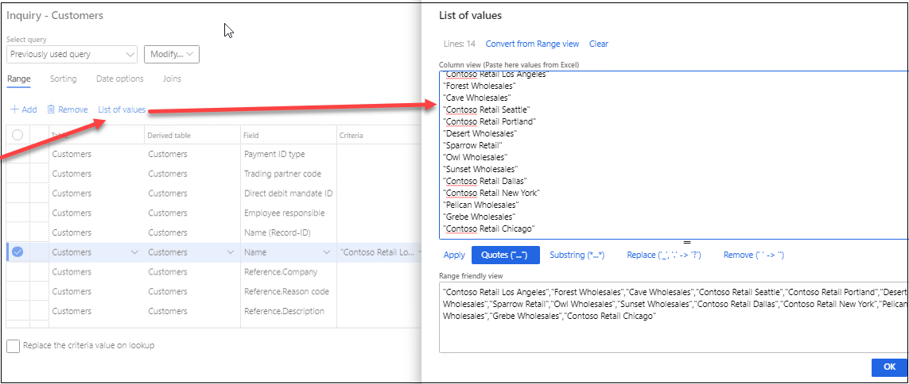

This functionality can help users deal with multiple values in a query range. You can:

- Copy the list of values from Excel and paste it in a query range;
- Easily manage the values in the existing range.

This tool was initially migrated to D365FO by Anton Kazarnovsky. Then it was slightly polished.

## How to work with this tool

To use this feature, you need to go to **Options-Page option**s and press **Advanced filter or sort** button(or use Ctrl + Shift + F3 shortcut).

A new button **List of values** was added on this form. If you press this button a new form will appear with two parts:

- Column view (upper part);
- Range friendly view (bottom part).

In the upper part **(Column view)** you can find a user-friendly view of the values in the selected range. Here you can:

- Edit a list of values (it will be immediately reflected in Range friendly view);
- Copy and insert a list of values from Excel;
- Convert the value from the **Range friendly view** field to Column view by using **Convert** button.

In the bottom part (**Range friendly view**) you can find the resulting query range. Here you can:

- Edit a list of values;
- Apply text conversions:
  - Add 'quotes' (“…”) at the start and at the end of each value;
  - Add 'asterisk' (\*…\*) at the start and at the end of each value;
  - Replace '\_' and '\.' symbols by the question mark ("?") in each value;
  - Remove spaces (' ')  from each value.

After you have finished editing of the values list, you can review the final range value in the bottom part, and press '**OK**'. Then the query range will be updated with the values. Several new ranges for the same field will be created if the length of the value list doesn't fit in one range.

## Summary

**List of Values to Range** tool can simplify your work with multiple query ranges. You can download it using the following link - [https://github.com/TrudAX/XppTools#installation](https://github.com/TrudAX/XppTools#installation)

Feel free to post any comments(better as a GitHub issue) or ideas, what else can be improved.
