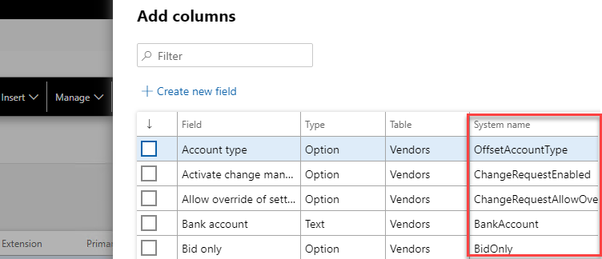

In the standard Advanced query filter dialog, when you select a field to filter, standard lookup displays only a field label. Sometimes, it is more convenient to filter by field AOT name(and not by the label).

This tool adds a new column in the standard Field lookup dialog, so you can search the required field by label or by AOT name.

UPDATE - the same field was also added into the "Personalize-Add columns" dialog(thanks @wojzeh for the idea)

## Summary

You can download this tool using the following link https://github.com/TrudAX/XppTools#-display-system-field-name-in-the-query-filter

If you have some ideas how to improve it, feel free to create a GitHub pull request or leave a comment.
