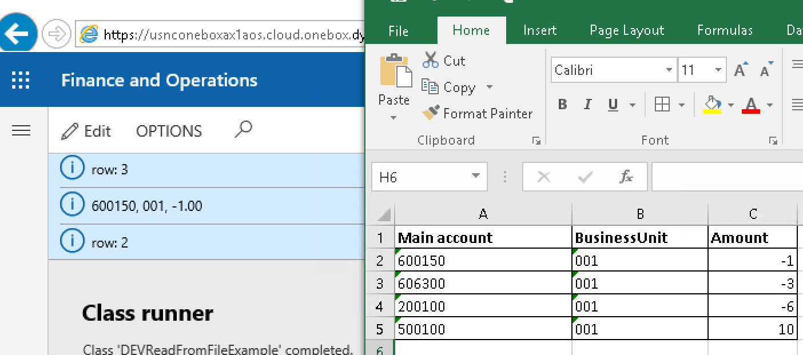
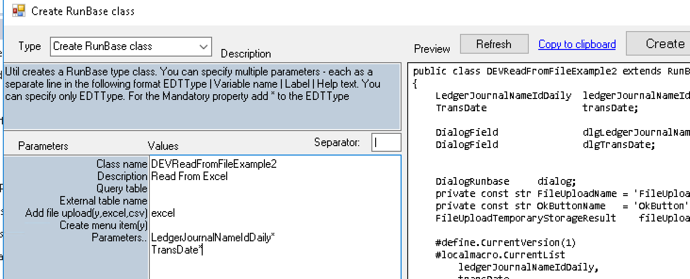
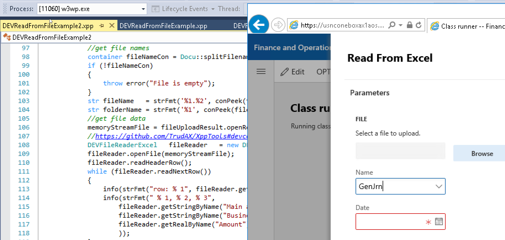
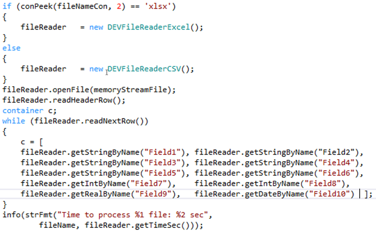
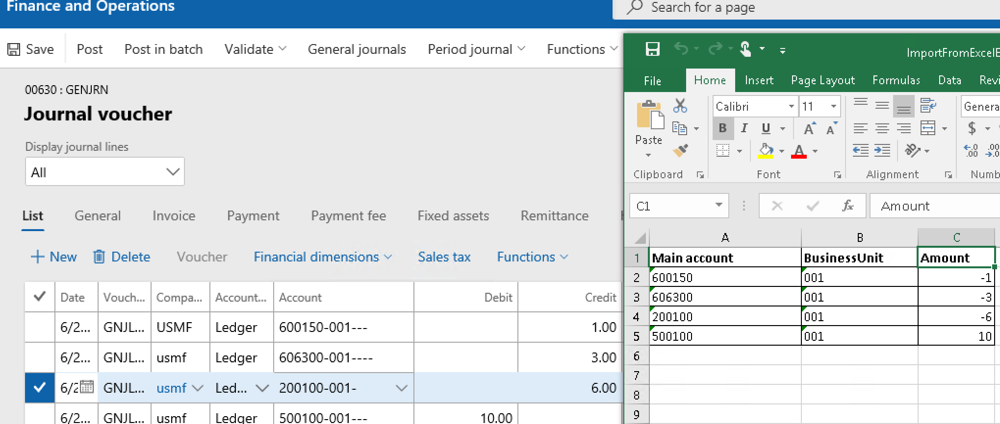

Sometimes you need to write X++ code to read the data from Excel(xlsx) or CSV files in D365FO.

Typical scenario for this:

- User interface operation, for example, a dialog with some parameters, where user can  specify a file. Then this operations reads the file and performs some actions(in some cases standard Excel add-in or Data management module or [Electronic reporting](https://ievgensaxblog.wordpress.com/2019/07/02/msdyn365fo-how-to-import-csv-file-using-electronic-reporting-part-5-run-import-from-x-code/) can perform the same task)
- A batch job that reads files from the network share(Azure storage, see [example](https://ievgensaxblog.wordpress.com/2017/07/16/d365fo-working-with-azure-file-storage/)) and processes them(as standard DMF doesn't support import in transaction, in case you have multi-line documents, you need to write custom code)

In this blog post, I provide an example of X++ classes that can be used to read XLSX and CSV files.

## File reading engines

To read an Excel file I use **EPPlus** library(https://github.com/JanKallman/EPPlus). The big advantage of this library that it is already a part of D365FO installation, you don't need to add external references.

With CSV file it is more complex. Standard D365FO installation doesn't include libraries that can read CSV format(it is quite complex). Often people use **TextIO** class that can read simple delimiter separated files, but this class can't handle more complex scenarios(for example delimiter symbol is presented in the data, or "new line" symbol is in the data). To read such files I use **Microsoft.VisualBasic.FileIO** library. It contains the proper CSV format reader, so if a file can be opened in Excel, this library can read it. (Note: This library is a part of D365FO installation and exists in .NET Core if you concern about future, but if you don't want to add a reference for some reason, I also included comments in DEVFileReaderCSV how to switch it to TextIO)

## Reader classes

As reading CSV and XLSX is very similar from the programming perspective I created one base class **DEVFileReaderBase** and two derived **DEVFileReaderCSV** and  **DEVFileReaderExcel**. Reading often includes the following stages:

- Open the file and read its content to the container, close the file
- Read the header row (if your file contains headers)
- Loop though rows
- Get the cell value for the current row (this can be done by column name - if you have the header row, or by column index)
- Try to convert the cell value to the required type(for CSV it will be always "string to type" conversion, for xlsx - convert from the type of cell to the required AX type)

```csharp
//Sample code to read an Excel file
DEVFileReaderExcel   fileReader   = new DEVFileReaderExcel();
fileReader.openFile(memoryStreamFile);
fileReader.readHeaderRow();
while (fileReader.readNextRow())
{
    info(strFmt("row: %1", fileReader.getCurRow()));
    info(strFmt("%1, %2, %3",
                fileReader.getStringByName("Main account"),
                fileReader.getStringByName("BusinessUnit"),
                fileReader.getRealByName("Amount")
               ));
}
//Sample code to read a CSV file
DEVFileReaderCSV   fileReader   = new DEVFileReaderCSV();
fileReader.readCSVFile(memoryStreamFile);
fileReader.readHeaderRow();
while (fileReader.readNextRow())
{
    info(strFmt("row: %1", fileReader.getCurRow()));
    info(strFmt("%1, %2, %3",
                fileReader.getStringByName("Main account"),
                fileReader.getStringByName("BusinessUnit"),
                fileReader.getRealByName("Amount")
               ));
}
```

Both examples print out the file content to the infolog



## Generate user dialog

To create a user dialog for the file import I extended my **Create RunBase class** utility(https://github.com/TrudAX/TRUDUtilsD365#runbase-class-builder)



Right now it accepts Excel or CSV value in the "Add file upload" parameter.

If you enter the following parameters into this utility

```
DEVReadFromFileExample2
Read From Excel


excel

LedgerJournalNameIdDaily*
TransDate*
```

it automatically generates the required code to read a file in a RunBase dialog



## Performance testing

Let's test the performance. To perform a test I created an Excel file with 10k lines and 10 columns with different types(100k cells total)

The main code for this performance testing is the following(full example is available in the **DEVReadFromFileExamplePerf** class) :



Results:

| File type                     | Time to read 10k lines(sec) |      |
| :---------------------------- | :-------------------------- | ---- |
| Excel                         | 1.54                        |      |
| CSV                           | 0.56                        |      |

As you see, reading itself is quite fast, in most cases you spend more time to process this data.

## More complex example - Journal creation

Let's consider more complex example - create a ledger journal based on the data from Excel file.

In this case we will use an Excel file with 3 columns(Main account, BusinessUnit, Amount) and a user dialog with a "Journal name" parameter.

To generate a dialog class we need to specify the following parameters in **Create RunBase class** utility:

```
DEVReadFromFileExampleCreateJournal
Create ledger journal from Excel


excel

LedgerJournalNameIdDaily*
```

Journal creation logic can be copied from my previous post - https://denistrunin.com/xpptools-createledgerjournal/, dimension processing is from the following post - https://denistrunin.com/xpptools-devfindim/

In our case this code is used for journal creation:

```csharp
void createLedgerJournal()
{
LedgerJournalTable      ledgerJournalTable;
LedgerJournalEngine     ledgerJournalEngine;
ledgerJournalTrans      ledgerJournalTrans;

ttsbegin;
while (fileReader.readNextRow())
{
    if (!ledgerJournalTable.RecId)
    {
        ledgerJournalTable.clear();
        ledgerJournalTable.initValue();
        ledgerJournalTable.JournalName = ledgerJournalNameIdDaily;  // highlight-line
        ledgerJournalTable.initFromLedgerJournalName();
        ledgerJournalTable.JournalNum = JournalTableData::newTable(ledgerJournalTable).nextJournalId();
        ledgerJournalTable.Name = strFmt("Excel file, Date %1", DEV::systemdateget());
        ledgerJournalTable.insert();

        info(strFmt("Journal %1 created", ledgerJournalTable.JournalNum));

        ledgerJournalEngine = LedgerJournalEngine::construct(ledgerJournalTable.JournalType);
        ledgerJournalEngine.newJournalActive(ledgerJournalTable);
    }

ledgerJournalTrans.clear();
ledgerJournalTrans.initValue();
ledgerJournalEngine.initValue(ledgerJournalTrans);
ledgerJournalTrans.JournalNum           =   ledgerJournalTable.JournalNum;
ledgerJournalTrans.TransDate            =   DEV::systemdateget();
ledgerJournalTrans.AccountType          =   LedgerJournalACType::Ledger;
ledgerJournalTrans.modifiedField(fieldNum(LedgerJournalTrans, AccountType));

ledgerJournalTrans.LedgerDimension = LedgerDimensionFacade::serviceCreateLedgerDimension(
LedgerDefaultAccountHelper::getDefaultAccountFromMainAccountId(fileReader.getStringByName('Main account')),
DEVDimensionHelper::setValueToDefaultDimension(0, DEVDimensionHelper::BusinessUnit, fileReader.getStringByName('BusinessUnit')));  // highlight-line

if (!ledgerJournalTrans.LedgerDimension)
{
    throw error("Missing or invalid ledger dimension for journal process");
}
ledgerJournalTrans.modifiedField(fieldNum(LedgerJournalTrans, LedgerDimension));
ledgerJournalEngine.accountModified(LedgerJournalTrans);

//amounts
ledgerJournalTrans.CurrencyCode         =   Ledger::accountingCurrency();
ledgerJournalEngine.currencyModified(LedgerJournalTrans);
ledgerJournalTrans.amountCur2DebCred(fileReader.getRealByName('Amount'));  // highlight-line

//additional fields
ledgerJournalTrans.Approver           = HcmWorker::userId2Worker(curuserid());
ledgerJournalTrans.Approved           = NoYes::Yes;

DEV::validateWriteRecordCheck(ledgerJournalTrans);
ledgerJournalTrans.insert();
ledgerJournalEngine.write(ledgerJournalTrans);
}
ttscommit;
}
```

As the result a new journal will be created



The full code is available in **DEVReadFromFileExampleCreateJournal** class

## Summary

The following classes are used in this post:

**DEVCommon** model:

Classes: [**DEVFileReaderBase**](https://github.com/TrudAX/XppTools/blob/master/DEVCommon/DEVCommon/AxClass/DEVFileReaderBase.xml),  [**DEVFileReaderCSV**](https://github.com/TrudAX/XppTools/blob/master/DEVCommon/DEVCommon/AxClass/DEVFileReaderCSV.xml) and  [**DEVFileReaderExcel**](https://github.com/TrudAX/XppTools/blob/master/DEVCommon/DEVCommon/AxClass/DEVFileReaderExcel.xml)  - read from CSV and XLSX files

**DEVTutorial** model:

Class [**DEVReadFromFileExamplePerf**](https://github.com/TrudAX/XppTools/blob/master/DEVTutorial/DEVTutorial/AxClass/DEVReadFromFileExamplePerf.xml) - measure read from file performance

Class [**DEVReadFromFileExampleCreateJournal**](https://github.com/TrudAX/XppTools/blob/master/DEVTutorial/DEVTutorial/AxClass/DEVReadFromFileExampleCreateJournal.xml)  - sample code to create a ledger journal from Excel file

 Excel files used in this post can be downloaded [here](https://github.com/TrudAX/XppTools/blob/master/assets/ImportFromExcelExample.zip)

Comments are welcome.
