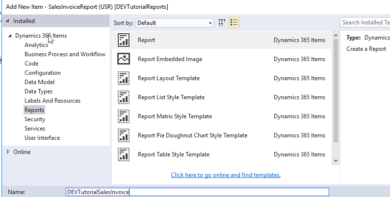
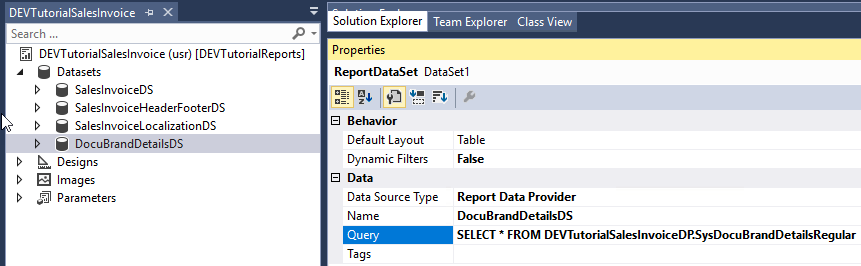
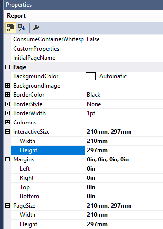
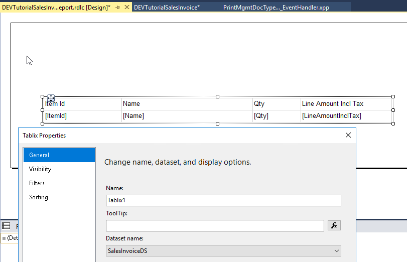
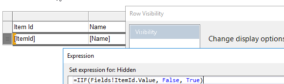
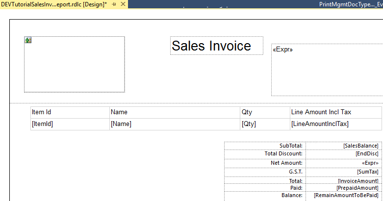
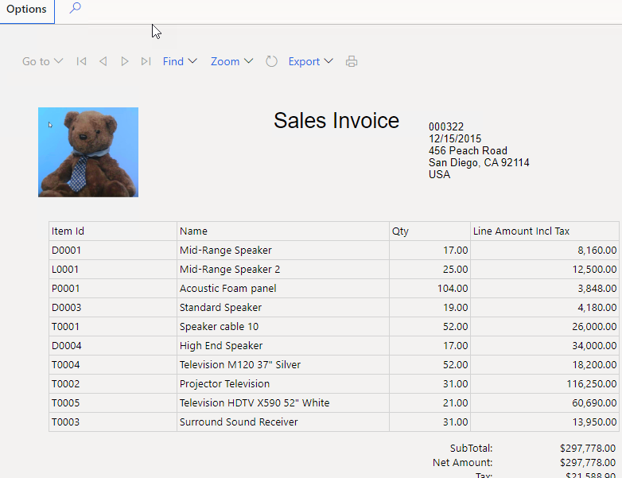

Creating a new Sales Invoice report design using SSRS and X++ is quite a common task. In this post, I'll try to describe how you can do this in Dynamics 365 Finance and Operations.

## Sales Invoice report development

I will use "DEVTutorial" prefix to new elements

### Data provided class

Let's start with a data provider. We should create a new class and extend it from the standard **SalesInvoiceDP**. In this case, we can add additional fields for header and line sections that apply only for our report.

```csharp
[SRSReportParameterAttribute(classStr(SalesInvoiceContract))]
class DEVTutorialSalesInvoiceDP  extends SalesInvoiceDP
{
protected void populateSalesInvoiceTmp(CustInvoiceJour _custInvoiceJour,
        CustInvoiceTrans _custInvoiceTrans,
        TaxSpec _taxSpec,
        CustPaymSchedLine _custPaymSchedLine,
        CustTrans _prepaymentCustTrans,
        TaxTrans _prepaymentTaxTrans)
    {
        super(_custInvoiceJour, _custInvoiceTrans, _taxSpec, _custPaymSchedLine, _prepaymentCustTrans, _prepaymentTaxTrans);
//populate additional fields in salesInvoiceTmp here
//salesInvoiceTmp.MyField = '';
//this method is called for main lines and also for all linked tables
}

protected void populateSalesInvoiceHeaderFooterTmp(CustInvoiceJour _custInvoiceJour, CompanyInfo _companyInfo)
{
    super(_custInvoiceJour, _companyInfo);
    //populate additional fields in salesInvoiceTmp here
    //salesInvoiceHeaderFooterTmp.MyField = '';
} }
```

### Report design

Then add a new SSRS report to our project



We need to add Datasets for this report. In the standard system we have 4 sales invoice datasets, let's add them all.

| Dataset name               | Query                                                        |
| -------------------------- | ------------------------------------------------------------ |
| SalesInvoiceDS             | SELECT * FROM DEVTutorialSalesInvoiceDP.SalesInvoiceTmp      |
| SalesInvoiceHeaderFooterDS | SELECT * FROM DEVTutorialSalesInvoiceDP.SalesInvoiceHeaderFooterTmp |
| SalesInvoiceLocalizationDS | SELECT * FROM DEVTutorialSalesInvoiceDP.SalesInvoiceLocalizationTmp |
| DocuBrandDetailsDS         | SELECT * FROM DEVTutorialSalesInvoiceDP.SysDocuBrandDetailsRegular |

At the end you should have something like that:



### Report Design

Then let's add a new Precision Design(Report)

Modify its properties - Size to standard **A4 210x297mm** and all Margins to **0**.



We add the following sections

### Header section

For the header, lets add a logo from Document branding

```vbscript
=First(Fields!Image1.Value, "DocuBrandDetailsDS")
```

and some client information

```vb
=First(Fields!SalesId.Value, "SalesInvoiceHeaderFooterDS")   & vbcrlf &  
First(Fields!InvoiceDate.Value, "SalesInvoiceHeaderFooterDS")  & vbcrlf &
First(Fields!InvoicingAddress.Value, "SalesInvoiceHeaderFooterDS")
```

### Line section

Add a new Tablix control with **SalesInvoiceDS** dataset



Adjust Row visibility to the following formula *"=IIF(Fields!ItemId.Value = "", true, false)"* as **SalesInvoiceDS** may contain data from linked tables(like payment schedule)



Let's also add some totals section. The resulting design should look like this



### Connect a new report to Print management

A sales invoice can be used in Print management module. In order to connect our report to this module, we need to subscribe to two events:

```csharp
[ExtensionOf(classstr(PrintMgmtReportFormatPopulator))]
final class PrintMgmtReportFormatPopulatorDEVTutorial_Extension
{   protected void addDocuments()
    {
        this.addStandard(PrintMgmtDocumentType::SalesOrderInvoice);
        next addDocuments();
    } }

final static class PrintMgmtDocTypeDEVTutorial_EventHandler
{     [SubscribesTo(classstr(PrintMgmtDocType), delegatestr(PrintMgmtDocType, getDefaultReportFormatDelegate))]
    public static void getDefaultReportFormatDelegate(PrintMgmtDocumentType _docType, EventHandlerResult _result)
    {   switch (_docType)
        {
            case PrintMgmtDocumentType::SalesOrderInvoice:
                _result.result(ssrsReportStr(DEVTutorialSalesInvoice, Report));
                break;
        }  } }
```

## Test Sales invoice report

That is all. It is time to test.

Build and deploy the report. Then, before the test, you need to add it to the print management settings. In order to do this - run the following job

```csharp
class DEVTutorialPopulateReports
{   public static void main(Args _args)
    {
        PrintMgmtReportFormatPopulator::construct().populate();
    }}

https://usnconeboxax1aos.cloud.onebox.dynamics.com/?mi=SysClassRunner&cls=DEVTutorialPopulateReports
```

Next step is to add a logo for our report. Go to the **Document images** form and upload the image. Then go to the **Branding details** form and select this image.

To print the invoice go to the **Accounts receivable - Invoice journal**, select **Document - Original preview** and you should see our sample report:



## The future of SSRS reporting

There may be a question of what is the future of SSRS reporting. Considering the latest news, I think that its popularity may grow. Microsoft recently released **Power BI Paginated Reports** that are completely based on SSRS **"rdl"** files. Technically a new **Power BI Paginated Reports Builder** is an old SSRS report builder with a new name(yes, another name change).

Check this recent course [Power BI Paginated Reports in a Day course](https://docs.microsoft.com/en-us/power-bi/learning-catalog/paginated-reports-online-course). Almost all it's modules(except maybe 04) are relevant to D365FO development.

And this Bear on the previous picture is not just a funny picture, it is an official mascot of Power BI [Paginated Reports](https://youtu.be/vu32LfckCt8?list=PL1N57mwBHtN1icIhpjQOaRL8r9G-wytpT&t=7). So with a new name and a new Bear, I hope the popularity of SSRS may grow.

## SSRS reporting issues

If you watch this  "Power BI Paginated reports Day [course"](https://docs.microsoft.com/en-us/power-bi/learning-catalog/paginated-reports-online-course) you may feel that SSRS is cool(presentation is really great). However, this technology is 10 years old and has some issues. Just some of them:

- **"rdl"** file is a very complex XML format. So in most cases, you will not be able to compare changes in the report - by using text compare you will see a huge number of differences in XML structure even for a small design change.
- Page splitting is very basic. For example, if you have a data row that is presented by multiple lines and you want to avoid page breaks inside this row, you may find that this is not supported and you need to develop your own page grouping solution.
- You can's define a section that prints something on the footer of last report page(and it is a quite popular requirement for reports - often it contains some payment bank information). There is a workaround for this if your report has 1 or 2 pages - you can put this information on page footer and hide the element using **Globals!PageNumber** and **Globals!TotalPages** variables, but if a report has 3 or more pages this will leave an empty space on these pages
- Report designer doesn't support formulas for defining width property

So there are a lot of things that can be improved, and I hope Microsoft will invest in it.

## Summary

Real-life invoice reports can be quite complex and require a lot of efforts to implement. However, as we see, creating a simple **Sales Invoice design** is not a complex task. You can use the project above as a starting point(another option to consider - install modern design [templates](https://docs.microsoft.com/en-us/dynamics365/fin-ops-core/dev-itpro/analytics/install-modern-report-design-templates#apply-the-modern-designs))

If you have some hints for SSRS report development, don't hesitate to post a comment. The project used in this post can be downloaded by the following link(you can download a model to a temporary folder and add elements from it to your project using "Add - Existing item.." command)
