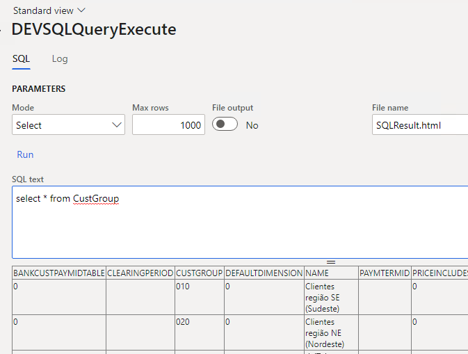
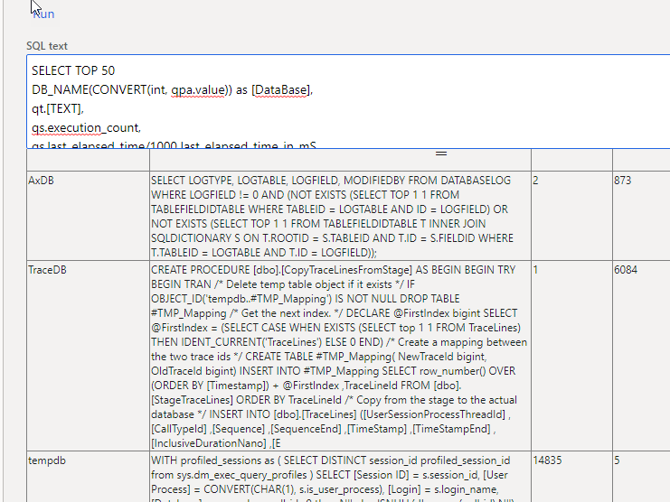
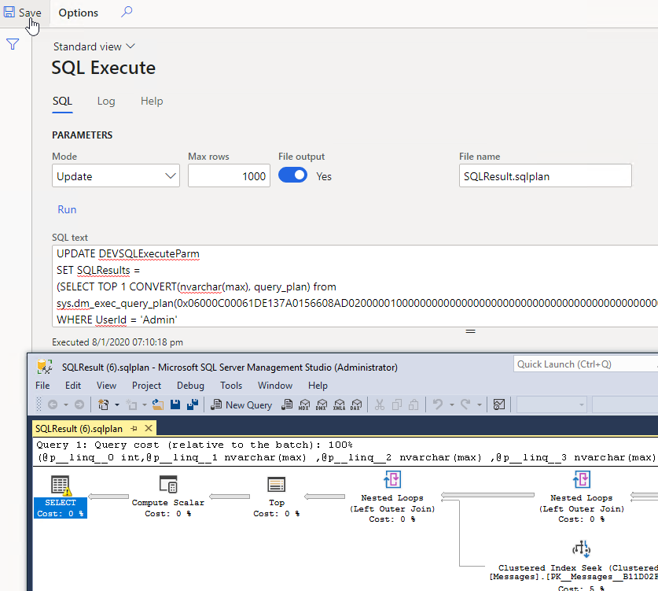

'Execute direct SQL' is a simple form that allows to write and execute direct SQL from the browser on D365FO database. It can save time whien you are debugging and troubleshooting.

The original idea was introduced in **AX Paradise** [blog post](https://axparadise.com/sql-access-on-production-in-d365fo/#page-content), I added some improvements and included it to my list of tools.

## How to work with this form

To use this form, you need to go to Administration-Inquiries-Database, and run **SQL Execute form**.

It allows you to enter **SQL text** to execute and outputs the execution results as **HTLM** or as a **File** when you press the **Run** button.

You can limit the number of returned rows. Due to AX string manipulation and text formatting current output is quite slow, it can handle only about 100-1000 rows.

As direct SQL execution is quite a dangerous operation, I also added a second tab to this form that logs all executed commands, so you can always check who used it.

To limit the number of users who can use this tool I added a new role - **DEVSQLQueryExecute**(it is required even for SysAdmin)

### Performance inquiry

One of possible use cases of this tool can be a performance troubleshooting for D365FO. Current tools for this in LCS are quite [slow](https://denistrunin.com/performance-sniffing) for a cloud version.

You can execute commands like getting [TOP SQL](https://github.com/TrudAX/TRUDScripts/blob/master/Performance/AX%20Technical%20Audit.md#get-top-sql) without a direct connection to SQL Server.

To return large text or the result of UPDATE statement you may update a **SQLResults** field.  

For example, you can also download and analyse SQL plan using the following command:

However, I don't know whether this will work for production instances(due to security rights). If you can test it, ping me with the results. If it doesn't work, probably we should create an Idea to allow this(at least until LCS views will be fixed). For a list of sample queries check Glenn Berry's monthly update of [Azure SQL Database Diagnostic Information Queries](https://github.com/ktaranov/sqlserver-kit/blob/master/Scripts/Azure%20SQL%20Database%20Diagnostic%20Information%20Queries.sql)

## Summary

**Execute direct SQL** tool can simplify your troubleshooting experience. You can download it using the following link - [https://github.com/TrudAX/XppTools#installation](https://github.com/TrudAX/XppTools#installation)

Feel free to post any comments(better as a GitHub issue) or ideas, what else can be improved.
